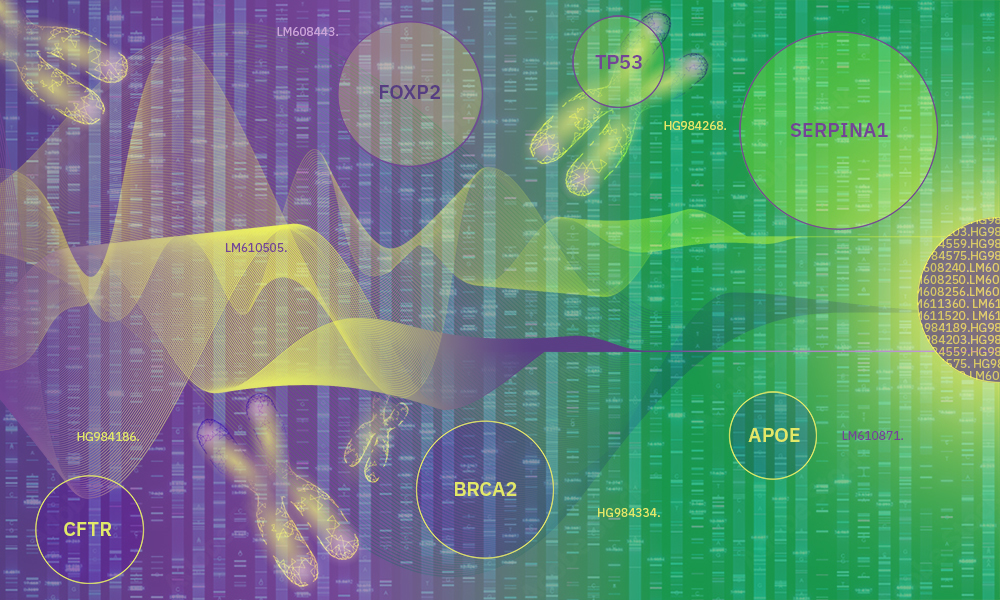

# multiomics2.0 #

This is the repository for my Master's Final Thesis.

1. [Data](data/): RNA-Seq, miRNA-Seq, methylation and proteomics data used in this project, both as raw and cooked.

2. [Scripts](scripts/): final .R scripts used to generate the results.
    - [Preprocessing](scripts/preprocessing/)
        1. [Downloading TCGA data](scripts/preprocessing/downloadingTCGA.R)
        2. [Cooking RNA-Seq](scripts/preprocessing/cookingRNASeq.R)
        3. 
    - [Associations](scripts/associations/)
    - [Models](scripts/models/)

3. [Reports](reports/): exploratory .Rmd notebooks (knitted to .html) used to decide which pipelines to follow.
    - [Preprocessing](reports/preprocessing/)
        1. [Downloading TCGA data](reports/preprocessing/downloadingTCGA.html)
        2. [Cooking RNA-Seq](reports/preprocessing/cookingRNASeq.html)
        3. 
    - [Associations](reports/associations/)
    - [Models](reports/models/)

4. [Results](results/)
    - [Preprocessing](results/preprocessing/)
        1. [Cooking RNA-Seq](results/preprocessing/cookingRNASeq)
        2. 
    - [Associations](results/associations/)
    - [Models](results/models/)