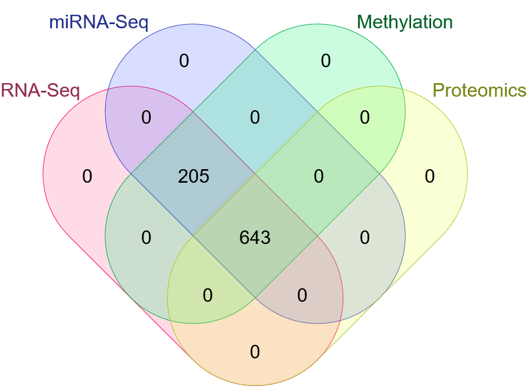

# :dna: Data

Since the data files are too large to store on GitHub, here is the structure of the data folder with direct links to said files stored in [this MEGA folder](https://mega.nz/folder/Kl8h1LJJ#oactgNw1q3Wwu5qZaLdnkA). All data was downloaded with R/Bioconductor package `TCGAbiolinks` using Harmonized mode, which prepares data in a different way to Legacy (e.g. using `STAR` counts instead of `RSEM` estimated counts in the case of RNA-Seq) and aligns reads against human assembly GRCh38 (hg38). `.rda` files can be directly loaded into R. `.RDS` files need to be read using the `readRDS` R function.

*Note: some omics appear to have more samples than others, but this is just because some samples (normal tissue; or tumor samples) were analyzed twice, using the same aliquot. In practice we'll merge the data in these cases. In other words, some tumor samples had more than 1 files associated with them, for RNA-Seq, miRNA-Seq and methylation data, meaning some samples had to be removed or merged with other existing ones following [Broad's Institute guideline on replicate samples](https://gdac.broadinstitute.org/runs/gdc/report_2017_08_02/TCGA-LGG_Replicate_Samples.html), which suggests keeping samples with the highest lexicographical sort value for the plate number. When this was unclear, FFPE (formalin fixed paraffin embedded) samples were removed, since [they are not suitable for molecular analysis because the RNA and DNA are trapped in the nucleic acid-protein cross linking from the fixation process](https://gdac.broadinstitute.org/runs/stddata__2014_04_16/samples_report/FFPE_Cases.html).

## 🥩 Raw data

### :one: RNA-Seq

`RangedSummarizedExperiment` objects generated by `TCGAbiolinks` containing (among other information) `unstranded`, `stranded_first`, `stranded_second`, `tpm_unstrand`, `fpkm_unstrand` and `fpkm_uq_unstrand` counts for 60,660 genes. `Unstranded` counts were used.

- **[RNA.rda (506.2 MB)](https://mega.nz/file/6lsX0QyQ#BhxdMgi1FXMRclh0uA23dLlLp96E-EVcfCO8SAa2U_A)**: with data for 857 samples that also have data for miRNA-Seq and methylation.

- **[RNA.with.prot.rda (383.8 MB)](https://mega.nz/file/bwcziAyJ#2VD9WB_BI2QzTZe2F9MPp4668GwgOcVCcx_Gcxd6am4)**: with data for only 650 of the previous samples that have data for proteomics as well.

### :two: miRNA-Seq

Data frames generated by `TCGAbiolinks` with `read_counts`, `reads_per_million_miRNA_mapped` and `cross-mapped` counts for 1,881 miRNAs. `read_counts` were used.

- **[miRNA.rda (3.6 MB)](https://mega.nz/file/K5cnjLDZ#FKsdTFvBnnuQtB5aU5WFlG_6PTkryKA40f2szdY3oas)**: with data for 864 samples.

- **[miRNA.with.prot.rda (2.7 MB)](https://mega.nz/file/3oNz0YJB#1x7V9HsVXdCPCBMpe1kVpX6OdVqq8y1B2jOnDJKj4iA)**: with data for only 489 of the previous samples.

### :three: Methylation

`RangedSummarizedExperiment` objects generated by `TCGAbiolinks` containing (among other information) methylation beta-values for 485,577 CpG islands obtained by mapping HM450 probes to the GRCh38 reference genome.

- **[met.rda (2.48 GB)](https://mega.nz/file/C0N3TaRb#CJmugJQ6-4OeKDhRXG4qxlubuvepJ7Nt1eYRtXSHED8)**: with data for 857 samples.

- **[met.with.prot.rda (1.94 GB)](https://mega.nz/file/uxdTkLgK#uttIfQ7dqYUWlqJQ1Onv2sYAAtR4oa_EC4yLiKMWP7I)**: with data for 646 of the previous samples. 

### :four: Proteomics

Data frame generated by `TCGAbiolinks` with quantified and normalized (median-centered, log2-transformed) protein expression for 487 peptide targets.

- **[prot.rda (1.9 MB)](https://mega.nz/file/78d2yTJZ#JwJG9bAUJ_Uo2WPRfWH2wiK4gy0KZ1TdhdMDdk8TqrY)**: with data for 643 samples.

## 🍖 Cooked

### :one: RNA-Seq

Raw counts were first filtered by setting a CPM threshold of 0.5 and a cv.cutoff of 500 with R/Bioconductor package `NOISeq`. These filtered counts were then normalized with R/Bioconductor `cqn` by correcting for sample-specific gene GC-content and length biases, as well as for between-sample effects.

- **[RNA.filt.rda (33.4 MB)](https://mega.nz/file/e90iTY7K#ME8OhQpTt8Uv_FDjWDbtaJUxI7fXzVbNc3ULh7ty0Qw)**: raw filtered counts for 19,318 genes and 848 samples.

- **[RNA.norm.Factors.rda (118.2 MB)](https://mega.nz/file/ysU0XBwD#qJUyCyptcFIgReJ3i6dwyLNjre6KmohRIaRIQXPhne4)**: normalization factors obtained with `cqn`. 

- **[RNA.norm.rda (336 MB)](https://mega.nz/file/u4Vg0YDQ#QwDa4oaelifmaZ-ThC4JkwbWCNxPuNfm41csOZUwHho)**: normalized expression matrix obtained with `cqn`. 

### :two: miRNA-Seq

Raw counts were first filtered by setting a CPM threshold of 0.5 and a cv.cutoff of 500 with R/Bioconductor package `NOISeq`. These filtered counts were then normalized with R/Bioconductor `EDASeq` by correcting for sample-specific gene GC-content bias, as well as for between-sample effects.

- **[miRNA.filt.rda (689 kB)](https://mega.nz/file/Ck0TiC6Q#h5uwGYehu8va7-wA29g5afYZipB2Mr3wR1la-78CkDQ)**: raw filtered counts for 491 miRNAs and 848 samples.

- **[miRNA.norm.Factors.rda (2.8 MB)](https://mega.nz/file/WxtC2J6R#gVfQrb_9RhIH6FhmyU3ZWXNiIT-osedDRU23cN_OqKo)**: normalization factors obtained with `EDASeq`. 

- **[miRNA.norm.rda (1.3 MB)](https://mega.nz/file/mhNnlDiL#g1YzHCO_JFXakn_mOG-VfvXQ5pkRT-DGwQacFwNalLc)**: normalized expression matrix obtained with `EDASeq`. 

### :three: Methylation

Probes that had any NA's were removed, as well as probes with all 0 values (of which there were none in this case). 

- **[bval.RDS (2.31 GB)](https://mega.nz/file/mgEz2DBT#JMF0rZePZ_1QPG5QJOYjsjqTrjcgSWfbT7hxrBQq2gk)**: filtered methylation beta-values for 364,019 CpG sites and 848 samples.

- **[mval.RDS (2.31 GB)](https://mega.nz/file/ullGAK4L#bbFN-MLNf-1FZpcRajtw2touDGu4fZJWGLIkTw2ReGw)**: M-values converted from beta-values through a logistic transformation for 364,019 CpG sites.

### :four: Proteomics

- **[prot.filt.rda (1.5 MB)](https://mega.nz/file/ntsWjLAT#wfDDHQnmI0PKFM1emImYdM3vCMikKGIy9_vGp66auRc)**: normalized (median-centered, log2-transformed) expression matrix for 369 protein targets converted to Entrez IDs and 625 samples, with no missing values.