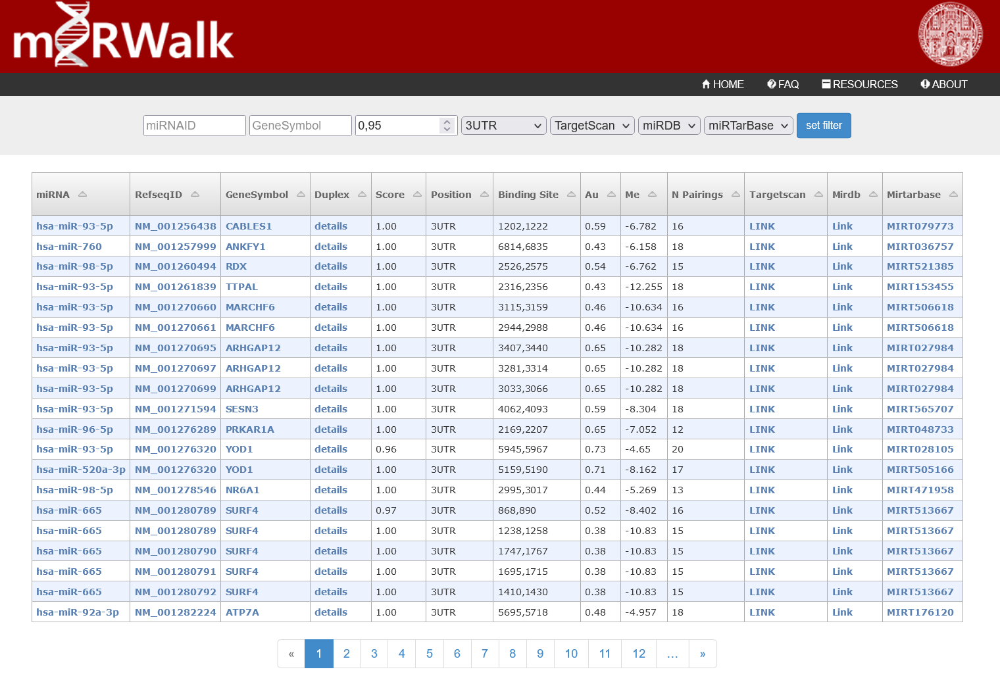

```{r setup, include=FALSE}
```

# Associating miRbase IDs to Gene Symbols with miRWalk

We discovered which miRNAs regulate which genes using online tool miRWalk, which allows us to retrieve only those associations that have been experimentally validated, since they appear in miRTarBase (not just predicted *in silico*) and that are also either on TargetScan or miRDB (or both of them), which computionally predict their targets.



```{r, eval = FALSE}
miRNA2gene <- read.table("reports/associations/miRNA-gene/all_miRWalk_miRNA_Targets.txt")
colnames(miRNA2gene) <- c("mirbase_id", "genesymbol")
miRNA2gene <- miRNA2gene[-1, ]
miRNA2gene <- unique(miRNA2gene)
```


```{r, eval = FALSE}
head(miRNA2gene)

    mirbase_id genesymbol
2  hsa-miR-107       CDK6
3  hsa-miR-107      CLOCK
4  hsa-miR-107     DICER1
5  hsa-miR-107      DYRK2
6  hsa-miR-107       VCAN
12 hsa-miR-107      PLAG1
```

# Converting Gene Symbols to ENSEMBL IDs

However, there is one problem: our gene expression matrix comes in the form of ENSEMBL IDs, yet this website gives genes as Gene Symbols. We have one more task to complete: to convert Gene Symbols to ENSEMBL IDs, with the help of `biomaRt`.

```{r, eval = FALSE}
gene.symbols <- unique(miRNA2gene$genesymbol) # we need to map 2293 genes
library(biomaRt)
mart = useMart(biomart="ensembl", dataset="hsapiens_gene_ensembl")
gene.conversion <- getBM(filters="external_gene_name",
              attributes=c("ensembl_gene_id", "external_gene_name"), 
              values= gene.symbols,
              mart=mart)
```

We have two problems to deal with: missing genes and genes with multiple ENSEMBL IDs. For the missing genes part, we can input them into [this multisymbol checker](https://www.genenames.org/tools/multi-symbol-checker/) to get the latest version of the gene name. For duplicated genes, what we did was to keep the main sequence (which happens to always be the last element) and delete the alternative ones (haplotypes/patches).

```{r, eval = FALSE}
gene.conversion <- gene.conversion[order(gene.conversion$external_gene_name), ]
rownames(gene.conversion) <- c(1:length(gene.conversion$ensembl_gene_id))

duplicated.genes <- which(duplicated(gene.conversion$external_gene_name))
duplicated.genes <- duplicated.genes-1 # we keep the last one, as this is the main sequence as opposed to alternative sequences (haplotypes/patches)
gene.conversion <- gene.conversion[-duplicated.genes, ]

missing.genes <- setdiff(gene.symbols, gene.conversion$external_gene_name) # 4
write.table(missing.genes, file = "reports/associations/miRNA-gene/missing.genes.txt", sep = "\t", quote = FALSE, row.names = FALSE, col.names = FALSE)

missing.genes <- read.table(file = "reports/associations/miRNA-gene/hgnc-symbol-check.csv", sep = ",")
colnames(missing.genes) <- missing.genes[1, ]
missing.genes <- missing.genes[-1, ]

missing.gene.conversion <- getBM(filters="external_gene_name",
              attributes=c("ensembl_gene_id", "external_gene_name"),
              values=missing.genes$`Approved symbol`,
              mart=mart)

missing.gene.conversion$external_gene_name <- missing.genes$Input[match(missing.gene.conversion$external_gene_name, missing.genes$`Approved symbol`)] # replace new names by old names, so that it finds them in the associations

gene.conversion <- rbind(gene.conversion, missing.gene.conversion)
```

As expected, some gene symbols map to several ENSEMBL IDs. We decided to map everything into ENSEMBL instead of going from ENSEMBL to Entrez/Gene Symbol because some ENSEMBL transcripts are novel or putative so they haven't been given an external ID yet. If we converted from ENSEMBL to Entrez, we would have to remove genes from the expression matrix; but if we convert from Entrez/Symbol to ENSEMBL, we just have to add extra associations to the associations matrix, which is fine.

```{r, eval = FALSE}
miRNA2gene$ensembl_gene_id <- gene.conversion$ensembl_gene_id[match(miRNA2gene$genesymbol, gene.conversion$external_gene_name)]

miRNA2gene[[1]] <- tolower(miRNA2gene[[1]]) # turn from uppercase to lowercase so that it can match DEGs, which are lowercase

write.table(miRNA2gene[, -2], file = "results/associations/miRNA-gene/all_miRWalk_miRNA_Targets.txt", sep = "\t", row.names = FALSE, quote = FALSE)
```

As an approximation we'll choose relevant associations as those where a relevant miRNA appears.

```{r, eval = FALSE}
miRNA.associations <- read.table(file = "results/associations/miRNA-gene/all_miRWalk_miRNA_Targets.txt", header = TRUE)
miRNA.DEGs <- read.table(file = "results/preprocessing/cookingmiRNASeq/common.miRNA.DEGs.txt")
relevant.miRNA.associations <- subset(miRNA.associations, mirbase_id %in% miRNA.DEGs$V1) # 169 miRNA-gene associations are relevant per this criterion
write.table(relevant.miRNA.associations, file = "results/associations/miRNA-gene/DEG_miRWalk_miRNA_Targets.txt", sep = "\t", quote = FALSE, row.names = FALSE, col.names = FALSE)
```

