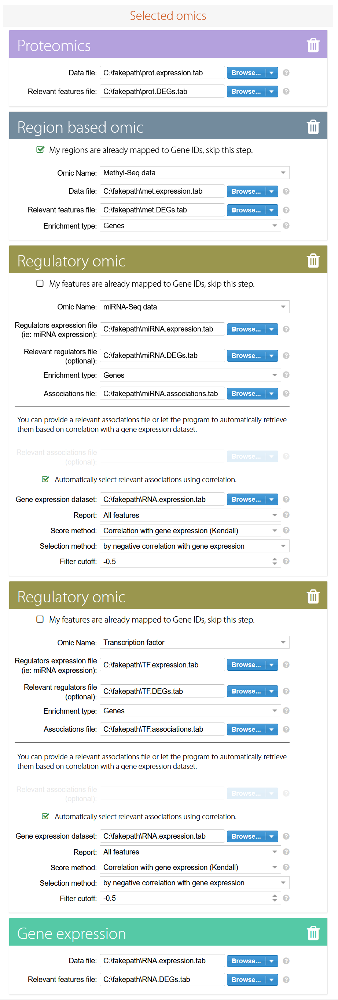
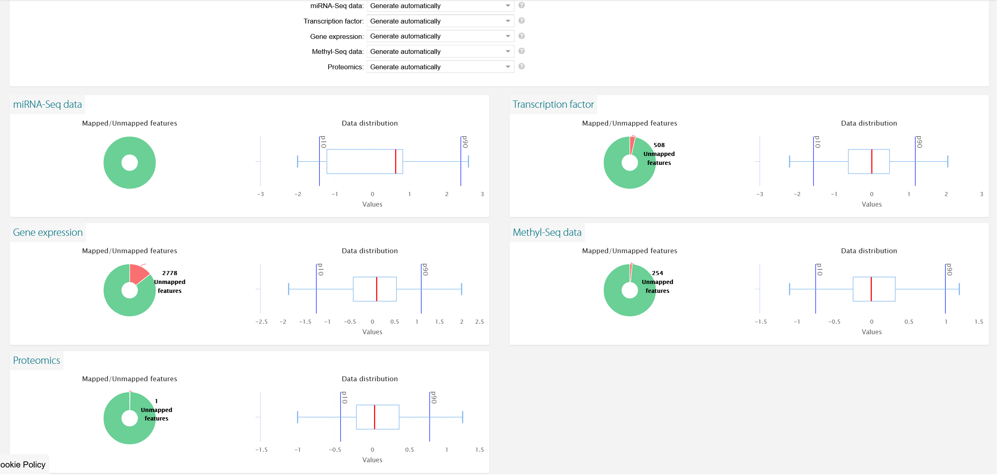

# PaintOmics

The input files can be found in [this folder](/input/). The data was input as seen in the following image.

Some features could not be mapped, as seen in the next image.

Note: even though Reactome database was also available for human, only KEGG was used, as KEGG + Reactome kept timing out due to the large amount of data.

For miRNAs I had to give it all 4 files (expression, relevant features, associations and relevant associations) but for TFs it wouldn't work unless I just did expression, associations and relevant associations. Otherwise it gave me this error:

ConnectionRef

1. TFs all 4: expression + relevant features + associations + relevant associations. DOESNT WORK
2. TFs just 3: expression + associations + relevant associations. DOESNT WORK
3. miRNAs all 4: expression + relevant features + associations + relevant associations. WORKS
4. miRNAs just 3: expression + associations + relevant associations

TFs all 4 gives me this error:
OSError: AT PathwayAcquisitionServlet.py: pathwayAcquisitionStep1_PART2. ERROR MESSAGE: [Errno 12] Cannot allocate memory. User ID: 74

TFs just 3 gives me this error:
ConnectionRefusedError: AT PathwayAcquisitionServlet.py: pathwayAcquisitionStep1_PART2. ERROR MESSAGE: [Errno 111] Connection refused. User ID: 74