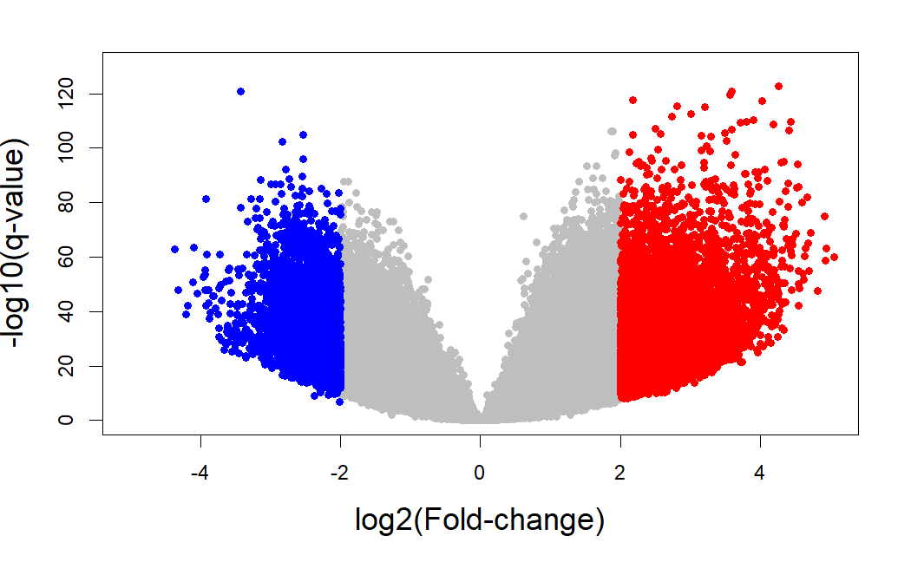

```{r setup, include=FALSE}
```

# Loading

The processed DNA methylation data measure the level of methylation at known CpG sites as beta-values, calculated from array intensities (Level 2 data) as Beta = M/(M+U) which ranges from 0 being unmethylated and 1 fully methylated. We have information for 485,577 CpG sites and 857 samples.

```{r, message = FALSE}
library(TCGAbiolinks)
library(SummarizedExperiment)

load("data/raw/met/met.rda")
```

```{r}
met.beta.values <- as.data.frame(assay(met))
head(met.beta.values)[, 1:4]
met.genes.info <- as.data.frame(rowRanges(met))
head(met.genes.info)
met.sample.info <- as.data.frame(met@colData)
```

# Filtering

We need to remove all probes that have any NA values.

```{r, eval = FALSE}
probe.na <- rowSums(is.na(met.beta.values))
table(probe.na == 0)
#  FALSE   TRUE 
# 121558 364019 

probe <- probe.na[probe.na == 0]
met.beta.values <- met.beta.values[row.names(met.beta.values) %in% names(probe), ]
```

We should also remove probes with all 0 values, although in this case there are none.

```{r, eval = FALSE}
probe.0 <- rowSums(met.beta.values)
table(probe.0 == 0)
#   FALSE 
#  364019 
```

# Converting

Let's convert beta-values to M-values.

```{r, eval = FALSE}
bval <- met.beta.values
saveRDS(bval, file = "data/cooked/met/bval.RDS", compress = FALSE)

max(bval)
# 0.99716
# max isn't 1 so there's no problem with applying logarithm transformation from B to M

# converting beta values to m_values
# m = log2(beta/1-beta)
mval <- t(apply(met.beta.values, 1, function(x) log2(x/(1-x))))
saveRDS(mval, file = "data/cooked/met/mval.RDS", compress = FALSE)

# to load
mval <- readRDS("data/cooked/met/mval.RDS")
bval <- readRDS("data/cooked/met/bval.RDS")
```

# Exploring

We can plot a PCA to see if there's good separation between the groups, picking 100,000 random CpG sites from the 364,019 filtered ones we have.

```{r, eval = FALSE}
pc = prcomp(t(bval[floor(runif(100000, min=1, max=364019)),]), scale = FALSE)
bcodes <- substr(rownames(pc$x), 1, 15)
tumor <- substr(bcodes, 14, 15) == "01"
loads <- round(pc$sdev^2/sum(pc$sdev)*100, 1)
xlab <- c(paste("PC1", loads[1], "%"))
ylab <- c(paste("PC2", loads[2], "%"))
plot(pc$x[ , 1], pc$x[ , 2], xlab = xlab, ylab = ylab, type = "n",
main = "PC1 vs . PC2 ", cex.axis = 1.5 , cex.lab = 1.3 , cex.main = 1.5)
points(pc$x[tumor, 1] , pc$x[tumor, 2], col = "red", pch = 16)
points(pc$x[!tumor, 1] , pc$x[!tumor, 2], col = "blue", pch = 16)
legend("topright", legend = c("Tumor" , "Normal" ), pch = 16, col = c("red", "blue"))
```


Plot beta values density.

We can also plot the density of beta-values for 10,000 random samples.

```{r, eval = FALSE}
rand_smp = sample(rownames(bval), 10000, replace = F)
bcodes = substr(colnames(bval), 1, 15)
tumor <- substr(bcodes, 14, 15) == "01"

plot(density(bval[rand_smp, 1]), type = "n", ylim = c(0,3), main = "Density of B-values for tumor and normal samples", cex.axis = 1.5, xlab = "Beta-value", ylab = "Density", cex.main = 1.5)
for (i in 1:length(bcodes)) {
  if (tumor[i] == T) {
    points(density(bval[rand_smp, i]), col = "red", type = "l")
  }
  else {
    points(density(bval[rand_smp, i]), col = "blue", type = "l")
  }
}
legend("topright", legend = c("Tumor", "Normal"), col = c("red", "blue"), lty = 1)
```


We can't see any significant differences between tumor and normal samples from this graph alone, although cancer samples do seem to peak higher.

# Analyzing differential expression

## limma

Why do we use M-values for analyzing differential expression?

"Regardless of the Illumina array version, for each CpG, there are two measurements: a methylated intensity (denoted by M) and an unmethylated intensity (denoted by U). These intensity values can be used to determine the proportion of methylation at each CpG locus. Methylation levels are commonly reported as either beta values (β=M/(M+U)) or M-values (Mvalue=log2(M/U)). For practical purposes, a small offset, α, can be added to the denominator of the β value equation to avoid dividing by small values, which is the default behaviour of the getBeta function in minfi. The default value for α is 100. Beta values and M-values are related through a logit transformation. Beta values are generally preferable for describing the level of methylation at a locus or for graphical presentation because percentage methylation is easily interpretable. However, due to their distributional properties, M-values are more appropriate for statistical testing."

```{r, eval = FALSE}
library(limma)
library(ggplot2)

group <- as.factor(met.sample.info$sample_type)

group <- relevel(group, ref = "Solid Tissue Normal")

design <- model.matrix(~ group)

fit <- lmFit(mval, design)
fit2 <- eBayes(fit)
top <- topTable(fit2, coef=ncol(design), number = Inf)

log.fold.change <- top$logFC
q.value <- top$adj.P.Val
genes.ids <- rownames(top)
names(log.fold.change) <- genes.ids
names(q.value) <- genes.ids

activated.genes.limma <- genes.ids[log.fold.change > 2 & q.value < 0.05]
repressed.genes.limma <- genes.ids[log.fold.change < -2 & q.value < 0.05]

length(activated.genes.limma) # 4400
length(repressed.genes.limma) # 8763

log.q.val <- -log10(q.value)
plot(log.fold.change,log.q.val,pch=19,col="grey",cex=0.8,
xlim=c(-5,5),ylim = c(0,130),
xlab="log2(Fold-change)",ylab="-log10(q-value)",cex.lab=1.5)
points(x = log.fold.change[activated.genes.limma],
y = log.q.val[activated.genes.limma],col="red",cex=0.8,pch=19)
points(x = log.fold.change[repressed.genes.limma],
y = log.q.val[repressed.genes.limma],col="blue",cex=0.8,pch=19)

write.table(activated.genes.limma, file = "results/preprocessing/cookingMet/limma.up.txt", row.names = FALSE, col.names = FALSE, quote = FALSE)

write.table(repressed.genes.limma, file = "results/preprocessing/cookingMet/limma.down.txt", row.names = FALSE, col.names = FALSE, quote = FALSE)

topOrdered <- top[order(top$adj.P.Val),]
topOrderedDF <- as.data.frame(topOrdered)
topOrderedDF <- na.omit(topOrderedDF)
write.table(topOrderedDF, file = "results/preprocessing/cookingMet/limma.ordered.csv", row.names=TRUE, col.names=TRUE, sep="\t", quote=FALSE)
```



It is always useful to plot sample-wise methylation levels for the top differentially methylated CpG sites to quickly ensure the results make sense. If the plots do not look as expected, it is usually an indication of an error in the code, or in setting up the design matrix. It is easier to interpret methylation levels on the beta value scale, so although the analysis is performed on the M-value scale, we visualise data on the beta value scale. The `plotCpg` function in `minfi` is a convenient way to plot the sample-wise beta values stratified by the grouping variable.

```{r, eval = FALSE}
topOrderedDF <- read.csv(file = "results/preprocessing/cookingMet/limma.ordered.csv", sep = "\t")

library(minfi)

# plot the top 4 most significantly differentially methylated CpGs
par(mfrow=c(2,2))
sapply(rownames(topOrderedDF)[1:4], function(cpg){
  plotCpg(bval, cpg=cpg, pheno=met.sample.info$sample_type)
})
```


# Gene ontology testing

Once you have performed a differential methylation analysis, there may be a very long list of significant CpG sites to interpret. One question a researcher may have is, “which gene pathways are over-represented for differentially methylated CpGs?” In some cases it is relatively straightforward to link the top differentially methylated CpGs to genes that make biological sense in terms of the cell types or samples being studied, but there may be many thousands of CpGs significantly differentially methylated. In order to gain an understanding of the biological processes that the differentially methylated CpGs may be involved in, we can perform gene ontology or KEGG pathway analysis using the `gometh` function in the `missMethyl` package.

The `gometh` function takes as input a character vector of the names (e.g. cg20832020) of the significant CpG sites, and optionally, a character vector of all CpGs tested. This is recommended particularly if extensive filtering of the CpGs has been performed prior to analysis. For gene ontology testing (default), the user can specify collection="GO" for KEGG testing collection="KEGG". In the DMPs table, the Name column corresponds to the CpG name. We will select all CpG sites that have adjusted p-value of less than 0.05.

```{r, eval = FALSE}
DMPs <- read.table(file = "results/preprocessing/cookingMet/met.DEGs.txt")
DMPs <- as.vector(DMPs$V1)

# Get all the CpG sites used in the analysis to form the background
all.CpG.sites <- rownames(topOrderedDF)
```

The `gometh` function takes into account the varying numbers of CpGs associated with each gene on the Illumina methylation arrays. For the 450k array, the numbers of CpGs mapping to genes can vary from as few as 1 to as many as 1200. The genes that have more CpGs associated with them will have a higher probability of being identified as differentially methylated compared to genes with fewer CpGs. We can look at this bias in the data by specifying plot=TRUE in the call to `gometh`.

The `gst` object is a data.frame with each row corresponding to the GO category being tested. The top 20 gene ontology categories can be displayed using the `topGO` function.

This function takes a character vector of significant CpG sites, maps the CpG sites to Entrez Gene IDs, and tests for GO term or KEGG pathway enrichment using a Wallenius' non central hypergeometric test, taking into account the number of CpG sites per gene on the 450K/EPIC array and multi-gene annotated CpGs. Geeleher et al. (2013) showed that a severe bias exists when performing gene set analysis for genome-wide methylation data that occurs due to the differing numbers of CpG sites profiled for each gene. gometh is based on the goseq method (Young et al., 2010), and is a modification of the goana function in the limma package.

The testing now also takes into account that some CpGs are annotated to multiple genes. For a small number of gene families, this previously caused their associated GO categories/gene sets to be erroneously overrepresented and thus highly significant. If fract.counts=FALSE then CpGs are allowed to map to multiple genes (this is NOT recommended).

A new feature of gometh and gsameth is the ability to restrict the input CpGs by genomic feature with the argument genomic.features. The possible options include "ALL", "TSS200", "TSS1500", "Body", "1stExon", "3'UTR", "5'UTR" and "ExonBnd", and the user may specify any combination. Please not that "ExonBnd" is not an annotated feature on 450K arrays. For example if you are interested in the promoter region only, you could specify genomic.features = c("TSS1500","TSS200","1stExon"). The default behaviour is to test all input CpGs sig.cpg even if the user specifies "ALL" and one or more other features.


```{r, eval = FALSE}
library(missMethyl)
library(limma)

par(mfrow=c(1,1))
gst <- gometh(sig.cpg=DMPs, all.cpg=all.CpG.sites, plot.bias=TRUE)

# Top 10 GO categories
topGO(gst, number=10)
```


From the output we can see many of the top GO categories correspond to immune system and T cell processes, which is unsurprising as the cell types being studied form part of the immune system.

# Differential variability

Rather than testing for differences in mean methylation, we may be interested in testing for differences between group variances. For example, it has been hypothesised that highly variable CpGs in cancer are important for tumour progression. Hence we may be interested in CpG sites that are consistently methylated in one group, but variably methylated in another group.

Sample size is an important consideration when testing for differentially variable CpG sites. In order to get an accurate estimate of the group variances, larger sample sizes are required than for estimating group means. A good rule of thumb is to have at least ten samples in each group.

We can test for differentially variable CpGs using the varFit function in the missMethyl package. The syntax for specifying which groups we are interested in testing is slightly different to the standard way a model is specified in limma, particularly for designs where an intercept is fitted (see missMethyl vignette for further details). For the ageing data, the design matrix includes an intercept term, and a term for age. The coef argument in the varFit function indicates which columns of the design matrix correspond to the intercept and grouping factor. Thus, for the ageing dataset we set coef=c(1,2). Note that design matrices without intercept terms are permitted, with specific contrasts tested using the contrasts.varFit function.

```{r}
# get M-values for analysis
age.mVals <- getM(age.mSetSqFlt)

design <- model.matrix(~factor(age.targets$Sample_Group))
# Fit the model for differential variability
# specifying the intercept and age as the grouping factor
fitvar <- varFit(age.mVals, design = design, coef = c(1,2))

# Summary of differential variability
summary(decideTests(fitvar))

topDV <- topVar(fitvar, coef=2)
# Top 10 differentially variable CpGs between old vs. newborns
topDV
```

Similarly to the differential methylation analysis, is it useful to plot sample-wise beta values for the differentially variable CpGs to ensure the significant results are not driven by artifacts or outliers (Figure 14).

```{r}
  # get beta values for ageing data
age.bVals <- getBeta(age.mSetSqFlt)
par(mfrow=c(2,2))
sapply(rownames(topDV)[1:4], function(cpg){
  plotCpg(age.bVals, cpg=cpg, pheno=age.targets$Sample_Group)
})
```

