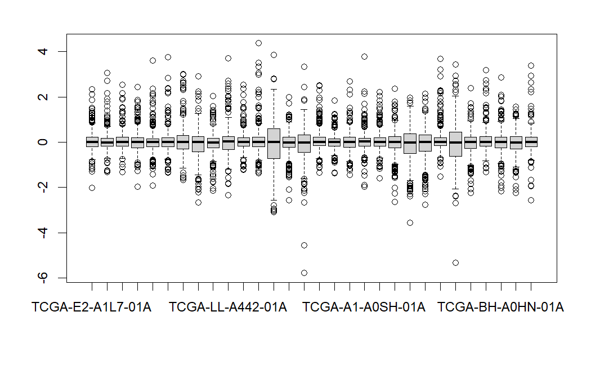
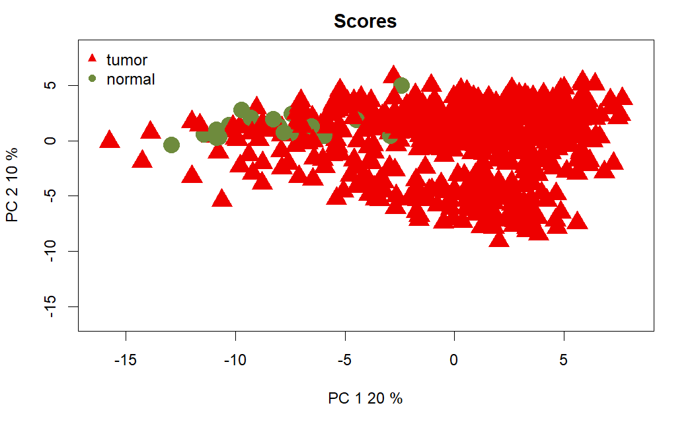
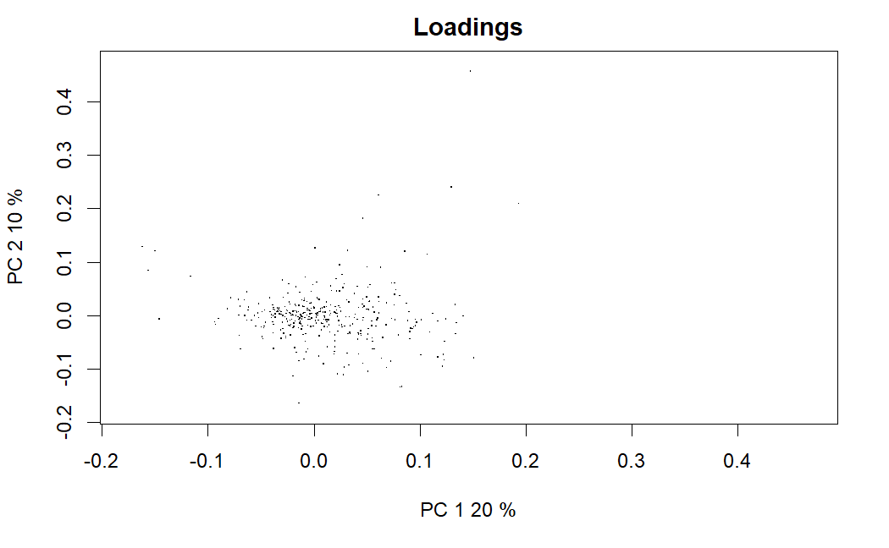
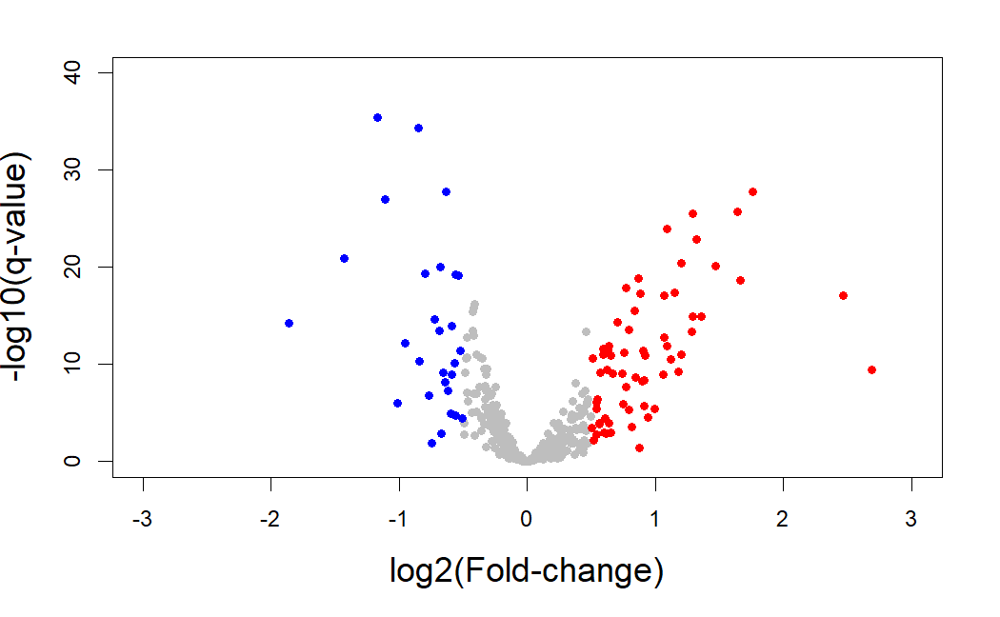

Cooking proteomics data
================
Pilar González Marchante

-   <a href="#loading" id="toc-loading">Loading</a>
-   <a href="#exploring" id="toc-exploring">Exploring</a>

# Loading

Reverse Phase Protein Array (RPPA) is a high-throughput antibody-based
technique with a procedure similar to that of Western blots. In the
procedure carried by MD Anderson Cancer Center, hundreds to thousands of
different cell lysates are immobilized on a nitrocellulose-coated slide
as many individual spots, followed by incubations with one
protein-specific antibody, and detection. A group (often several
hundreds) of antibodies form a set, which are used for each assay.
Occasionally, antibodies may be added to or removed from the set
depending on feasibility/functionality, which forms a new set.

To quantify protein expression, a “standard curve” is constructed from
spots on each slide (one slide probed for one antibody). These spots
include serial dilutions of each sample plus QC spots of standard
lysates at different concentrations.

[The original paper](https://www.nature.com/articles/s41586-019-1186-3)
mentions:

“Each dilution curve was fitted with a logistic model (‘supercurve
fitting’ developed by the Department of Bioinformatics and Computational
Biology in MD Anderson Cancer Center;
<http://bioinformatics.mdanderson.org/OOMPA>). This fits a single curve
using all the samples (that is, dilution series) on a slide with the
signal intensity as the response variable and the dilution step as the
independent variable. The fitted curve is plotted with both the observed
and fitted signal intensities on the y axis and the log2 concentration
of proteins on the x axis for diagnostic purposes. The protein
concentrations of each set of slides were then normalized for protein
loading. Correction factor was calculated by first median‐centring
across samples of all antibody experiments and then median‐centring
across antibodies for each sample.”

``` r
load("data/raw/prot/prot.rda")
```

# Exploring

There are no duplicated samples. Protein expression is given by Relative
levels of protein expression - interpolation of each dilution curve to
the “standard curve” (supercurve) of the slide (antibody).

``` r
prot <- prot[-c(1,2,3,4,5)]
first.30.samples <- prot[, 1:30]
boxplot(first.30.samples)
```



It seems our data is already normalized, which makes sense since it is
stated that the data was median-centred and log2-transformed.

How many missing values do we have?

``` r
missing.per.patient <- as.data.frame(sapply(prot, function(x) sum(is.na(x))))
missing.per.patient$percentage <- missing.per.patient$`sapply(prot, function(x) sum(is.na(x)))`*100/487
missing.per.peptide <- as.data.frame(rowSums(is.na(prot)))
missing.per.peptide$percentage <- missing.per.peptide$`rowSums(is.na(prot))`*100/643
```

Some peptides have missing values for all samples, so these ones we will
remove. Any samples or peptides with a missing rate higher than 20% will
have to be removed from the matrix, since it is not possible to impute
these values with confidence.

``` r
patients.to.remove <- rownames(missing.per.patient[which(missing.per.patient$percentage >= 20), ]) # 18
 [1] "TCGA-JL-A3YX-01A" "TCGA-AR-A24W-01A" "TCGA-A7-A26E-01A" "TCGA-A1-A0SQ-01A" "TCGA-BH-A1FL-01A" "TCGA-AR-A255-01A" "TCGA-AC-A23E-01A"
 [8] "TCGA-E9-A1RE-01A" "TCGA-EW-A1OY-01A" "TCGA-BH-A1EO-01A" "TCGA-D8-A1JJ-01A" "TCGA-D8-A1JN-01A" "TCGA-A2-A1FV-01A" "TCGA-BH-A1FR-01A"
[15] "TCGA-E9-A1R6-01A" "TCGA-A1-A0SF-01A" "TCGA-D8-A1JU-01A" "TCGA-EW-A1PD-01A"
peptides.to.remove <- rownames(missing.per.peptide[which(missing.per.peptide$percentage >= 20), ]) # 30
 [1] "ALPHACATENIN"       "AXL"                "CA9"                "CASPASE9"           "COMPLEXIISUBUNIT30" "CTLA4"              "E2F1"              
 [8] "ENY2"               "EZH2"               "GATA6"              "GCN5L2"             "GYS"                "GYS_pS641"          "HIF1ALPHA"         
[15] "LDHA"               "LDHB"               "MITOCHONDRIA"       "MYOSINIIA"          "NAPSINA"            "NRF2"               "P63"               
[22] "PARP1"              "PDCD1"              "PKM2"               "PYGB"               "PYGL"               "PYGM"               "RET_pY905"         
[29] "SLC1A5"             "TTF1"
```

``` r
prot[, patients.to.remove] <- NULL

prot <- prot[!(row.names(prot) %in% peptides.to.remove), ]
```

Let’s once again see how many missing values we have.

``` r
missing.per.patient <- as.data.frame(sapply(prot, function(x) sum(is.na(x))))
missing.per.patient$percentage <- missing.per.patient$`sapply(prot, function(x) sum(is.na(x)))`*100/457
missing.per.peptide <- as.data.frame(rowSums(is.na(prot)))
missing.per.peptide$percentage <- missing.per.peptide$`rowSums(is.na(prot))`*100/625
```

After removing 18 samples and 30 peptides, there are no missing values.
We now have a matrix with information for 457 peptides and 625 samples.
Notice the peptide names: they’re antibodies. We can convert them to
their Entrez Gene IDs using [MD Anderson’s current expanded antibody
list](https://www.mdanderson.org/research/research-resources/core-facilities/functional-proteomics-rppa-core/antibody-information-and-protocols.html),
as this center was the one that processed the data. Some peptides have
more than 1 Entrez IDs associated with them (for example,
Aurora-ABC_p\_T288_T232_T198 has 6790, 9212 and 6795, corresponding to
aurora kinase A, B and C, respectively). We could keep one at random or
delete them altogether; as to not overcomplicate things, we decided to
remove all instances with more than 1 Entrez IDs.

``` r
library(dplyr)
antibodies <- read.table("data/raw/prot/RPPA_Antibodies.txt", sep = "\t", header = TRUE, row.names = 1)
rownames(antibodies)<-gsub("-","",as.character(rownames(antibodies)))
rownames(antibodies)<-gsub("_","",as.character(rownames(antibodies)))
rownames(antibodies)<-toupper(rownames(antibodies))
rownames(prot)<-gsub("-","",as.character(rownames(prot)))
rownames(prot)<-gsub("_","",as.character(rownames(prot)))
rownames(prot)<-toupper(rownames(prot))

existing.peptides <- intersect(rownames(prot), rownames(antibodies)) # 437

missing.peptides <- setdiff(rownames(prot), rownames(antibodies)) # 20

prot <- prot[!(row.names(prot) %in% missing.peptides), ]

prot$Entrez <- antibodies[existing.peptides, ]$NCBI_Entrez_Gene_ID

write.table(prot, file = "data/cooked/prot/prot.txt", sep = "\t", quote = FALSE)

# after deleting duplicated Entrez IDs and keeping the most reliable peptide for it
load("data/cooked/prot/prot.filt.rda")
```

In the end, we have a matrix with normalized protein expression values
for 369 proteins and 625 samples. We can now explore our data with
`NOIseq`’s PCA.

``` r
library(NOISeq)

groups <- substr(colnames(prot), 13, 15)
groups <- gsub("-01", "tumor", groups)
groups <- gsub("-11", "normal", groups)

groups <- as.data.frame(groups)

mydata <- NOISeq::readData(data = prot, factors = groups)

myPCA = dat(mydata, type = "PCA", logtransf = TRUE, norm = TRUE)
par(cex = 0.75)
explo.plot(myPCA, factor = "groups", plottype = "scores")
explo.plot(myPCA, factor = "groups", plottype = "loadings")
```


 \# Analyzing differential
expression

Since our data is already normalized, we need to use `limma`.

``` r
library(limma)

groups <- substr(colnames(prot), 13, 15)
groups <- gsub("-01", "tumor", groups)
groups <- gsub("-11", "normal", groups)

design <- model.matrix(~ groups)

fit1 <- lmFit(prot, design)

fit2 <- eBayes(fit1)

top.limma <- topTable(fit2, coef = 2, number = Inf)

log.fold.change <- top.limma$logFC
q.value <- top.limma$adj.P.Val
genes.ids <- rownames(top.limma)
names(log.fold.change) <- genes.ids
names(q.value) <- genes.ids

activated.genes.limma <- genes.ids[log.fold.change > 0.5 & q.value < 0.05]
repressed.genes.limma <- genes.ids[log.fold.change < -0.5 & q.value < 0.05]

length(activated.genes.limma) # 64
length(repressed.genes.limma) # 28

log.q.val <- -log10(q.value)
plot(log.fold.change,log.q.val,pch=19,col="grey",cex=0.8,
     xlim=c(-3,3),ylim = c(0,40),
     xlab="log2(Fold-change)",ylab="-log10(q-value)",cex.lab=1.5)
points(x = log.fold.change[activated.genes.limma],
       y = log.q.val[activated.genes.limma],col="red",cex=0.8,pch=19)
points(x = log.fold.change[repressed.genes.limma],
       y = log.q.val[repressed.genes.limma],col="blue",cex=0.8,pch=19)

write.table(activated.genes.limma, file = "results/preprocessing/cookingProt/limma.up.txt", row.names = FALSE, col.names = FALSE, quote = FALSE)

write.table(repressed.genes.limma, file = "results/preprocessing/cookingProt/limma.down.txt", row.names = FALSE, col.names = FALSE, quote = FALSE)

topOrdered <- top.limma[order(top.limma$adj.P.Val),]
topOrderedDF <- as.data.frame(topOrdered)
topOrderedDF <- na.omit(topOrderedDF)
write.table(topOrderedDF, file = "results/preprocessing/cookingProt/limma.ordered.csv", row.names=TRUE, col.names=TRUE, sep="\t", quote=FALSE)
```


