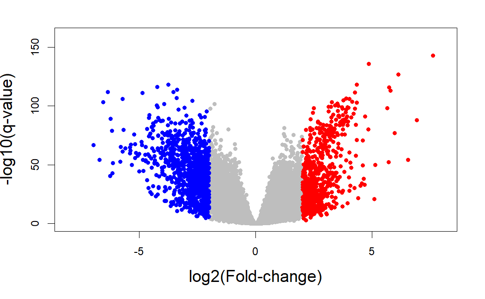
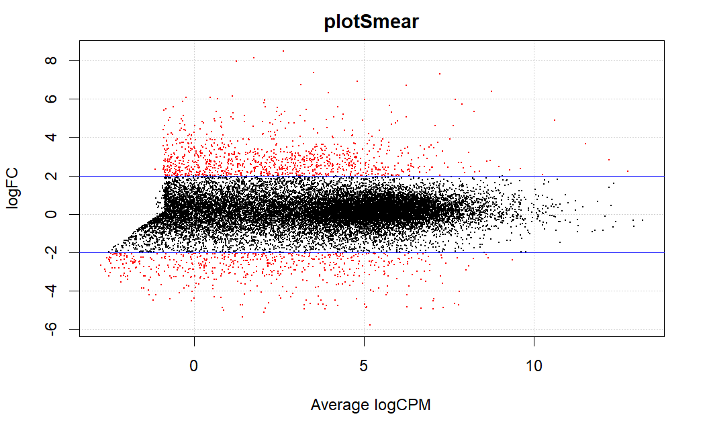

```{r setup, include=FALSE}
```

# Loading

The GDC harmonizes RNA-Seq data by aligning raw RNA reads to the GRCh38 reference genome build and calculating gene expression levels with standardized protocols. We downloaded data of category `Transcriptome Profiling` and type `Gene Expression Quantification` where the experimental strategy is `RNA-Seq` and the workflow type is `STAR - Counts`; and saved the `RangedSummarizedExperiment` object in an `.RData` file named `RNA.rda`.

```{r}
load("data/raw/RNA-Seq/RNA.rda")
```

There are 3 functions that allow us to access the most important data present in `rna`: `colData()`, to access the clinical data; `rowRanges()`, to access information about the genes; and `assay`, for the raw counts.

```{r}
library(TCGAbiolinks)
library(SummarizedExperiment)

rna.raw.counts <- as.data.frame(assay(rna))
rna.genes.info <- as.data.frame(rowRanges(rna))
rna.sample.info <- as.data.frame(colData(rna))
```

As mentioned, if we want to access the clinical data, we can use the object created with `colData`:

```{r}
colnames(rna.sample.info)
```

Let's look at some potentially interesting clinical variables.

```{r}
table(rna.sample.info$vital_status)
table(rna.sample.info$ajcc_pathologic_stage)
table(rna.sample.info$days_to_death)
```

One question we might ask ourselves is which was the tissue type that was measured: primary tumor or solid tissue.

```{r}
summary(factor(rna$sample_type))
```

There are **76 controls** (`Solid Tissue Normal`) (note: these controls are not healthy individuals, but normal tissue coming from those same cancer patients) and **781 cancer samples** (`Primary Tumor`).

We'll delete those features that are constant, redundant or that have no clinical relevance.

```{r}
names_toremove <- c("barcode", "patient", "sample", "sample_submitter_id", "sample_id", "sample_type_id", "state", "pathology_report_uuid", "submitter_id", "oct_embedded", "is_ffpe", "tissue_type", "synchronous_malignancy", "treatments", "last_known_disease_status", "tissue_or_organ_of_origin", "ajcc_staging_system_edition", "classification_of_tumor", "diagnosis_id", "site_of_resection_or_biopsy", "tumor_grade", "progression_or_recurrence", "alcohol_history", "exposure_id", "demographic_id", "bcr_patient_barcode", "primary_site", "project_id", "disease_type", "name", "releasable", "released", "preservation_method", "days_to_sample_procurement", "paper_patient", "paper_Tumor.Type", "paper_Included_in_previous_marker_papers", "paper_vital_status", "paper_days_to_birth", "paper_days_to_death", "paper_days_to_last_followup", "paper_age_at_initial_pathologic_diagnosis", "paper_Tumor_Grade", "paper_MSI_status", "paper_HPV_Status", "paper_tobacco_smoking_history", "paper_CNV Clusters", "paper_Mutation Clusters", "paper_DNA.Methylation Clusters", "paper_mRNA Clusters", "paper_miRNA Clusters", "paper_lncRNA Clusters", "paper_Protein Clusters", "paper_PARADIGM Clusters", "paper_Pan-Gyn Clusters")
names_toremain <- names(colData(rna))
names_toremain <- setdiff(names_toremain, names_toremove)
colData(rna) <- colData(rna)[, names_toremain]
rna.sample.info <- as.data.frame(colData(rna))

# load again because we changed the colnames earlier
load("data/raw/RNA-Seq/RNA.rda")
```

We were able to trim down our data from 85 to **30 clinical variables**.

```{r, eval=FALSE}
head(rna.sample.info)
```

We can now load our RNA-Seq count matrix. We have 60,660 genes in rows and 857 samples in columns.

```{r}
head(rna.raw.counts[, 1:5])
dim(rna.raw.counts)
```

We can also see the gene names associated with the Ensembl IDs in the count matrix.

```{r}
head(rna.genes.info)
```

RNA-Seq reads were aligned to the genome with STAR (Spliced Transcripts Alignment to a Reference), a fast RNA-Seq read mapper with support for splice-junction and fusion read detection. For [more information on the pipeline used for mRNA counts generation](https://docs.gdc.cancer.gov/Data/Bioinformatics_Pipelines/Expression_mRNA_Pipeline/){.url}.

Note: our `rna.raw.counts` matrix contains **unnormalized, unstranded raw counts**. The `rna` object has these raw `unstranded` counts, as well as `stranded_first` and `stranded_second`, and `tpm_unstranded`, `fpkm_unstranded` and `fpkm_uq_unstranded` normalized counts.


Before performing differential expression analysis, we should preprocess the raw counts by filtering out low expression counts (and checking for experimental bias, like batch effect). We also need to perform normalization, as it's likely that counts will vary depending on their length and/or GC content, removing noise inherent to the experimental technique.

# Filtering

We already have our expression data in `rna.raw.counts`, but we still have to define our factors as `condition`, `tss`, `plate`, `portion`and `sample`, which we can easily extract with the `TCGAbiolinks` function `get_IDs`.

```{r}
library(NOISeq)
library(TCGAbiolinks)
barcodes <- get_IDs(rna)
myfactors <- data.frame(barcodes$tss, barcodes$portion, barcodes$plate, barcodes$condition)
head(myfactors)
```

And we'll need additional biological information, such as feature length, GC content, gene type and chromosome number, which we can get through the Ensembl BioMart online interface (I tried to get them with `getGeneLengthAndGCContent` from `EDASeq`, but it kept timing out). I had to get rid of version numbers from the Ensembl gene IDs, since otherwise I'd get information about fewer genes.

```{r, eval=FALSE}
# the list used as input for BioMart
ids <- sub('\\.[0-9]*$', '', rna.genes.info$gene_id) # need to remove final digits after the dot (version numbers)
write.table(ids, file = "results/preprocessing/cookingRNASeq/genes.IDs.csv", row.names = FALSE, col.names = FALSE, quote = FALSE)
```

As a rough estimate of gene length, we can use the overlap of all exons given by `rna.genes.info` as `width`. The same object gives us `gene_type` and `seq.names` (chromosome number), so we only need to download GC content from BioMart.

```{r}
GCcontent <- read.csv("results/preprocessing/cookingRNASeq/genes.biomart.txt", sep = "\t")
length(GCcontent$Gene...GC.content) # we had 60660 genes but only have GC content info for 60513 of them, thus losing 147 genes
colnames(GCcontent) <- c("gene_id", "gc_content") # rename headers so we can merge

# problem: we have different versions so we need to merge by ID only
# so we create a new column in rna.genes.info with the gene ID without version number, and we do the same in GCcontent

rna.genes.info$gene_id_no_version <- sub('\\.[0-9]*$', '', rna.genes.info$gene_id)
GCcontent$gene_id_no_version <- sub('\\.[0-9]*$', '', GCcontent$gene_id)

# complete rna.genes.info with GC content
rna.genes.info <- merge(rna.genes.info, GCcontent, by = "gene_id_no_version") # merging turns gene_id into gene_id.x and the gene_id from GCcontent into gene_id.y, so we need to remove those

rna.genes.info$gene_id <- rna.genes.info$gene_id.x
rna.genes.info$gene_id.x <- NULL
rna.genes.info$gene_id.y <- NULL

mygc = c(rna.genes.info$gc_content)
names(mygc) = rna.genes.info$gene_id

mylength = c(rna.genes.info$width)
names(mylength) = rna.genes.info$gene_id

mybiotypes = c(rna.genes.info$gene_type)
names(mybiotypes) = rna.genes.info$gene_id

mychroms = data.frame(rna.genes.info$seqnames, rna.genes.info$start, rna.genes.info$end)
rownames(mychroms) = rna.genes.info$gene_id
colnames(mychroms) <- c("Chr", "GeneStart", "GeneEnd")

head(mygc)
head(mylength)
head(mybiotypes)
head(mychroms)
```

Once we have created the count data matrix, the data.frame for the factors and the 4 biological annotation objects, we have to pack all this information into a `NOISeq` object by using the `readData` function.

```{r}
mydata <- NOISeq::readData(data = rna.raw.counts, factors = myfactors, length = mylength, gc = mygc, biotype = mybiotypes, chromosome = mychroms)

myfirst50data <- NOISeq::readData(data = rna.raw.counts[, 1:50], factors = myfactors[1:50, ], length = mylength[1:50], gc = mygc[1:50], biotype = mybiotypes[1:50], chromosome = mychroms[1:50, ]) # for plots and tests that require a smaller sample size
```

Genes with very low counts in all samples provide little evidence for differential expression. Often samples have many genes with zero or very low counts. Testing for differential expression for many genes simultaneously adds to the multiple testing burden, reducing the power to detect DE genes. IT IS VERY IMPORTANT to filter out genes that have all zero counts or very low counts. We filter using CPM values rather than counts because they account for differences in sequencing depth between samples.

Excluding features with low counts improves differential expression results since the noise in the data is reduced. `NOISeq` includes three methods to filter out these low count features: CPM, WIlcoxon test and proportion test. We'll try the first two.

But first, we'll explore the raw counts a bit to later help us choose a filtering method.

```{r}
boxplot(log10(rna.raw.counts[, 1:50])+1, outline = FALSE, las = 2)
```


```{r, eval = FALSE}
mybiodetection <- dat(mydata, k = 0, type = "biodetection", factor = NULL)
par(mfrow = c(1,2))
explo.plot(mybiodetection, samples = c(1, 2), toplot = "protein_coding", plottype = "comparison")
```


```{r, eval = FALSE}
[1] "Percentage of protein_coding biotype in each sample:"
TCGA-E2-A1L7-01A-11R-A144-07 
                     53.5015 
TCGA-E2-A1L7-11A-33R-A144-07 
                     51.4557 
[1] "Confidence interval at 95% for the difference of percentages: TCGA-E2-A1L7-01A-11R-A144-07 - TCGA-E2-A1L7-11A-33R-A144-07"
[1] 1.4823 2.6094
[1] "The percentage of this biotype is significantly DIFFERENT for these two samples (p-value = 1.012e-12 )."
```

How shall we choose a CPM threshold? The sensitivity plot can help us. We can see that most features have between 0 and 1 CPM for these first 50 samples, so the threshold should be between 0.2 and 1, roughly speaking.

```{r, eval = FALSE}
mycountsbio = dat(myfirst50data, factor = NULL, type = "countsbio")
explo.plot(mycountsbio, toplot = 1, samples = NULL, plottype = "barplot")
```


It can also help to visualize the log2(cpm) as histogram and density plots. In them we see a bimodal distribution that can be split with a filtering threshold of \~0.5. As a general rule, a good threshold can be chosen by identifying the CPM that corresponds to a count of 10. Our minimum library size is 19 millions, whereas median and mean are 57 millions and maximum is 114 million counts. An acceptable threshold would be between 10/19 = 0.52 and 10/57 = 0.18, so we will try 0.2, 0.5 and 1 as possible CPM thresholds.

```{r}
library(SummarizedExperiment)
library(edgeR)
library(limma)
library(ggplot2)

mean_log_cpm <- aveLogCPM(rna.raw.counts)

filter_threshold <- log2(0.5)

ggplot() + aes(x=mean_log_cpm) +
    geom_histogram(binwidth=0.2) +
    geom_vline(xintercept=filter_threshold) +
    ggtitle("Histogram of logCPM before filtering")

ggplot() + aes(x=mean_log_cpm) +
    geom_density() +
    geom_vline(xintercept=filter_threshold) +
    ggtitle("Density plot of logCPM before filtering") +
    xlim(-6.1, 13.5)

summary(colSums(rna.raw.counts))
```

So let's try CPM filtering with a `CPM threshold = 0.2, 0.5 and 1` and a `cv.cutoff = 500`, so that we remove those features with low expression (but not with low variability). We will also apply Wilcoxon test filtering and compare the results.

```{r, eval=FALSE}
myfiltCPM02 <- filtered.data(rna.raw.counts, factor = myfactors$barcodes.condition, norm = FALSE, depth = NULL, method = 1, cv.cutoff = 500, cpm = 0.2, p.adj = "fdr") # 22797 features (37%) are to be kept for differential expression analysis with filtering method 1

myfiltCPM05 <- filtered.data(rna.raw.counts, factor = myfactors$barcodes.condition, norm = FALSE, depth = NULL, method = 1, cv.cutoff = 500, cpm = 0.5, p.adj = "fdr") # 19350 features (32%) are to be kept for differential expression analysis with filtering method 1

myfiltCPM1 <- filtered.data(rna.raw.counts, factor = myfactors$barcodes.condition, norm = FALSE, depth = NULL, method = 1, cv.cutoff = 500, cpm = 1, p.adj = "fdr") # 17276 features (28.5%) are to be kept for differential expression analysis with filtering method 1

myfiltWilcoxon <- filtered.data(rna.raw.counts, factor = myfactors$barcodes.condition, norm = FALSE, depth = NULL, method = 2, p.adj = "fdr") # 56401 (93%) features are to be kept for differential expression analysis with filtering method 2

boxplot(log10(myfiltCPM02[, 1:50])+1, outline = FALSE, las = 2)
boxplot(log10(myfiltCPM05[, 1:50])+1, outline = FALSE, las = 2)
boxplot(log10(myfiltCPM1[, 1:50])+1, outline = FALSE, las = 2)
boxplot(log10(myfiltWilcoxon[, 1:50])+1, outline = FALSE, las = 2)
```


What kind of features are these methods filtering out?

```{r, eval=FALSE}
myCPMdata02 <- NOISeq::readData(data = myfiltCPM02, factors = myfactors, length = mylength, gc = mygc, biotype = mybiotypes, chromosome = mychroms)

myCPMdata05 <- NOISeq::readData(data = myfiltCPM05, factors = myfactors, length = mylength, gc = mygc, biotype = mybiotypes, chromosome = mychroms)

myCPMdata1 <- NOISeq::readData(data = myfiltCPM1, factors = myfactors, length = mylength, gc = mygc, biotype = mybiotypes, chromosome = mychroms)

myWilcoxondata <- NOISeq::readData(data = myfiltWilcoxon, factors = myfactors, length = mylength, gc = mygc, biotype = mybiotypes, chromosome = mychroms)

mybiodetectionCPM02 <- dat(myCPMdata02, k = 0, type = "biodetection", factor = NULL)
par(mfrow = c(1,2))
explo.plot(mybiodetectionCPM02, samples = c(1, 2), toplot = "protein_coding", plottype = "comparison")

mybiodetectionCPM05 <- dat(myCPMdata05, k = 0, type = "biodetection", factor = NULL)
par(mfrow = c(1,2))
explo.plot(mybiodetectionCPM05, samples = c(1, 2), toplot = "protein_coding", plottype = "comparison")

mybiodetectionCPM1 <- dat(myCPMdata1, k = 0, type = "biodetection", factor = NULL)
par(mfrow = c(1,2))
explo.plot(mybiodetectionCPM1, samples = c(1, 2), toplot = "protein_coding", plottype = "comparison")

mybiodetectionWilcoxon <- dat(myWilcoxondata, k = 0, type = "biodetection", factor = NULL)
par(mfrow = c(1,2))
explo.plot(mybiodetectionWilcoxon, samples = c(1, 2), toplot = "protein_coding", plottype = "comparison")

sum(mydata@featureData@data$Biotype=="protein_coding", na.rm=TRUE) # 19916 protein coding genes
sum(myCPMdata02@featureData@data$Biotype=="protein_coding", na.rm=TRUE) # 16021 protein coding genes
sum(myCPMdata05@featureData@data$Biotype=="protein_coding", na.rm=TRUE) # 15434 protein coding genes
sum(myCPMdata1@featureData@data$Biotype=="protein_coding", na.rm=TRUE) # 14772 protein coding genes
sum(myWilcoxondata@featureData@data$Biotype=="protein_coding", na.rm=TRUE) # 19391 protein coding genes
```


Method 2 (Wilcoxon test) barely does any filtering at all, so we'll stick to method 1 (CPM). Given the amount of protein coding features we are left with with all the different thresholds, we'll choose a CPM threshold of 0.5 and will be left with only 32% of the original features. This makes sense, as the prefiltered raw counts had a large number of long non-coding RNAs and pseudogenes (which tend to have low expression in an organism) that were removed with the CPM filtering, enriching the counts in protein coding genes (going from \~70% to 85% of total biotypes).

Let's prep our data once again, this time with our filtered data!

```{r, eval=FALSE}
# delete unnecessary objects
rm(mybiodetection, mybiodetectionCPM02, mybiodetectionCPM05, mybiodetectionCPM1, mybiodetectionWilcoxon, myCPMdata02, myCPMdata05, myCPMdata1, mydata, myfiltCPM02, myfiltCPM1, myfiltWilcoxon, myfirst50data, myWilcoxondata, mean_log_cpm, filter_threshold)

rna.filt.counts <- myfiltCPM05
rm(myfiltCPM05)

save(rna.filt.counts, file = "data/cooked/RNA-Seq/RNA.filt.rda")
```

```{r}
load("data/cooked/RNA-Seq/RNA.filt.rda")

myexpdata.filt <- NOISeq::readData(data = rna.filt.counts, factors = myfactors, length = mylength, gc = mygc, biotype = mybiotypes, chromosome = mychroms)
```


# Exploring

What type of normalization should we use? In order to help us make a decision, we will try to see if there are any length and/or GC content biases that have to be corrected for.

## Length bias

This plot describes the relationship between the feature length and the expression values.

```{r}
myexplengthbias.filt = dat(myexpdata.filt, factor = "barcodes.condition", type = "lengthbias")
explo.plot(myexplengthbias.filt, samples = NULL, toplot = "global")
```

Since the p-values are significant (even though R^2^ coefficients aren't higher than 95%) and we can see in the graph that mean expression varies depending on feature length, we can conclude that the expression depends on the feature length and as such, a length-based normalization is required.

## GC content bias

This plot describes the relationship between the feature GC content and the expression values.

```{r}
myexpGCbias.filt = dat(myexpdata.filt, factor = "barcodes.condition", type = "GCbias")
explo.plot(myexpGCbias.filt, samples = NULL, toplot = "global")
```

Although the p-values are significant, R² values are not high enough for us to be able to confidently say there exists a GC content bias. However, we will try a GC-content normalization as well, to try to remove this potential bias.

## RNA composition

When two samples have different RNA composition, the distribution of sequencing reads across the features is different in such a way that although a feature had the same number of read counts in both samples, it would not mean that it was equally expressed in both.

```{r, eval = FALSE}
myexpcd = dat(myexpdata.filt, type = "cd", norm = FALSE, refColumn = 1)
# "Diagnostic test: FAILED. Normalization is required to correct this bias."
```

Since the test failed (median deviations of the samples with regard to the reference sample are statistically significant) this means that a normalization procedure should be used to correct this effect and make the samples comparable before computing differential expression.

## PCA exploration

Are any of our factors producing some kind of batch effect?

```{r}
# PCAs with NOISeq
myexpPCA = dat(myexpdata.filt, type = "PCA")
par(cex = 0.75)
explo.plot(myexpPCA, factor = "barcodes.condition", plottype = "scores")
explo.plot(myexpPCA, factor = "barcodes.condition", plottype = "loadings")
explo.plot(myexpPCA, factor = "barcodes.condition")
explo.plot(myexpPCA, factor = "barcodes.tss")
explo.plot(myexpPCA, factor = "barcodes.portion")
explo.plot(myexpPCA, factor = "barcodes.plate")
```

We can appreciate in these plots that **none of the factors (TSS, portion, plate) seem to be contributing towards batch effect** in our RNA-Seq data, but we shall repeat these plots once our data is normalized.

# Normalizing

## cqn

Prepare gene information for filtered data: GC content and length.

```{r}
load("data/cooked/RNA-Seq/RNA.filt.rda")
library(cqn)

# GeneLengthAndGCContent <- getGeneLengthAndGCContent(sub('\\.[0-9]*$', '', rownames(rna.filt.counts)), "hsa")

# we need to delete the genes for which we have no information, after trying to download it using organism-based annotation packages from Bioconductor instead of the biomart package

# get missing information
# valores_NA <- GeneLengthAndGCContent[rowSums(is.na(GeneLengthAndGCContent)) > 0, ]
# NA_GeneLengthAndGCContent <- getGeneLengthAndGCContent(sub('\\.[0-9]*$', '', rownames(valores_NA)), "hsa", mode = "org.db")
# assembly: TxDb.Hsapiens.UCSC.hg38.knownGene
# genome assembly: BSgenome.Hsapiens.UCSC.hg38
# notna <- na.omit(NA_GeneLengthAndGCContent)

# replace 5 newly found genes :)
# GeneLengthAndGCContent[match(rownames(notna), rownames(GeneLengthAndGCContent)), ] <- notna
# valores_NA <- GeneLengthAndGCContent[rowSums(is.na(GeneLengthAndGCContent)) > 0, ]

# delete 32 missing genes :(
# GeneLengthAndGCContent <- GeneLengthAndGCContent[-(match(rownames(valores_NA), rownames(GeneLengthAndGCContent))), ]

# save information
# gc.length.rna <- GeneLengthAndGCContent 
# save(GeneLengthAndGCContent, file = "results/preprocessing/cookingRNASeq/GC.length.RNA.rda)

# also need to delete 32 missing genes from filtered counts
# rna.filt.counts <- rna.filt.counts[-match(rownames(valores_NA), sub('\\.[0-9]*$', '', rownames(rna.filt.counts))), ]

# and save those filtered complete counts
# save(rna.filt.counts, file = "data/cooked/RNA-Seq/RNA.filt.rda")

# load("results/preprocessing/cookingRNASeq/GC.length.RNA.rda")
```

Run normalization function. `cqn` requires an input of gene length, GC content and the estimated library size per sample (which it will estimate as the total sum of the counts if not provided by the user).

The hand off between the two packages is to use `DESeq2` with the original counts and to supply the offset matrix calculated by `cqn` as a `normalizationFactor` for the `dds` object.

```{r, eval = FALSE}
load("data/cooked/RNA-Seq/RNA.filt.rda")
library(cqn)

sizeFactors.rna <- colSums(rna.filt.counts)

load("results/preprocessing/cookingRNASeq/GC.length.RNA.rda")
gc.length.rna <- as.data.frame(gc.length.rna)

rna.cqn.norm <- cqn(rna.filt.counts, lengths = gc.length.rna$length, x = gc.length.rna$gc, sizeFactors = sizeFactors.rna, verbose = TRUE)

save(rna.cqn.norm, file = "reports/preprocessing/files/cookingRNASeq/RNA.cqn.norm.rda")

rna.cqn.norm

# Extract the offset, which will be input directly into DEseq2 to normalise the counts
cqnOffset <- rna.cqn.norm$glm.offset
cqnNormFactors <- exp(cqnOffset)
save(cqnNormFactors, file = "reports/preprocessing/files/cookingRNASeq/RNA.cqn.normFactors.rda")

# Extract normalized data to check for bias on NOISeq
rna.cqn.norm.expression <- rna.cqn.norm$y + rna.cqn.norm$offset
rna.cqn.norm.expression <- as.data.frame(rna.cqn.norm.expression)
```

Did `cqn` normalization reduce our gene length and GC content biases?

```{r}
load("reports/preprocessing/files/cookingRNASeq/RNA.cqn.norm.rda")
rna.cqn.norm.expression <- rna.cqn.norm$y + rna.cqn.norm$offset
rna.cqn.norm.expression <- as.data.frame(rna.cqn.norm.expression)

# need to prep gene information format
load("results/preprocessing/cookingRNASeq/GC.length.RNA.rda")
gc.length.rna <- as.data.frame(gc.length.rna)
mylength.norm <- as.integer(c(gc.length.rna$length))
names(mylength.norm) <- rownames(gc.length.rna)

mygc.norm <- c(gc.length.rna$gc)
names(mygc.norm) <- rownames(gc.length.rna)
  
mybiotypes.norm <- mybiotypes[match(rownames(gc.length.rna), sub('\\.[0-9]*$', '', names(mybiotypes)))]
mybiotypes.norm <- as.vector(mybiotypes.norm)
  
mychroms.norm <- mychroms[match(rownames(gc.length.rna), sub('\\.[0-9]*$', '', rownames(mychroms))), ]
rownames(mychroms.norm) <- sub('\\.[0-9]*$', '', rownames(mychroms.norm))

barcodes <- get_IDs(rna)
barcodes$condition <- as.factor(barcodes$condition)
barcodes$condition <- relevel(barcodes$condition, ref = "normal")
myfactors <- data.frame(barcodes$tss, barcodes$portion, barcodes$plate, barcodes$condition)

# need to drop the version number of the ENSEMBL IDs because there aren't any in the GC and length information
rownames(rna.cqn.norm.expression) <- sub('\\.[0-9]*$', '', rownames(rna.cqn.norm.expression))

myexpdata.norm <- NOISeq::readData(data = rna.cqn.norm.expression, factors = myfactors, length = mylength.norm, gc = mygc.norm, biotype = mybiotypes.norm, chromosome = mychroms.norm)

myexplengthbias.norm = dat(myexpdata.norm, factor = "barcodes.condition", type = "lengthbias")
explo.plot(myexplengthbias.norm, samples = NULL, toplot = "global")

myexpGCbias.norm = dat(myexpdata.norm, factor = "barcodes.condition", type = "GCbias")
explo.plot(myexpGCbias.norm, samples = NULL, toplot = "global")
```

GC content and length biases have significantly improved, to the point where it's almost gone. What about PCAs? Is there such good separation between tumor and control samples still?

```{r}
myexpPCA.norm = dat(myexpdata.norm, type = "PCA", norm = TRUE, logtransf = TRUE)
par(cex = 0.75)
explo.plot(myexpPCA.norm, factor = "barcodes.condition", plottype = "scores")
explo.plot(myexpPCA.norm, factor = "barcodes.condition", plottype = "loadings")

boxplot(rna.cqn.norm.expression[, 1:50], outline = FALSE, las = 2)
```

We can also assess the effect of normalization with some in-built `cqn` functions.

```{r, eval = FALSE}
library(ggplot2)
# we can compare the fold changes of this normalized data and standard RPKM
# first we compute standard RPKM on a log2 scale
RPM <- sweep(log2(rna.filt.counts + 1), 2, log2(sizeFactors.rna/10^6))
RPKM.std <- sweep(RPM, 1, log2(gc.length.rna$length / 10^3))

whGenes <- which(rowMeans(RPKM.std) >= 2 & gc.length.rna$length >= 100)
M.std <- rowMeans(RPKM.std[whGenes, which(barcodes$condition == "cancer")]) - rowMeans(RPKM.std[whGenes, which(barcodes$condition == "normal")])
A.std <- rowMeans(RPKM.std[whGenes,])
M.cqn <- rowMeans(rna.cqn.norm.expression[whGenes, which(barcodes$condition == "cancer")]) - rowMeans(rna.cqn.norm.expression[whGenes, which(barcodes$condition == "normal")])
A.cqn <- rowMeans(rna.cqn.norm.expression[whGenes,])

par(mfrow = c(1,2))
plot(A.std, M.std, cex = 0.5, pch = 16, xlab = "A", ylab = "M", 
     main = "Standard RPKM", ylim = c(-4,4), xlim = c(0,12), 
     col = alpha("black", 0.25))
plot(A.cqn, M.cqn, cex = 0.5, pch = 16, xlab = "A", ylab = "M", 
     main = "CQN normalized RPKM", ylim = c(-4,4), xlim = c(0,12), 
     col = alpha("black", 0.25))

# We can plot the effect of GC and length
par(mfrow=c(1,2))
cqnplot(rna.cqn.norm, n = 1, xlab = "GC content", lty = 1, ylim = c(1,7))
cqnplot(rna.cqn.norm, n = 2, xlab = "length", lty = 1, ylim = c(1,7))
```


## EDASeq

We'll also try normalizing with `EDASeq`. Following (Risso et al. 2011), we consider two main types of effects on gene-level counts: (1) within-lane gene-specific (and possibly lane-specific) effects, e.g., related to gene length or GC-content, and (2) effects related to between-lane distributional differences, e.g., sequencing depth. Accordingly, `withinLaneNormalization` and `betweenLaneNormalization` adjust for the first and second type of effects, respectively. We recommend to normalize for within-lane effects prior to between-lane normalization.

The `EDASeq` package provides the `SeqExpressionSet` class to store gene counts, (lane-level) information on the sequenced libraries, and (gene-level) feature information. We use the data frame met created in Section secRead for the lane-level data. As for the feature data, we use gene length and GC-content.

Since `EDASeq` can't normalize for both GC content and length in one go, we'll try several configurations: (1) full GC, (2) full GC then length, and (3) full length then GC.

```{r, eval = FALSE}
library(EDASeq)

# need to drop the version number of the ENSEMBL IDs because there aren't any in the GC and length information
rownames(rna.filt.counts) <- sub('\\.[0-9]*$', '', rownames(rna.filt.counts))

feature <- data.frame(gc=mygc.norm,length=mylength.norm)
data <- newSeqExpressionSet(counts=as.matrix(rna.filt.counts),
                            featureData=feature,
                            phenoData=data.frame(
                              conditions=barcodes$condition,
                              row.names=barcodes$barcode))

rna.eda.norm.gc <- withinLaneNormalization(data,"gc", which="full")
rna.eda.norm.gc <- betweenLaneNormalization(rna.eda.norm.gc, which="full")

rna.eda.norm.gc.length <- withinLaneNormalization(data, "gc", which="full")
rna.eda.norm.gc.length <- withinLaneNormalization(rna.eda.norm.gc.length, "length", which="full")
rna.eda.norm.gc.length <- betweenLaneNormalization(rna.eda.norm.gc.length, which="full")

rna.eda.norm.length.gc <- withinLaneNormalization(data, "length", which="full")
rna.eda.norm.length.gc <- withinLaneNormalization(rna.eda.norm.length.gc, "gc", which="full")
rna.eda.norm.length.gc <- betweenLaneNormalization(rna.eda.norm.length.gc, which="full")

save(rna.eda.norm.gc, file = "reports/preprocessing/files/cookingRNASeq/RNA.eda.GC.norm.rda")

save(rna.eda.norm.gc.length, file = "reports/preprocessing/files/cookingRNASeq/RNA.eda.GC.length.norm.rda")

save(rna.eda.norm.length.gc, file = "reports/preprocessing/files/cookingRNASeq/RNA.eda.length.GC.norm.rda")
```

Did `EDASeq` normalization reduce our gene length and GC content biases?

```{r}
load("reports/preprocessing/files/cookingRNASeq/RNA.eda.GC.norm.rda")
load("reports/preprocessing/files/cookingRNASeq/RNA.eda.GC.length.norm.rda")
load("reports/preprocessing/files/cookingRNASeq/RNA.eda.length.GC.norm.rda")

# Extract normalized counts to check for bias on NOISeq
rna.eda.counts.gc <- rna.eda.norm.gc@assayData$normalizedCounts
rna.eda.counts.gc <- as.data.frame(rna.eda.counts.gc)

rna.eda.counts.gc.length <- rna.eda.norm.gc.length@assayData$normalizedCounts
rna.eda.counts.gc.length <- as.data.frame(rna.eda.counts.gc.length)

rna.eda.counts.length.gc <- rna.eda.norm.length.gc@assayData$normalizedCounts
rna.eda.counts.length.gc <- as.data.frame(rna.eda.counts.length.gc)

library(NOISeq)

myexpdata.norm.eda.gc <- NOISeq::readData(data = rna.eda.counts.gc, factors = myfactors, length = mylength.norm, gc = mygc.norm)

myexpdata.norm.eda.gc.length <- NOISeq::readData(data = rna.eda.counts.gc.length, factors = myfactors, length = mylength.norm, gc = mygc.norm)

myexpdata.norm.eda.length.gc <- NOISeq::readData(data = rna.eda.counts.length.gc, factors = myfactors, length = mylength.norm, gc = mygc.norm)

myexplengthbias.norm.eda.gc = dat(myexpdata.norm.eda.gc, factor = "barcodes.condition", type = "lengthbias")
explo.plot(myexplengthbias.norm.eda.gc, samples = NULL, toplot = "global")

myexplengthbias.norm.eda.gc.length = dat(myexpdata.norm.eda.gc.length, factor = "barcodes.condition", type = "lengthbias")
explo.plot(myexplengthbias.norm.eda.gc.length, samples = NULL, toplot = "global")

myexplengthbias.norm.eda.length.gc = dat(myexpdata.norm.eda.length.gc, factor = "barcodes.condition", type = "lengthbias")
explo.plot(myexplengthbias.norm.eda.length.gc, samples = NULL, toplot = "global")

myexpGCbias.norm.eda.gc = dat(myexpdata.norm.eda.gc, factor = "barcodes.condition", type = "GCbias")
explo.plot(myexpGCbias.norm.eda.gc, samples = NULL, toplot = "global")

myexpGCbias.norm.eda.gc.length = dat(myexpdata.norm.eda.gc.length, factor = "barcodes.condition", type = "GCbias")
explo.plot(myexpGCbias.norm.eda.gc.length, samples = NULL, toplot = "global")

myexpGCbias.norm.eda.length.gc = dat(myexpdata.norm.eda.length.gc, factor = "barcodes.condition", type = "GCbias")
explo.plot(myexpGCbias.norm.eda.length.gc, samples = NULL, toplot = "global")
```

Length then GC normalization has the same effect as only GC normalization, leading me to think it's not
applying it properly. The third option (length then GC normalization) is actually increasing length bias, so that one is out of the question. The second option (GC then length normalization) is the most interesting out of the three, but `cqn` does a better job for GC bias (while being pretty comparable on length bias), so we'll normalize our filtered RNA-Seq counts with `cqn` instead of with `EDASeq`.

What about PCAs? Is there such good separation between tumor and control samples still?

```{r}
myexpPCA.norm.eda.gc = dat(myexpdata.norm.eda.gc, type = "PCA", norm = TRUE, logtransf = FALSE)
par(cex = 0.75)
explo.plot(myexpPCA.norm.eda.gc, factor = "barcodes.condition", plottype = "scores")
explo.plot(myexpPCA.norm.eda.gc, factor = "barcodes.condition", plottype = "loadings")

boxplot(log10(rna.eda.counts.gc.length[, 1:50])+1, outline = FALSE, las = 2)

myexpPCA.norm.eda.gc.length = dat(myexpdata.norm.eda.gc.length, type = "PCA", norm = TRUE, logtransf = FALSE)
par(cex = 0.75)
explo.plot(myexpPCA.norm.eda.gc.length, factor = "barcodes.condition", plottype = "scores")
explo.plot(myexpPCA.norm.eda.gc.length, factor = "barcodes.condition", plottype = "loadings")

boxplot(log10(rna.eda.counts.length.gc[, 1:50])+1, outline = FALSE, las = 2)

myexpPCA.norm.eda.length.gc = dat(myexpdata.norm.eda.length.gc, type = "PCA", norm = TRUE, logtransf = FALSE)
par(cex = 0.75)
explo.plot(myexpPCA.norm.eda.length.gc, factor = "barcodes.condition", plottype = "scores")
explo.plot(myexpPCA.norm.eda.length.gc, factor = "barcodes.condition", plottype = "loadings")

boxplot(log10(rna.eda.counts.length.gc[, 1:50])+1, outline = FALSE, las = 2)
```

# Analyzing differential expression

For all, I'll select DEGs as those genes with a q.value/p.adj/FDR less than 0.05; and with a logFoldChange bigger than 2. Standard is logFC of 1, but we are being more restrictive because of the large amount of data we'll be working with.

## DESeq2

First we create a `DESeqDataSet` object.

```{r, eval = FALSE}
library(DESeq2)
library(TCGAbiolinks)

load("data/cooked/RNA-Seq/RNA.filt.rda")

barcodes <- get_IDs(rna)
myfactors <- data.frame(barcodes$tss, barcodes$portion, barcodes$plate, barcodes$condition)
rna.sample.info <- cbind(rna.sample.info, myfactors)

dds <- DESeqDataSetFromMatrix(countData = rna.filt.counts,
                              colData = rna.sample.info,
                              design = ~ barcodes.condition)

dds$barcodes.condition <- relevel(dds$barcodes.condition, ref = "normal")
```

We generate the normalization factor matrices.

```{r, eval = FALSE}
load("data/cooked/RNA-Seq/RNA.normFactors.rda")
# Before inputing normalizationFactors into DESeq2, you should divide out the geometric mean
normFactors <- normFactors / exp(rowMeans(log(normFactors)))
normalizationFactors(dds) <- normFactors
# This is so that mean(counts(dds, normalized=TRUE)[gene,]) is roughly on the same scale as mean(counts(dds)[gene,])
```

And get the results. Calling results without any arguments will extract the estimated log2 fold changes and p-values for the last variable in the design formula. alpha: the significance cutoff used for optimizing the independent filtering (by default 0.1). If the adjusted p-value cutoff (FDR) will be a value other than 0.1, alpha should be set to that value.

```{r, eval = FALSE}
dds <- DESeq(dds)
resultsNames(dds) # lists the coefficients
# [1] "Intercept"                          
# [2] "barcodes.condition_cancer_vs_normal"
res <- results(dds, alpha = 0.05)
summary(res)
```

```{r, eval = FALSE}
out of 19318 with nonzero total read count
adjusted p-value < 0.05
LFC > 0 (up)       : 10159, 53%
LFC < 0 (down)     : 5353, 28%
outliers [1]       : 0, 0%
low counts [2]     : 0, 0%
(mean count < 3)
```

We'll select as significant those genes with a p.adj < 0.05 and a lFC > 2 or lFC < -2. We get a total of 1148 upregulated DEGs (a 6% of the filtered genes) in cancer samples, compared to normal ones; and 670 downregulated DEGs (a 3.5% of the filtered genes), from a total of 19318 filtered genes (originally 60660 genes in our raw data).

```{r, eval = FALSE}
log.fold.change <- res$log2FoldChange
q.value <- res$padj
genes.ids <- rownames(rna.filt.counts)
names(log.fold.change) <- genes.ids
names(q.value) <- genes.ids
activated.genes.deseq2 <- genes.ids[log.fold.change > 2 & q.value < 0.05]
activated.genes.deseq2 <- activated.genes.deseq2[!is.na(activated.genes.deseq2)]
repressed.genes.deseq2 <- genes.ids[log.fold.change < - 2 & q.value < 0.05]
repressed.genes.deseq2 <- repressed.genes.deseq2[!is.na(repressed.genes.deseq2)]
length(activated.genes.deseq2) # 1148
length(repressed.genes.deseq2) # 670

log.q.val <- -log10(q.value)
plot(log.fold.change,log.q.val,pch=19,col="grey",cex=0.8,
xlim=c(-8,8),ylim = c(0,240),
xlab="log2(Fold-change)",ylab="-log10(q-value)",cex.lab=1.5)
points(x = log.fold.change[activated.genes.deseq2],
y = log.q.val[activated.genes.deseq2],col="red",cex=0.8,pch=19)
points(x = log.fold.change[repressed.genes.deseq2],
y = log.q.val[repressed.genes.deseq2],col="blue",cex=0.8,pch=19)
```


Our results table so far only contains the Ensembl gene IDs, but alternative gene names may be more informative for interpretation. Bioconductor's annotation packages help with mapping various ID schemes to each other. We load the `AnnotationDbi` package and the annotation package `org.Hs.eg.db`. We can use the *mapIds* function to add individual columns to our results table. We provide the row names of our results table as a key, and specify that `keytype=ENSEMBL`. The `column` argument tells the *mapIds* function which information we want, and the `multiVals` argument tells the function what to do if there are multiple possible values for a single input value. Here we ask to just give us back the first one that occurs in the database. To add the gene symbol and Entrez ID, we call *mapIds* twice.

```{r, eval = FALSE}
library(AnnotationDbi)
library(org.Hs.eg.db)

ens.str <- substr(rownames(res), 1, 15)
res$symbol <- mapIds(org.Hs.eg.db,
                     keys=ens.str,
                     column="SYMBOL",
                     keytype="ENSEMBL",
                     multiVals="first")
res$entrez <- mapIds(org.Hs.eg.db,
                     keys=ens.str,
                     column="ENTREZID",
                     keytype="ENSEMBL",
                     multiVals="first")

activated.genes.deseq2 <- as.data.frame(activated.genes.deseq2)
ens.str <- substr(activated.genes.deseq2$activated.genes.deseq2, 1, 15)
activated.genes.deseq2$entrez <- mapIds(org.Hs.eg.db,
                                        keys=ens.str,
                                        column="ENTREZID",
                                        keytype="ENSEMBL",
                                        multiVals="first")
activated.genes.deseq2 <- na.omit(activated.genes.deseq2)

repressed.genes.deseq2 <- as.data.frame(repressed.genes.deseq2)
ens.str <- substr(repressed.genes.deseq2$repressed.genes.deseq2, 1, 15)
repressed.genes.deseq2$entrez <- mapIds(org.Hs.eg.db,
                                        keys=ens.str,
                                        column="ENTREZID",
                                        keytype="ENSEMBL",
                                        multiVals="first")
repressed.genes.deseq2 <- na.omit(repressed.genes.deseq2)
```

Some of the tested genes don't have an Entrez ID associated with them (whether because they've just been discovered or are hypothetical), so we'll omit those to make our life easier, leaving us with 17191 genes. Out of the 1148 activated genes we ended up with 988; and from the 670 supressed genes, we only have names for 600 of them.

We'll save both lists of DEGs (upregulated and downregulated) as well as the DEA results for all of the tested genes, ordered by adjusted p-value. All gene IDs will be Entrez to save us time in later analysis (e.g. GSEA).

```{r, eval = FALSE}
write.table(activated.genes.deseq2$entrez, file = "results/preprocessing/cookingRNASeq/DESeq2.up.txt", row.names = FALSE, col.names = FALSE, quote = FALSE)

write.table(repressed.genes.deseq2$entrez, file = "results/preprocessing/cookingRNASeq/DESeq2.down.txt", row.names = FALSE, col.names = FALSE, quote = FALSE)

resOrdered <- res[order(res$padj),]
head(resOrdered)
resOrderedDF <- as.data.frame(resOrdered)
resOrderedDF <- na.omit(resOrderedDF)
write.table(resOrderedDF, file = "results/preprocessing/cookingRNASeq/DESeq2.ordered.csv", row.names=TRUE, col.names=TRUE, sep="\t", quote=FALSE)
```

## limma

limma-voom transformation could not be applied, since the data is normalized (and thus has negative values) and there is no way to provide the function with the normalization factors like `DESeq2` and `edgeR` have, so `limma` was directly applied to cqn normalized expression data.

I left the design matrix as the intersection (without adding +1 or any other constants) in order not to have to make the contrasts, thus simplifying the process.

```{r, eval = FALSE}
library(limma)
load("data/cooked/RNA-Seq/RNA.norm.rda")

rna.norm.expression <- rna.norm$y + rna.norm$offset

library(TCGAbiolinks)
barcodes <- get_IDs(rna)

barcodes$condition <- as.factor(barcodes$condition)
barcodes$condition <- relevel(barcodes$condition, ref = "normal")

design <- model.matrix(~ barcodes$condition)

fit1 <- lmFit(rna.norm.expression, design)

fit2 <- eBayes(fit1)

top <- topTable(fit2, coef = 2, number = Inf)

log.fold.change <- top$logFC
q.value <- top$adj.P.Val
genes.ids <- rownames(top)
names(log.fold.change) <- genes.ids
names(q.value) <- genes.ids

activated.genes.limma <- genes.ids[log.fold.change > 2 & q.value < 0.05]
repressed.genes.limma <- genes.ids[log.fold.change < -2 & q.value < 0.05]

length(activated.genes.limma) # 571
length(repressed.genes.limma) # 933

log.q.val <- -log10(q.value)
plot(log.fold.change,log.q.val,pch=19,col="grey",cex=0.8,
xlim=c(-8,8),ylim = c(0,160),
xlab="log2(Fold-change)",ylab="-log10(q-value)",cex.lab=1.5)
points(x = log.fold.change[activated.genes.limma],
y = log.q.val[activated.genes.limma],col="red",cex=0.8,pch=19)
points(x = log.fold.change[repressed.genes.limma],
y = log.q.val[repressed.genes.limma],col="blue",cex=0.8,pch=19)
```



`limma` gives us 571 upregulated genes and 933 downregulated genes. We save the results.

```{r, eval = FALSE}
library(AnnotationDbi)
library(org.Hs.eg.db)

ens.str <- substr(rownames(top), 1, 15)
top$symbol <- mapIds(org.Hs.eg.db,
                     keys=ens.str,
                     column="SYMBOL",
                     keytype="ENSEMBL",
                     multiVals="first")
top$entrez <- mapIds(org.Hs.eg.db,
                     keys=ens.str,
                     column="ENTREZID",
                     keytype="ENSEMBL",
                     multiVals="first")

activated.genes.limma <- as.data.frame(activated.genes.limma)
ens.str <- substr(activated.genes.limma$activated.genes.limma, 1, 15)
activated.genes.limma$entrez <- mapIds(org.Hs.eg.db,
                                        keys=ens.str,
                                        column="ENTREZID",
                                        keytype="ENSEMBL",
                                        multiVals="first")
activated.genes.limma <- na.omit(activated.genes.limma)

repressed.genes.limma <- as.data.frame(repressed.genes.limma)
ens.str <- substr(repressed.genes.limma$repressed.genes.limma, 1, 15)
repressed.genes.limma$entrez <- mapIds(org.Hs.eg.db,
                                        keys=ens.str,
                                        column="ENTREZID",
                                        keytype="ENSEMBL",
                                        multiVals="first")
repressed.genes.limma <- na.omit(repressed.genes.limma)

write.table(activated.genes.limma$entrez, file = "results/preprocessing/cookingRNASeq/limma.up.txt", row.names = FALSE, col.names = FALSE, quote = FALSE)

write.table(repressed.genes.limma$entrez, file = "results/preprocessing/cookingRNASeq/limma.down.txt", row.names = FALSE, col.names = FALSE, quote = FALSE)

topOrdered <- top[order(top$adj.P.Val),]
topOrderedDF <- as.data.frame(topOrdered)
topOrderedDF <- na.omit(topOrderedDF)
write.table(topOrderedDF, file = "results/preprocessing/cookingRNASeq/limma.ordered.csv", row.names=TRUE, col.names=TRUE, sep="\t", quote=FALSE)
```

Again, we lost some genes that could not be mapped to Entrez IDs; we now have 510 activated DEGs and 850 repressed DEGs.

## edgeR

First we construct a `DGEList`.

```{r, eval = FALSE}
library(edgeR)

load("data/cooked/RNA-Seq/RNA.normFactors.rda")

y <- DGEList(counts = rna.filt.counts, lib.size = colSums(rna.filt.counts), group = barcodes$condition, genes = rownames(rna.filt.counts))

y$offset <- normFactors
```

Compute gene-wise exact tests for differences in the means between two groups of negative-binomially distributed counts.

There are several options: classical ("Compute genewise exact tests for differences in the means between two groups of negatively-binomially distributed counts") and GLM ("GLMs specify probability distributions according to their mean-variance relationships").

The classical one can only be used for single-factor designs, such as ours; while GLMs are usually applied for more complicated experimental designs, with more than 2 factors (although they can also be used if we have only one factor, although in this case I have not found it necessary).

We use classic `edgeR`, as opposed to GLM `edgeR`, as we only have one factor. The first step is estimating the common and tagwise (gene after gene) dispersion parameters. We also need to setup a design matrix.

These estimated dispersions can be plotted with a BCV plot, and thus it can be checked whether the common dispersion really represents the dispersion between genes.

```{r, eval = FALSE}
design <- model.matrix(~ barcodes$condition)

y <- estimateCommonDisp(y, design = design)
y <- estimateTagwiseDisp(y, design = design)
plotBCV(y)
```


In this case it is not correct to set the common dispersion for all genes as there is a lot of difference between the two dispersions and therefore this cannot be treated as a good representation of the dispersion of each gene, so gene by gene dispersion was necessary.

After adjusting the dispersion parameters, we have to adjust the model and perform a significance test. exactTest does the two-by-two comparisons for the differential expression between the two groups and topTags takes the output and adjusts the p-values using FDR correction, and returns all the DEGs (because I have set n=Inf).

```{r, eval = FALSE}
et <- exactTest(y) # performs pair-wise tests for differential expression between two groups
top <- topTags(et, n = Inf) # takes the output from exactTest(), adjusts the raw p-values using the False Discovery Rate (FDR) correction, and returns the top differentially expressed genes

topSig <- top[top$table$FDR < 0.05, ] # we select DEGs with alpha=0.05
dim(topSig)
topSig <- topSig[abs(top$table$logFC) >= 2, ] # we filter the output of dataDEGs by abs(LogFC) >=2
dim(topSig)

# this is equivalent to doing
de <- (decideTestsDGE(et, lfc = 2, p.value = 0.05))
summary(de)
```

```{r, eval = FALSE}
       cancer-normal
Down             661
NotSig         17727
Up               930
```

```{r, eval = FALSE}
detags <- rownames(y)[as.logical(de)]
plotSmear(et, de.tags=detags, main="plotSmear")
abline(h=c(-2,2), col="blue")

activated.genes.edger <- topSig$table$genes[topSig$table$logFC > 0]
length(activated.genes.edger) # 930
repressed.genes.edger <- topSig$table$genes[topSig$table$logFC < 0]
length(repressed.genes.edger) # 661
```



```{r, eval = FALSE}
top <- top$table
log.fold.change <- top$logFC
q.value <- top$FDR
genes.ids <- rownames(rna.filt.counts)
names(log.fold.change) <- genes.ids
names(q.value) <- genes.ids
activated.genes.edger <- genes.ids[log.fold.change > 2 & q.value < 0.05]
activated.genes.edger <- activated.genes.edger[!is.na(activated.genes.edger)]
repressed.genes.edger <- genes.ids[log.fold.change < - 2 & q.value < 0.05]
repressed.genes.edger <- repressed.genes.edger[!is.na(repressed.genes.edger)]

log.q.val <- -log10(q.value)
plot(log.fold.change,log.q.val,pch=19,col="grey",cex=0.8,
xlim=c(-8,8),ylim = c(0,240),
xlab="log2(Fold-change)",ylab="-log10(q-value)",cex.lab=1.5)
points(x = log.fold.change[activated.genes.edger],
y = log.q.val[activated.genes.edger],col="red",cex=0.8,pch=19)
points(x = log.fold.change[repressed.genes.edger],
y = log.q.val[repressed.genes.edger],col="blue",cex=0.8,pch=19)
```


In cancer samples (compared to normal samples) there would be 930 upregulated genes and 661 downregulated genes.

Again, let's save the results.

```{r, eval = FALSE}
library(AnnotationDbi)
library(org.Hs.eg.db)

top <- as.data.frame(top)
ens.str <- substr(rownames(top), 1, 15)
top$symbol <- mapIds(org.Hs.eg.db,
                     keys=ens.str,
                     column="SYMBOL",
                     keytype="ENSEMBL",
                     multiVals="first")
top$entrez <- mapIds(org.Hs.eg.db,
                     keys=ens.str,
                     column="ENTREZID",
                     keytype="ENSEMBL",
                     multiVals="first")

activated.genes.edger <- as.data.frame(activated.genes.edger)
ens.str <- substr(activated.genes.edger$activated.genes.edger, 1, 15)
activated.genes.edger$entrez <- mapIds(org.Hs.eg.db,
                                        keys=ens.str,
                                        column="ENTREZID",
                                        keytype="ENSEMBL",
                                        multiVals="first")
activated.genes.edger <- na.omit(activated.genes.edger)

repressed.genes.edger <- as.data.frame(repressed.genes.edger)
ens.str <- substr(repressed.genes.edger$repressed.genes.edger, 1, 15)
repressed.genes.edger$entrez <- mapIds(org.Hs.eg.db,
                                        keys=ens.str,
                                        column="ENTREZID",
                                        keytype="ENSEMBL",
                                        multiVals="first")
repressed.genes.edger <- na.omit(repressed.genes.edger)

write.table(activated.genes.edger$entrez, file = "results/preprocessing/cookingRNASeq/edgeR.up.txt", row.names = FALSE, col.names = FALSE, quote = FALSE)

write.table(repressed.genes.edger$entrez, file = "results/preprocessing/cookingRNASeq/edgeR.down.txt", row.names = FALSE, col.names = FALSE, quote = FALSE)

topOrdered <- top[order(top$FDR),]
topOrderedDF <- as.data.frame(topOrdered)
topOrderedDF <- na.omit(topOrderedDF)
write.table(topOrderedDF, file = "results/preprocessing/cookingRNASeq/edgeR.ordered.csv", row.names=TRUE, col.names=TRUE, sep="\t", quote=FALSE)
```


## Intersecting DEGs

```{r, eval = FALSE}
activated.genes.deseq2 <- read.table(file = "results/preprocessing/cookingRNASeq/DESeq2.up.txt")
activated.genes.deseq2 <- as.vector(activated.genes.deseq2$V1)

repressed.genes.deseq2 <- read.table(file = "results/preprocessing/cookingRNASeq/DESeq2.down.txt")
repressed.genes.deseq2 <- as.vector(repressed.genes.deseq2$V1)

activated.genes.limma <- read.table(file = "results/preprocessing/cookingRNASeq/limma.up.txt")
activated.genes.limma <- as.vector(activated.genes.limma$V1)

repressed.genes.limma <- read.table(file = "results/preprocessing/cookingRNASeq/limma.down.txt")
repressed.genes.limma <- as.vector(repressed.genes.limma$V1)

activated.genes.edger <- read.table(file = "results/preprocessing/cookingRNASeq/edgeR.up.txt")
activated.genes.edger <- as.vector(activated.genes.edger$V1)

repressed.genes.edger <- read.table(file = "results/preprocessing/cookingRNASeq/edgeR.down.txt")
repressed.genes.edger <- as.vector(repressed.genes.edger$V1)

common.activated <- intersect(intersect(activated.genes.deseq2, activated.genes.edger), activated.genes.limma) 
length(common.activated) # 452

common.repressed <- intersect(intersect(repressed.genes.deseq2, repressed.genes.edger), repressed.genes.limma) 
length(common.repressed) # 473

write.table(common.activated, file = "results/preprocessing/cookingRNASeq/common.up.txt", row.names = FALSE, col.names = FALSE, quote = FALSE)

write.table(common.repressed, file = "results/preprocessing/cookingRNASeq/common.down.txt", row.names = FALSE, col.names = FALSE, quote = FALSE)
```

|     DEGs     | DESeq2 | limma  | edgeR  | Common |
|:------------:|:------:|:------:|:------:|:-------:|
| *Activated*  |  988   |  510   |  834   |   452   |
| *Repressed* |  600  |  850   |  661   |   473   |
|   *Total*    | *1588* | *1360* | *1495* | *925*  |

We have 925 DEGs, a 4.8% of the filtered genes (19318) and a 1.5% of the original genes (60660).