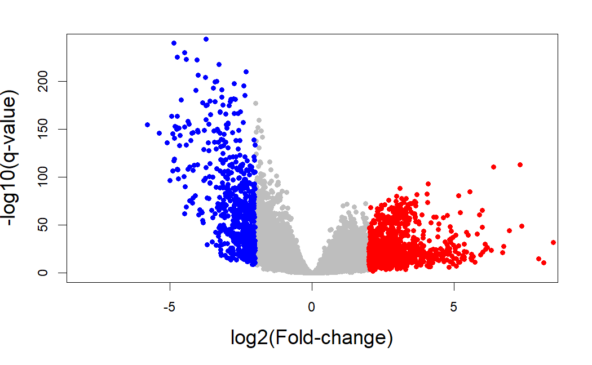

Cooking RNA-Seq data
================
Pilar González Marchante

- <a href="#loading" id="toc-loading">Loading</a>
- <a href="#filtering" id="toc-filtering">Filtering</a>
- <a href="#exploring" id="toc-exploring">Exploring</a>
  - <a href="#length-bias" id="toc-length-bias">Length bias</a>
  - <a href="#gc-content-bias" id="toc-gc-content-bias">GC content bias</a>
  - <a href="#rna-composition" id="toc-rna-composition">RNA composition</a>
  - <a href="#pca-exploration" id="toc-pca-exploration">PCA exploration</a>
- <a href="#normalizing" id="toc-normalizing">Normalizing</a>
  - <a href="#cqn" id="toc-cqn">cqn</a>
  - <a href="#edaseq" id="toc-edaseq">EDASeq</a>
- <a href="#analyzing-differential-expression"
  id="toc-analyzing-differential-expression">Analyzing differential
  expression</a>
  - <a href="#deseq2" id="toc-deseq2">DESeq2</a>
  - <a href="#limma" id="toc-limma">limma</a>
  - <a href="#edger" id="toc-edger">edgeR</a>
  - <a href="#intersecting-degs" id="toc-intersecting-degs">Intersecting
    DEGs</a>

# Loading

The GDC harmonizes RNA-Seq data by aligning raw RNA reads to the GRCh38
reference genome build and calculating gene expression levels with
standardized protocols. We downloaded data of category
`Transcriptome Profiling` and type `Gene Expression Quantification`
where the experimental strategy is `RNA-Seq` and the workflow type is
`STAR - Counts`; and saved the `RangedSummarizedExperiment` object in an
`.RData` file named `RNA.rda`.

``` r
load("data/raw/RNA-Seq/RNA.rda")
```

There are 3 functions that allow us to access the most important data
present in `rna`: `colData()`, to access the clinical data;
`rowRanges()`, to access information about the genes; and `assay`, for
the raw counts.

``` r
library(TCGAbiolinks)
library(SummarizedExperiment)
```

    ## Loading required package: MatrixGenerics

    ## Loading required package: matrixStats

    ## 
    ## Attaching package: 'MatrixGenerics'

    ## The following objects are masked from 'package:matrixStats':
    ## 
    ##     colAlls, colAnyNAs, colAnys, colAvgsPerRowSet, colCollapse,
    ##     colCounts, colCummaxs, colCummins, colCumprods, colCumsums,
    ##     colDiffs, colIQRDiffs, colIQRs, colLogSumExps, colMadDiffs,
    ##     colMads, colMaxs, colMeans2, colMedians, colMins, colOrderStats,
    ##     colProds, colQuantiles, colRanges, colRanks, colSdDiffs, colSds,
    ##     colSums2, colTabulates, colVarDiffs, colVars, colWeightedMads,
    ##     colWeightedMeans, colWeightedMedians, colWeightedSds,
    ##     colWeightedVars, rowAlls, rowAnyNAs, rowAnys, rowAvgsPerColSet,
    ##     rowCollapse, rowCounts, rowCummaxs, rowCummins, rowCumprods,
    ##     rowCumsums, rowDiffs, rowIQRDiffs, rowIQRs, rowLogSumExps,
    ##     rowMadDiffs, rowMads, rowMaxs, rowMeans2, rowMedians, rowMins,
    ##     rowOrderStats, rowProds, rowQuantiles, rowRanges, rowRanks,
    ##     rowSdDiffs, rowSds, rowSums2, rowTabulates, rowVarDiffs, rowVars,
    ##     rowWeightedMads, rowWeightedMeans, rowWeightedMedians,
    ##     rowWeightedSds, rowWeightedVars

    ## Loading required package: GenomicRanges

    ## Loading required package: stats4

    ## Loading required package: BiocGenerics

    ## 
    ## Attaching package: 'BiocGenerics'

    ## The following objects are masked from 'package:stats':
    ## 
    ##     IQR, mad, sd, var, xtabs

    ## The following objects are masked from 'package:base':
    ## 
    ##     anyDuplicated, append, as.data.frame, basename, cbind, colnames,
    ##     dirname, do.call, duplicated, eval, evalq, Filter, Find, get, grep,
    ##     grepl, intersect, is.unsorted, lapply, Map, mapply, match, mget,
    ##     order, paste, pmax, pmax.int, pmin, pmin.int, Position, rank,
    ##     rbind, Reduce, rownames, sapply, setdiff, sort, table, tapply,
    ##     union, unique, unsplit, which.max, which.min

    ## Loading required package: S4Vectors

    ## 
    ## Attaching package: 'S4Vectors'

    ## The following objects are masked from 'package:base':
    ## 
    ##     expand.grid, I, unname

    ## Loading required package: IRanges

    ## Loading required package: GenomeInfoDb

    ## Loading required package: Biobase

    ## Welcome to Bioconductor
    ## 
    ##     Vignettes contain introductory material; view with
    ##     'browseVignettes()'. To cite Bioconductor, see
    ##     'citation("Biobase")', and for packages 'citation("pkgname")'.

    ## 
    ## Attaching package: 'Biobase'

    ## The following object is masked from 'package:MatrixGenerics':
    ## 
    ##     rowMedians

    ## The following objects are masked from 'package:matrixStats':
    ## 
    ##     anyMissing, rowMedians

``` r
rna.raw.counts <- as.data.frame(assay(rna))
rna.genes.info <- as.data.frame(rowRanges(rna))
rna.sample.info <- as.data.frame(colData(rna))
```

As mentioned, if we want to access the clinical data, we can use the
object created with `colData`:

``` r
colnames(rna.sample.info)
```

    ##  [1] "barcode"                                  
    ##  [2] "patient"                                  
    ##  [3] "sample"                                   
    ##  [4] "shortLetterCode"                          
    ##  [5] "definition"                               
    ##  [6] "sample_submitter_id"                      
    ##  [7] "sample_type_id"                           
    ##  [8] "sample_id"                                
    ##  [9] "sample_type"                              
    ## [10] "days_to_collection"                       
    ## [11] "state"                                    
    ## [12] "initial_weight"                           
    ## [13] "pathology_report_uuid"                    
    ## [14] "submitter_id"                             
    ## [15] "oct_embedded"                             
    ## [16] "is_ffpe"                                  
    ## [17] "tissue_type"                              
    ## [18] "synchronous_malignancy"                   
    ## [19] "ajcc_pathologic_stage"                    
    ## [20] "days_to_diagnosis"                        
    ## [21] "treatments"                               
    ## [22] "last_known_disease_status"                
    ## [23] "tissue_or_organ_of_origin"                
    ## [24] "days_to_last_follow_up"                   
    ## [25] "age_at_diagnosis"                         
    ## [26] "primary_diagnosis"                        
    ## [27] "prior_malignancy"                         
    ## [28] "year_of_diagnosis"                        
    ## [29] "prior_treatment"                          
    ## [30] "ajcc_staging_system_edition"              
    ## [31] "ajcc_pathologic_t"                        
    ## [32] "morphology"                               
    ## [33] "ajcc_pathologic_n"                        
    ## [34] "ajcc_pathologic_m"                        
    ## [35] "classification_of_tumor"                  
    ## [36] "diagnosis_id"                             
    ## [37] "icd_10_code"                              
    ## [38] "site_of_resection_or_biopsy"              
    ## [39] "tumor_grade"                              
    ## [40] "progression_or_recurrence"                
    ## [41] "alcohol_history"                          
    ## [42] "exposure_id"                              
    ## [43] "race"                                     
    ## [44] "gender"                                   
    ## [45] "ethnicity"                                
    ## [46] "vital_status"                             
    ## [47] "age_at_index"                             
    ## [48] "days_to_birth"                            
    ## [49] "year_of_birth"                            
    ## [50] "demographic_id"                           
    ## [51] "year_of_death"                            
    ## [52] "days_to_death"                            
    ## [53] "bcr_patient_barcode"                      
    ## [54] "primary_site"                             
    ## [55] "project_id"                               
    ## [56] "disease_type"                             
    ## [57] "name"                                     
    ## [58] "releasable"                               
    ## [59] "released"                                 
    ## [60] "preservation_method"                      
    ## [61] "days_to_sample_procurement"               
    ## [62] "paper_patient"                            
    ## [63] "paper_Tumor.Type"                         
    ## [64] "paper_Included_in_previous_marker_papers" 
    ## [65] "paper_vital_status"                       
    ## [66] "paper_days_to_birth"                      
    ## [67] "paper_days_to_death"                      
    ## [68] "paper_days_to_last_followup"              
    ## [69] "paper_age_at_initial_pathologic_diagnosis"
    ## [70] "paper_pathologic_stage"                   
    ## [71] "paper_Tumor_Grade"                        
    ## [72] "paper_BRCA_Pathology"                     
    ## [73] "paper_BRCA_Subtype_PAM50"                 
    ## [74] "paper_MSI_status"                         
    ## [75] "paper_HPV_Status"                         
    ## [76] "paper_tobacco_smoking_history"            
    ## [77] "paper_CNV.Clusters"                       
    ## [78] "paper_Mutation.Clusters"                  
    ## [79] "paper_DNA.Methylation.Clusters"           
    ## [80] "paper_mRNA.Clusters"                      
    ## [81] "paper_miRNA.Clusters"                     
    ## [82] "paper_lncRNA.Clusters"                    
    ## [83] "paper_Protein.Clusters"                   
    ## [84] "paper_PARADIGM.Clusters"                  
    ## [85] "paper_Pan.Gyn.Clusters"

Let’s look at some potentially interesting clinical variables.

``` r
table(rna.sample.info$vital_status)
```

    ## 
    ## Alive  Dead 
    ##   722   134

``` r
table(rna.sample.info$ajcc_pathologic_stage)
```

    ## 
    ##    Stage I   Stage IA   Stage IB   Stage II  Stage IIA  Stage IIB  Stage III 
    ##         66         66          4          6        272        203          2 
    ## Stage IIIA Stage IIIB Stage IIIC   Stage IV    Stage X 
    ##        138         21         55         12          5

``` r
table(rna.sample.info$days_to_death)
```

    ## 
    ##    0    1  116  160  172  197  227  239  255  266  295  302  320  322  348  365 
    ##    2    2    1    1    1    1    1    1    1    1    1    1    1    1    1    2 
    ##  377  385  446  524  538  558  571  573  577  584  614  616  639  678  723  785 
    ##    1    1    1    1    1    1    1    1    2    1    4    1    1    2    1    2 
    ##  786  792  821  825  860  879  904  912  959  967  976 1004 1009 1032 1034 1048 
    ##    2    2    1    1    1    1    1    1    2    1    2    1    1    1    3    1 
    ## 1072 1093 1104 1152 1174 1272 1275 1286 1324 1365 1388 1430 1439 1468 1508 1642 
    ##    2    1    1    1    2    1    1    2    1    1    2    1    1    1    1    2 
    ## 1649 1673 1688 1694 1759 1781 1793 1812 1900 1927 2097 2127 2192 2273 2361 2373 
    ##    1    1    1    2    2    1    1    1    1    2    1    2    2    2    1    1 
    ## 2417 2469 2520 2534 2551 2636 2712 2798 2854 2866 2965 3063 3126 3262 3461 3462 
    ##    1    1    2    2    1    1    1    2    1    1    2    1    1    1    1    1 
    ## 3472 3669 3959 6593 
    ##    2    2    2    1

One question we might ask ourselves is which was the tissue type that
was measured: primary tumor or solid tissue.

``` r
summary(factor(rna$sample_type))
```

    ##       Primary Tumor Solid Tissue Normal 
    ##                 781                  76

There are **76 controls** (`Solid Tissue Normal`) (note: these controls
are not healthy individuals, but normal tissue coming from those same
cancer patients) and **781 cancer samples** (`Primary Tumor`).

We’ll delete those features that are constant, redundant or that have no
clinical relevance.

``` r
names_toremove <- c("barcode", "patient", "sample", "sample_submitter_id", "sample_id", "sample_type_id", "state", "pathology_report_uuid", "submitter_id", "oct_embedded", "is_ffpe", "tissue_type", "synchronous_malignancy", "treatments", "last_known_disease_status", "tissue_or_organ_of_origin", "ajcc_staging_system_edition", "classification_of_tumor", "diagnosis_id", "site_of_resection_or_biopsy", "tumor_grade", "progression_or_recurrence", "alcohol_history", "exposure_id", "demographic_id", "bcr_patient_barcode", "primary_site", "project_id", "disease_type", "name", "releasable", "released", "preservation_method", "days_to_sample_procurement", "paper_patient", "paper_Tumor.Type", "paper_Included_in_previous_marker_papers", "paper_vital_status", "paper_days_to_birth", "paper_days_to_death", "paper_days_to_last_followup", "paper_age_at_initial_pathologic_diagnosis", "paper_Tumor_Grade", "paper_MSI_status", "paper_HPV_Status", "paper_tobacco_smoking_history", "paper_CNV Clusters", "paper_Mutation Clusters", "paper_DNA.Methylation Clusters", "paper_mRNA Clusters", "paper_miRNA Clusters", "paper_lncRNA Clusters", "paper_Protein Clusters", "paper_PARADIGM Clusters", "paper_Pan-Gyn Clusters")
names_toremain <- names(colData(rna))
names_toremain <- setdiff(names_toremain, names_toremove)
colData(rna) <- colData(rna)[, names_toremain]
rna.sample.info <- as.data.frame(colData(rna))

# load again because we changed the colnames earlier
load("data/raw/RNA-Seq/RNA.rda")
```

We were able to trim down our data from 85 to **30 clinical variables**.

``` r
head(rna.sample.info)
```

We can now load our RNA-Seq count matrix. We have 60,660 genes in rows
and 857 samples in columns.

``` r
head(rna.raw.counts[, 1:5])
```

    ##                    TCGA-E2-A1L7-01A-11R-A144-07 TCGA-E2-A1L7-11A-33R-A144-07
    ## ENSG00000000003.15                         1689                         4209
    ## ENSG00000000005.6                            16                           71
    ## ENSG00000000419.13                         1810                         1611
    ## ENSG00000000457.14                         1098                         1217
    ## ENSG00000000460.17                          715                          346
    ## ENSG00000000938.13                          624                          787
    ##                    TCGA-BH-A28O-01A-11R-A22K-07 TCGA-D8-A1XU-01A-11R-A14M-07
    ## ENSG00000000003.15                         4583                         5605
    ## ENSG00000000005.6                           135                            6
    ## ENSG00000000419.13                         1531                         4901
    ## ENSG00000000457.14                         1445                         1911
    ## ENSG00000000460.17                          298                          595
    ## ENSG00000000938.13                          515                          410
    ##                    TCGA-AC-A8OP-01A-11R-A36F-07
    ## ENSG00000000003.15                          786
    ## ENSG00000000005.6                            88
    ## ENSG00000000419.13                         1494
    ## ENSG00000000457.14                         1052
    ## ENSG00000000460.17                          229
    ## ENSG00000000938.13                          327

``` r
dim(rna.raw.counts)
```

    ## [1] 60660   857

We can also see the gene names associated with the Ensembl IDs in the
count matrix.

``` r
head(rna.genes.info)
```

    ##                    seqnames     start       end  width strand source type score
    ## ENSG00000000003.15     chrX 100627108 100639991  12884      - HAVANA gene    NA
    ## ENSG00000000005.6      chrX 100584936 100599885  14950      + HAVANA gene    NA
    ## ENSG00000000419.13    chr20  50934867  50958555  23689      - HAVANA gene    NA
    ## ENSG00000000457.14     chr1 169849631 169894267  44637      - HAVANA gene    NA
    ## ENSG00000000460.17     chr1 169662007 169854080 192074      + HAVANA gene    NA
    ## ENSG00000000938.13     chr1  27612064  27635185  23122      - HAVANA gene    NA
    ##                    phase            gene_id      gene_type gene_name level
    ## ENSG00000000003.15    NA ENSG00000000003.15 protein_coding    TSPAN6     2
    ## ENSG00000000005.6     NA  ENSG00000000005.6 protein_coding      TNMD     2
    ## ENSG00000000419.13    NA ENSG00000000419.13 protein_coding      DPM1     2
    ## ENSG00000000457.14    NA ENSG00000000457.14 protein_coding     SCYL3     2
    ## ENSG00000000460.17    NA ENSG00000000460.17 protein_coding  C1orf112     2
    ## ENSG00000000938.13    NA ENSG00000000938.13 protein_coding       FGR     2
    ##                       hgnc_id          havana_gene
    ## ENSG00000000003.15 HGNC:11858 OTTHUMG00000022002.2
    ## ENSG00000000005.6  HGNC:17757 OTTHUMG00000022001.2
    ## ENSG00000000419.13  HGNC:3005 OTTHUMG00000032742.2
    ## ENSG00000000457.14 HGNC:19285 OTTHUMG00000035941.6
    ## ENSG00000000460.17 HGNC:25565 OTTHUMG00000035821.9
    ## ENSG00000000938.13  HGNC:3697 OTTHUMG00000003516.3

RNA-Seq reads were aligned to the genome with STAR (Spliced Transcripts
Alignment to a Reference), a fast RNA-Seq read mapper with support for
splice-junction and fusion read detection. For <a
href="https://docs.gdc.cancer.gov/Data/Bioinformatics_Pipelines/Expression_mRNA_Pipeline/"
class="url">more information on the pipeline used for mRNA counts
generation</a>.

Note: our `rna.raw.counts` matrix contains **unnormalized, unstranded
raw counts**. The `rna` object has these raw `unstranded` counts, as
well as `stranded_first` and `stranded_second`, and `tpm_unstranded`,
`fpkm_unstranded` and `fpkm_uq_unstranded` normalized counts.


Before performing differential expression analysis, we should preprocess
the raw counts by filtering out low expression counts (and checking for
experimental bias, like batch effect). We also need to perform
normalization, as it’s likely that counts will vary depending on their
length and/or GC content, removing noise inherent to the experimental
technique.

# Filtering

We already have our expression data in `rna.raw.counts`, but we still
have to define our factors as `condition`, `tss`, `plate`, `portion`and
`sample`, which we can easily extract with the `TCGAbiolinks` function
`get_IDs`.

``` r
library(NOISeq)
```

    ## Loading required package: splines

    ## Loading required package: Matrix

    ## 
    ## Attaching package: 'Matrix'

    ## The following object is masked from 'package:S4Vectors':
    ## 
    ##     expand

``` r
library(TCGAbiolinks)
barcodes <- get_IDs(rna)
myfactors <- data.frame(barcodes$tss, barcodes$portion, barcodes$plate, barcodes$condition)
head(myfactors)
```

    ##   barcodes.tss barcodes.portion barcodes.plate barcodes.condition
    ## 1           E2              11R           A144             cancer
    ## 2           E2              33R           A144             normal
    ## 3           BH              11R           A22K             cancer
    ## 4           D8              11R           A14M             cancer
    ## 5           AC              11R           A36F             cancer
    ## 6           A2              11R           A084             cancer

And we’ll need additional biological information, such as feature
length, GC content, gene type and chromosome number, which we can get
through the Ensembl BioMart online interface (I tried to get them with
`getGeneLengthAndGCContent` from `EDASeq`, but it kept timing out). I
had to get rid of version numbers from the Ensembl gene IDs, since
otherwise I’d get information about fewer genes.

``` r
# the list used as input for BioMart
ids <- sub('\\.[0-9]*$', '', rna.genes.info$gene_id) # need to remove final digits after the dot (version numbers)
write.table(ids, file = "results/preprocessing/cookingRNASeq/genes.IDs.csv", row.names = FALSE, col.names = FALSE, quote = FALSE)
```

As a rough estimate of gene length, we can use the overlap of all exons
given by `rna.genes.info` as `width`. The same object gives us
`gene_type` and `seq.names` (chromosome number), so we only need to
download GC content from BioMart.

``` r
GCcontent <- read.csv("results/preprocessing/cookingRNASeq/genes.biomart.txt", sep = "\t")
length(GCcontent$Gene...GC.content) # we had 60660 genes but only have GC content info for 60513 of them, thus losing 147 genes
```

    ## [1] 60513

``` r
colnames(GCcontent) <- c("gene_id", "gc_content") # rename headers so we can merge

# problem: we have different versions so we need to merge by ID only
# so we create a new column in rna.genes.info with the gene ID without version number, and we do the same in GCcontent

rna.genes.info$gene_id_no_version <- sub('\\.[0-9]*$', '', rna.genes.info$gene_id)
GCcontent$gene_id_no_version <- sub('\\.[0-9]*$', '', GCcontent$gene_id)

# complete rna.genes.info with GC content
rna.genes.info <- merge(rna.genes.info, GCcontent, by = "gene_id_no_version") # merging turns gene_id into gene_id.x and the gene_id from GCcontent into gene_id.y, so we need to remove those

rna.genes.info$gene_id <- rna.genes.info$gene_id.x
rna.genes.info$gene_id.x <- NULL
rna.genes.info$gene_id.y <- NULL

mygc = c(rna.genes.info$gc_content)
names(mygc) = rna.genes.info$gene_id

mylength = c(rna.genes.info$width)
names(mylength) = rna.genes.info$gene_id

mybiotypes = c(rna.genes.info$gene_type)
names(mybiotypes) = rna.genes.info$gene_id

mychroms = data.frame(rna.genes.info$seqnames, rna.genes.info$start, rna.genes.info$end)
rownames(mychroms) = rna.genes.info$gene_id
colnames(mychroms) <- c("Chr", "GeneStart", "GeneEnd")

head(mygc)
```

    ## ENSG00000000003.15  ENSG00000000005.6 ENSG00000000419.13 ENSG00000000457.14 
    ##              40.40              40.78              40.20              40.14 
    ## ENSG00000000460.17 ENSG00000000938.13 
    ##              39.22              52.92

``` r
head(mylength)
```

    ## ENSG00000000003.15  ENSG00000000005.6 ENSG00000000419.13 ENSG00000000457.14 
    ##              12884              14950              23689              44637 
    ## ENSG00000000460.17 ENSG00000000938.13 
    ##             192074              23122

``` r
head(mybiotypes)
```

    ## ENSG00000000003.15  ENSG00000000005.6 ENSG00000000419.13 ENSG00000000457.14 
    ##   "protein_coding"   "protein_coding"   "protein_coding"   "protein_coding" 
    ## ENSG00000000460.17 ENSG00000000938.13 
    ##   "protein_coding"   "protein_coding"

``` r
head(mychroms)
```

    ##                      Chr GeneStart   GeneEnd
    ## ENSG00000000003.15  chrX 100627108 100639991
    ## ENSG00000000005.6   chrX 100584936 100599885
    ## ENSG00000000419.13 chr20  50934867  50958555
    ## ENSG00000000457.14  chr1 169849631 169894267
    ## ENSG00000000460.17  chr1 169662007 169854080
    ## ENSG00000000938.13  chr1  27612064  27635185

Once we have created the count data matrix, the data.frame for the
factors and the 4 biological annotation objects, we have to pack all
this information into a `NOISeq` object by using the `readData`
function.

``` r
mydata <- NOISeq::readData(data = rna.raw.counts, factors = myfactors, length = mylength, gc = mygc, biotype = mybiotypes, chromosome = mychroms)

myfirst50data <- NOISeq::readData(data = rna.raw.counts[, 1:50], factors = myfactors[1:50, ], length = mylength[1:50], gc = mygc[1:50], biotype = mybiotypes[1:50], chromosome = mychroms[1:50, ]) # for plots and tests that require a smaller sample size
```

Genes with very low counts in all samples provide little evidence for
differential expression. Often samples have many genes with zero or very
low counts. Testing for differential expression for many genes
simultaneously adds to the multiple testing burden, reducing the power
to detect DE genes. IT IS VERY IMPORTANT to filter out genes that have
all zero counts or very low counts. We filter using CPM values rather
than counts because they account for differences in sequencing depth
between samples.

Excluding features with low counts improves differential expression
results since the noise in the data is reduced. `NOISeq` includes three
methods to filter out these low count features: CPM, WIlcoxon test and
proportion test. We’ll try the first two.

But first, we’ll explore the raw counts a bit to later help us choose a
filtering method.

``` r
boxplot(log10(rna.raw.counts[, 1:50])+1, outline = FALSE, las = 2)
```

<!-- -->

``` r
mybiodetection <- dat(mydata, k = 0, type = "biodetection", factor = NULL)
par(mfrow = c(1,2))
explo.plot(mybiodetection, samples = c(1, 2), toplot = "protein_coding", plottype = "comparison")
```


``` r
[1] "Percentage of protein_coding biotype in each sample:"
TCGA-E2-A1L7-01A-11R-A144-07 
                     53.5015 
TCGA-E2-A1L7-11A-33R-A144-07 
                     51.4557 
[1] "Confidence interval at 95% for the difference of percentages: TCGA-E2-A1L7-01A-11R-A144-07 - TCGA-E2-A1L7-11A-33R-A144-07"
[1] 1.4823 2.6094
[1] "The percentage of this biotype is significantly DIFFERENT for these two samples (p-value = 1.012e-12 )."
```

How shall we choose a CPM threshold? The sensitivity plot can help us.
We can see that most features have between 0 and 1 CPM for these first
50 samples, so the threshold should be between 0.2 and 1, roughly
speaking.

``` r
mycountsbio = dat(myfirst50data, factor = NULL, type = "countsbio")
explo.plot(mycountsbio, toplot = 1, samples = NULL, plottype = "barplot")
```


It can also help to visualize the log2(cpm) as histogram and density
plots. In them we see a bimodal distribution that can be split with a
filtering threshold of \~0.5. As a general rule, a good threshold can be
chosen by identifying the CPM that corresponds to a count of 10. Our
minimum library size is 19 millions, whereas median and mean are 57
millions and maximum is 114 million counts. An acceptable threshold
would be between 10/19 = 0.52 and 10/57 = 0.18, so we will try 0.2, 0.5
and 1 as possible CPM thresholds.

``` r
library(SummarizedExperiment)
library(edgeR)
```

    ## Loading required package: limma

    ## 
    ## Attaching package: 'limma'

    ## The following object is masked from 'package:BiocGenerics':
    ## 
    ##     plotMA

    ## 
    ## Attaching package: 'edgeR'

    ## The following object is masked from 'package:NOISeq':
    ## 
    ##     rpkm

``` r
library(limma)
library(ggplot2)

mean_log_cpm <- aveLogCPM(rna.raw.counts)

filter_threshold <- log2(0.5)

ggplot() + aes(x=mean_log_cpm) +
    geom_histogram(binwidth=0.2) +
    geom_vline(xintercept=filter_threshold) +
    ggtitle("Histogram of logCPM before filtering")
```

<!-- -->

``` r
ggplot() + aes(x=mean_log_cpm) +
    geom_density() +
    geom_vline(xintercept=filter_threshold) +
    ggtitle("Density plot of logCPM before filtering") +
    xlim(-6.1, 13.5)
```

<!-- -->

``` r
summary(colSums(rna.raw.counts))
```

    ##      Min.   1st Qu.    Median      Mean   3rd Qu.      Max. 
    ##  19225117  46779421  57014106  57485218  68315834 114015705

So let’s try CPM filtering with a `CPM threshold = 0.2, 0.5 and 1` and a
`cv.cutoff = 500`, so that we remove those features with low expression
(but not with low variability). We will also apply Wilcoxon test
filtering and compare the results.

``` r
myfiltCPM02 <- filtered.data(rna.raw.counts, factor = myfactors$barcodes.condition, norm = FALSE, depth = NULL, method = 1, cv.cutoff = 500, cpm = 0.2, p.adj = "fdr") # 22797 features (37%) are to be kept for differential expression analysis with filtering method 1

myfiltCPM05 <- filtered.data(rna.raw.counts, factor = myfactors$barcodes.condition, norm = FALSE, depth = NULL, method = 1, cv.cutoff = 500, cpm = 0.5, p.adj = "fdr") # 19350 features (32%) are to be kept for differential expression analysis with filtering method 1

myfiltCPM1 <- filtered.data(rna.raw.counts, factor = myfactors$barcodes.condition, norm = FALSE, depth = NULL, method = 1, cv.cutoff = 500, cpm = 1, p.adj = "fdr") # 17276 features (28.5%) are to be kept for differential expression analysis with filtering method 1

myfiltWilcoxon <- filtered.data(rna.raw.counts, factor = myfactors$barcodes.condition, norm = FALSE, depth = NULL, method = 2, p.adj = "fdr") # 56401 (93%) features are to be kept for differential expression analysis with filtering method 2

boxplot(log10(myfiltCPM02[, 1:50])+1, outline = FALSE, las = 2)
boxplot(log10(myfiltCPM05[, 1:50])+1, outline = FALSE, las = 2)
boxplot(log10(myfiltCPM1[, 1:50])+1, outline = FALSE, las = 2)
boxplot(log10(myfiltWilcoxon[, 1:50])+1, outline = FALSE, las = 2)
```


 What kind of
features are these methods filtering out?

``` r
myCPMdata02 <- NOISeq::readData(data = myfiltCPM02, factors = myfactors, length = mylength, gc = mygc, biotype = mybiotypes, chromosome = mychroms)

myCPMdata05 <- NOISeq::readData(data = myfiltCPM05, factors = myfactors, length = mylength, gc = mygc, biotype = mybiotypes, chromosome = mychroms)

myCPMdata1 <- NOISeq::readData(data = myfiltCPM1, factors = myfactors, length = mylength, gc = mygc, biotype = mybiotypes, chromosome = mychroms)

myWilcoxondata <- NOISeq::readData(data = myfiltWilcoxon, factors = myfactors, length = mylength, gc = mygc, biotype = mybiotypes, chromosome = mychroms)

mybiodetectionCPM02 <- dat(myCPMdata02, k = 0, type = "biodetection", factor = NULL)
par(mfrow = c(1,2))
explo.plot(mybiodetectionCPM02, samples = c(1, 2), toplot = "protein_coding", plottype = "comparison")

mybiodetectionCPM05 <- dat(myCPMdata05, k = 0, type = "biodetection", factor = NULL)
par(mfrow = c(1,2))
explo.plot(mybiodetectionCPM05, samples = c(1, 2), toplot = "protein_coding", plottype = "comparison")

mybiodetectionCPM1 <- dat(myCPMdata1, k = 0, type = "biodetection", factor = NULL)
par(mfrow = c(1,2))
explo.plot(mybiodetectionCPM1, samples = c(1, 2), toplot = "protein_coding", plottype = "comparison")

mybiodetectionWilcoxon <- dat(myWilcoxondata, k = 0, type = "biodetection", factor = NULL)
par(mfrow = c(1,2))
explo.plot(mybiodetectionWilcoxon, samples = c(1, 2), toplot = "protein_coding", plottype = "comparison")

sum(mydata@featureData@data$Biotype=="protein_coding", na.rm=TRUE) # 19916 protein coding genes
sum(myCPMdata02@featureData@data$Biotype=="protein_coding", na.rm=TRUE) # 16021 protein coding genes
sum(myCPMdata05@featureData@data$Biotype=="protein_coding", na.rm=TRUE) # 15434 protein coding genes
sum(myCPMdata1@featureData@data$Biotype=="protein_coding", na.rm=TRUE) # 14772 protein coding genes
sum(myWilcoxondata@featureData@data$Biotype=="protein_coding", na.rm=TRUE) # 19391 protein coding genes
```


Method 2 (Wilcoxon test) barely does any filtering at all, so we’ll
stick to method 1 (CPM). Given the amount of protein coding features we
are left with with all the different thresholds, we’ll choose a CPM
threshold of 0.5 and will be left with only 32% of the original
features. This makes sense, as the prefiltered raw counts had a large
number of long non-coding RNAs and pseudogenes (which tend to have low
expression in an organism) that were removed with the CPM filtering,
enriching the counts in protein coding genes (going from \~70% to 85% of
total biotypes).

Let’s prep our data once again, this time with our filtered data!

``` r
# delete unnecessary objects
rm(mybiodetection, mybiodetectionCPM02, mybiodetectionCPM05, mybiodetectionCPM1, mybiodetectionWilcoxon, myCPMdata02, myCPMdata05, myCPMdata1, mydata, myfiltCPM02, myfiltCPM1, myfiltWilcoxon, myfirst50data, myWilcoxondata, mean_log_cpm, filter_threshold)

rna.filt.counts <- myfiltCPM05
rm(myfiltCPM05)

save(rna.filt.counts, file = "data/cooked/RNA-Seq/RNA.filt.rda")
```

``` r
load("data/cooked/RNA-Seq/RNA.filt.rda")

myexpdata.filt <- NOISeq::readData(data = rna.filt.counts, factors = myfactors, length = mylength, gc = mygc, biotype = mybiotypes, chromosome = mychroms)
```

# Exploring

What type of normalization should we use? In order to help us make a
decision, we will try to see if there are any length and/or GC content
biases that have to be corrected for.

## Length bias

This plot describes the relationship between the feature length and the
expression values.

``` r
myexplengthbias.filt = dat(myexpdata.filt, factor = "barcodes.condition", type = "lengthbias")
```

    ## [1] "Length bias detection information is to be computed for:"
    ## [1] "cancer" "normal"
    ## [1] "cancer"
    ## 
    ## Call:
    ## lm(formula = datos[, i] ~ bx)
    ## 
    ## Residuals:
    ##      Min       1Q   Median       3Q      Max 
    ## -12.4787  -4.2298  -0.0206   3.0406  22.4140 
    ## 
    ## Coefficients: (2 not defined because of singularities)
    ##              Estimate Std. Error t value Pr(>|t|)    
    ## (Intercept)    19.011      6.559   2.898  0.00479 ** 
    ## bx1            -3.886      6.798  -0.572  0.56905    
    ## bx2            38.257      7.306   5.236 1.19e-06 ***
    ## bx3            10.846      8.091   1.340  0.18371    
    ## bx4            32.309      8.608   3.753  0.00032 ***
    ## bx5            14.000     10.463   1.338  0.18448    
    ## bx6            26.124     15.580   1.677  0.09730 .  
    ## bx7             1.192     37.970   0.031  0.97504    
    ## bx8            51.397    197.767   0.260  0.79559    
    ## bx9          -306.846   1459.827  -0.210  0.83403    
    ## bx10         1311.533   6093.355   0.215  0.83010    
    ## bx11        -6915.289  32215.101  -0.215  0.83055    
    ## bx12               NA         NA      NA       NA    
    ## bx13               NA         NA      NA       NA    
    ## ---
    ## Signif. codes:  0 '***' 0.001 '**' 0.01 '*' 0.05 '.' 0.1 ' ' 1
    ## 
    ## Residual standard error: 6.559 on 84 degrees of freedom
    ## Multiple R-squared:  0.6913, Adjusted R-squared:  0.6509 
    ## F-statistic:  17.1 on 11 and 84 DF,  p-value: < 2.2e-16
    ## 
    ## [1] "normal"
    ## 
    ## Call:
    ## lm(formula = datos[, i] ~ bx)
    ## 
    ## Residuals:
    ##     Min      1Q  Median      3Q     Max 
    ## -9.7902 -3.8141 -0.8844  3.1568 22.1201 
    ## 
    ## Coefficients: (2 not defined because of singularities)
    ##               Estimate Std. Error t value Pr(>|t|)    
    ## (Intercept)     24.491      6.273   3.904 0.000190 ***
    ## bx1            -12.569      6.501  -1.933 0.056550 .  
    ## bx2             26.130      6.987   3.740 0.000336 ***
    ## bx3              5.535      7.737   0.715 0.476364    
    ## bx4             32.360      8.231   3.931 0.000173 ***
    ## bx5             11.402     10.005   1.140 0.257679    
    ## bx6             36.513     14.898   2.451 0.016328 *  
    ## bx7            -19.737     36.310  -0.544 0.588186    
    ## bx8            186.854    189.118   0.988 0.325977    
    ## bx9          -1293.000   1395.984  -0.926 0.356981    
    ## bx10          5415.628   5826.872   0.929 0.355333    
    ## bx11        -28591.057  30806.226  -0.928 0.356018    
    ## bx12                NA         NA      NA       NA    
    ## bx13                NA         NA      NA       NA    
    ## ---
    ## Signif. codes:  0 '***' 0.001 '**' 0.01 '*' 0.05 '.' 0.1 ' ' 1
    ## 
    ## Residual standard error: 6.273 on 84 degrees of freedom
    ## Multiple R-squared:  0.7606, Adjusted R-squared:  0.7293 
    ## F-statistic: 24.26 on 11 and 84 DF,  p-value: < 2.2e-16

``` r
explo.plot(myexplengthbias.filt, samples = NULL, toplot = "global")
```

<!-- -->

Since the p-values are significant (even though R<sup>2</sup>
coefficients aren’t higher than 95%) and we can see in the graph that
mean expression varies depending on feature length, we can conclude that
the expression depends on the feature length and as such, a length-based
normalization is required.

## GC content bias

This plot describes the relationship between the feature GC content and
the expression values.

``` r
myexpGCbias.filt = dat(myexpdata.filt, factor = "barcodes.condition", type = "GCbias")
```

    ## [1] "GC content bias detection is to be computed for:"
    ## [1] "cancer" "normal"
    ## [1] "cancer"
    ## 
    ## Call:
    ## lm(formula = datos[, i] ~ bx)
    ## 
    ## Residuals:
    ##      Min       1Q   Median       3Q      Max 
    ## -10.7042  -3.6881  -0.6295   3.0816  12.2557 
    ## 
    ## Coefficients: (1 not defined because of singularities)
    ##              Estimate Std. Error t value Pr(>|t|)    
    ## (Intercept)   26.3116     5.1789   5.081 2.28e-06 ***
    ## bx1           -9.6796     7.3241  -1.322   0.1899    
    ## bx2          -14.6534    46.3276  -0.316   0.7526    
    ## bx3            0.6629    10.9283   0.061   0.9518    
    ## bx4           11.8903     6.5747   1.808   0.0742 .  
    ## bx5           11.5113     6.0597   1.900   0.0610 .  
    ## bx6           11.3659     6.0680   1.873   0.0646 .  
    ## bx7            7.0364     6.1741   1.140   0.2577    
    ## bx8           14.5436     6.3594   2.287   0.0247 *  
    ## bx9            4.1733     6.9507   0.600   0.5499    
    ## bx10           3.0472     8.9555   0.340   0.7345    
    ## bx11          40.2910    19.4769   2.069   0.0417 *  
    ## bx12        -134.5647    67.4670  -1.995   0.0494 *  
    ## bx13               NA         NA      NA       NA    
    ## ---
    ## Signif. codes:  0 '***' 0.001 '**' 0.01 '*' 0.05 '.' 0.1 ' ' 1
    ## 
    ## Residual standard error: 5.179 on 83 degrees of freedom
    ## Multiple R-squared:  0.3215, Adjusted R-squared:  0.2234 
    ## F-statistic: 3.277 on 12 and 83 DF,  p-value: 0.0006648
    ## 
    ## [1] "normal"
    ## 
    ## Call:
    ## lm(formula = datos[, i] ~ bx)
    ## 
    ## Residuals:
    ##     Min      1Q  Median      3Q     Max 
    ## -9.2695 -3.8362 -0.9797  3.7794 12.2347 
    ## 
    ## Coefficients: (1 not defined because of singularities)
    ##             Estimate Std. Error t value Pr(>|t|)    
    ## (Intercept)  15.0635     5.1790   2.909 0.004657 ** 
    ## bx1          -0.3342     7.3241  -0.046 0.963713    
    ## bx2         -11.1257    46.3282  -0.240 0.810805    
    ## bx3          19.3891    10.9284   1.774 0.079699 .  
    ## bx4          24.8862     6.5748   3.785 0.000289 ***
    ## bx5          25.0790     6.0598   4.139 8.34e-05 ***
    ## bx6          21.9787     6.0681   3.622 0.000502 ***
    ## bx7          13.8378     6.1742   2.241 0.027679 *  
    ## bx8          20.9280     6.3595   3.291 0.001468 ** 
    ## bx9           8.7553     6.9508   1.260 0.211342    
    ## bx10          9.4780     8.9557   1.058 0.292979    
    ## bx11         13.7603    19.4772   0.706 0.481865    
    ## bx12        -52.2332    67.4678  -0.774 0.441015    
    ## bx13              NA         NA      NA       NA    
    ## ---
    ## Signif. codes:  0 '***' 0.001 '**' 0.01 '*' 0.05 '.' 0.1 ' ' 1
    ## 
    ## Residual standard error: 5.179 on 83 degrees of freedom
    ## Multiple R-squared:  0.5848, Adjusted R-squared:  0.5248 
    ## F-statistic: 9.742 on 12 and 83 DF,  p-value: 1.553e-11

``` r
explo.plot(myexpGCbias.filt, samples = NULL, toplot = "global")
```

<!-- -->

Although the p-values are significant, R² values are not high enough for
us to be able to confidently say there exists a GC content bias.
However, we will try a GC-content normalization as well, to try to
remove this potential bias.

## RNA composition

When two samples have different RNA composition, the distribution of
sequencing reads across the features is different in such a way that
although a feature had the same number of read counts in both samples,
it would not mean that it was equally expressed in both.

``` r
myexpcd = dat(myexpdata.filt, type = "cd", norm = FALSE, refColumn = 1)
# "Diagnostic test: FAILED. Normalization is required to correct this bias."
```

Since the test failed (median deviations of the samples with regard to
the reference sample are statistically significant) this means that a
normalization procedure should be used to correct this effect and make
the samples comparable before computing differential expression.

## PCA exploration

Are any of our factors producing some kind of batch effect?

``` r
# PCAs with NOISeq
myexpPCA = dat(myexpdata.filt, type = "PCA")
par(cex = 0.75)
explo.plot(myexpPCA, factor = "barcodes.condition", plottype = "scores")
```

<!-- -->

``` r
explo.plot(myexpPCA, factor = "barcodes.condition", plottype = "loadings")
```

<!-- -->

``` r
explo.plot(myexpPCA, factor = "barcodes.condition")
```

<!-- -->

``` r
explo.plot(myexpPCA, factor = "barcodes.tss")
```

<!-- -->

``` r
explo.plot(myexpPCA, factor = "barcodes.portion")
```

<!-- -->

``` r
explo.plot(myexpPCA, factor = "barcodes.plate")
```

<!-- -->

We can appreciate in these plots that **none of the factors (TSS,
portion, plate) seem to be contributing towards batch effect** in our
RNA-Seq data, but we shall repeat these plots once our data is
normalized.

# Normalizing

## cqn

Prepare gene information for filtered data: GC content and length.

``` r
load("data/cooked/RNA-Seq/RNA.filt.rda")
library(cqn)
```

    ## Loading required package: mclust

    ## Package 'mclust' version 5.4.10
    ## Type 'citation("mclust")' for citing this R package in publications.

    ## Loading required package: nor1mix

    ## Loading required package: preprocessCore

    ## Loading required package: quantreg

    ## Loading required package: SparseM

    ## 
    ## Attaching package: 'SparseM'

    ## The following object is masked from 'package:base':
    ## 
    ##     backsolve

``` r
# GeneLengthAndGCContent <- getGeneLengthAndGCContent(sub('\\.[0-9]*$', '', rownames(rna.filt.counts)), "hsa")

# we need to delete the genes for which we have no information, after trying to download it using organism-based annotation packages from Bioconductor instead of the biomart package

# get missing information
# valores_NA <- GeneLengthAndGCContent[rowSums(is.na(GeneLengthAndGCContent)) > 0, ]
# NA_GeneLengthAndGCContent <- getGeneLengthAndGCContent(sub('\\.[0-9]*$', '', rownames(valores_NA)), "hsa", mode = "org.db")
# assembly: TxDb.Hsapiens.UCSC.hg38.knownGene
# genome assembly: BSgenome.Hsapiens.UCSC.hg38
# notna <- na.omit(NA_GeneLengthAndGCContent)

# replace 5 newly found genes :)
# GeneLengthAndGCContent[match(rownames(notna), rownames(GeneLengthAndGCContent)), ] <- notna
# valores_NA <- GeneLengthAndGCContent[rowSums(is.na(GeneLengthAndGCContent)) > 0, ]

# delete 32 missing genes :(
# GeneLengthAndGCContent <- GeneLengthAndGCContent[-(match(rownames(valores_NA), rownames(GeneLengthAndGCContent))), ]

# save information
# gc.length.rna <- GeneLengthAndGCContent 
# save(GeneLengthAndGCContent, file = "results/preprocessing/cookingRNASeq/GC.length.RNA.rda)

# also need to delete 32 missing genes from filtered counts
# rna.filt.counts <- rna.filt.counts[-match(rownames(valores_NA), sub('\\.[0-9]*$', '', rownames(rna.filt.counts))), ]

# and save those filtered complete counts
# save(rna.filt.counts, file = "data/cooked/RNA-Seq/RNA.filt.rda")

# load("results/preprocessing/cookingRNASeq/GC.length.RNA.rda")
```

Run normalization function. `cqn` requires an input of gene length, GC
content and the estimated library size per sample (which it will
estimate as the total sum of the counts if not provided by the user).

The hand off between the two packages is to use `DESeq2` with the
original counts and to supply the offset matrix calculated by `cqn` as a
`normalizationFactor` for the `dds` object.

``` r
load("data/cooked/RNA-Seq/RNA.filt.rda")
library(cqn)

sizeFactors.rna <- colSums(rna.filt.counts)

load("results/preprocessing/cookingRNASeq/GC.length.RNA.rda")
gc.length.rna <- as.data.frame(gc.length.rna)

rna.cqn.norm <- cqn(rna.filt.counts, lengths = gc.length.rna$length, x = gc.length.rna$gc, sizeFactors = sizeFactors.rna, verbose = TRUE)

save(rna.cqn.norm, file = "reports/preprocessing/files/cookingRNASeq/RNA.cqn.norm.rda")

rna.cqn.norm

# Extract the offset, which will be input directly into DEseq2 to normalise the counts
cqnOffset <- rna.cqn.norm$glm.offset
cqnNormFactors <- exp(cqnOffset)
save(cqnNormFactors, file = "reports/preprocessing/files/cookingRNASeq/RNA.cqn.normFactors.rda")

# Extract normalized data to check for bias on NOISeq
rna.cqn.norm.expression <- rna.cqn.norm$y + rna.cqn.norm$offset
rna.cqn.norm.expression <- as.data.frame(rna.cqn.norm.expression)
```

Did `cqn` normalization reduce our gene length and GC content biases?

``` r
load("reports/preprocessing/files/cookingRNASeq/RNA.cqn.norm.rda")
rna.cqn.norm.expression <- rna.cqn.norm$y + rna.cqn.norm$offset
rna.cqn.norm.expression <- as.data.frame(rna.cqn.norm.expression)

# need to prep gene information format
load("results/preprocessing/cookingRNASeq/GC.length.RNA.rda")
gc.length.rna <- as.data.frame(gc.length.rna)
mylength.norm <- as.integer(c(gc.length.rna$length))
names(mylength.norm) <- rownames(gc.length.rna)

mygc.norm <- c(gc.length.rna$gc)
names(mygc.norm) <- rownames(gc.length.rna)
  
mybiotypes.norm <- mybiotypes[match(rownames(gc.length.rna), sub('\\.[0-9]*$', '', names(mybiotypes)))]
mybiotypes.norm <- as.vector(mybiotypes.norm)
  
mychroms.norm <- mychroms[match(rownames(gc.length.rna), sub('\\.[0-9]*$', '', rownames(mychroms))), ]
rownames(mychroms.norm) <- sub('\\.[0-9]*$', '', rownames(mychroms.norm))

barcodes <- get_IDs(rna)
barcodes$condition <- as.factor(barcodes$condition)
barcodes$condition <- relevel(barcodes$condition, ref = "normal")
myfactors <- data.frame(barcodes$tss, barcodes$portion, barcodes$plate, barcodes$condition)

# need to drop the version number of the ENSEMBL IDs because there aren't any in the GC and length information
rownames(rna.cqn.norm.expression) <- sub('\\.[0-9]*$', '', rownames(rna.cqn.norm.expression))

myexpdata.norm <- NOISeq::readData(data = rna.cqn.norm.expression, factors = myfactors, length = mylength.norm, gc = mygc.norm, biotype = mybiotypes.norm, chromosome = mychroms.norm)

myexplengthbias.norm = dat(myexpdata.norm, factor = "barcodes.condition", type = "lengthbias")
```

    ## [1] "Length bias detection information is to be computed for:"
    ## [1] "normal" "cancer"
    ## [1] "normal"
    ## 
    ## Call:
    ## lm(formula = datos[, i] ~ bx)
    ## 
    ## Residuals:
    ##     Min      1Q  Median      3Q     Max 
    ## -7.5776 -1.5879 -0.0566  1.5353  5.7054 
    ## 
    ## Coefficients: (1 not defined because of singularities)
    ##               Estimate Std. Error t value Pr(>|t|)    
    ## (Intercept)  5.421e+01  2.711e+00  20.000   <2e-16 ***
    ## bx1         -7.863e+00  3.371e+00  -2.333   0.0221 *  
    ## bx2         -1.788e-01  3.358e+00  -0.053   0.9577    
    ## bx3         -7.465e+00  3.215e+00  -2.322   0.0227 *  
    ## bx4         -4.028e-01  3.084e+00  -0.131   0.8964    
    ## bx5         -4.088e-01  3.176e+00  -0.129   0.8979    
    ## bx6         -1.534e+00  3.501e+00  -0.438   0.6624    
    ## bx7          3.613e+00  4.222e+00   0.856   0.3946    
    ## bx8         -8.052e-01  6.386e+00  -0.126   0.9000    
    ## bx9         -4.126e+00  1.576e+01  -0.262   0.7942    
    ## bx10        -1.272e+01  9.016e+01  -0.141   0.8881    
    ## bx11         3.266e+03  1.437e+04   0.227   0.8208    
    ## bx12        -3.662e+05  1.538e+06  -0.238   0.8124    
    ## bx13                NA         NA      NA       NA    
    ## ---
    ## Signif. codes:  0 '***' 0.001 '**' 0.01 '*' 0.05 '.' 0.1 ' ' 1
    ## 
    ## Residual standard error: 2.711 on 83 degrees of freedom
    ## Multiple R-squared:  0.3752, Adjusted R-squared:  0.2849 
    ## F-statistic: 4.154 on 12 and 83 DF,  p-value: 4.424e-05
    ## 
    ## [1] "cancer"
    ## 
    ## Call:
    ## lm(formula = datos[, i] ~ bx)
    ## 
    ## Residuals:
    ##    Min     1Q Median     3Q    Max 
    ## -7.943 -1.693  0.000  1.546  6.853 
    ## 
    ## Coefficients: (1 not defined because of singularities)
    ##               Estimate Std. Error t value Pr(>|t|)    
    ## (Intercept)  5.451e+01  2.605e+00  20.929  < 2e-16 ***
    ## bx1         -7.244e+00  3.239e+00  -2.237  0.02800 *  
    ## bx2         -1.672e-01  3.227e+00  -0.052  0.95879    
    ## bx3         -8.681e+00  3.090e+00  -2.810  0.00618 ** 
    ## bx4         -5.138e-01  2.964e+00  -0.173  0.86279    
    ## bx5         -6.853e-01  3.052e+00  -0.225  0.82289    
    ## bx6         -1.986e+00  3.364e+00  -0.590  0.55662    
    ## bx7          2.571e+00  4.057e+00   0.634  0.52811    
    ## bx8          2.101e-01  6.137e+00   0.034  0.97278    
    ## bx9         -1.199e+01  1.515e+01  -0.792  0.43078    
    ## bx10         2.925e+01  8.663e+01   0.338  0.73652    
    ## bx11        -3.648e+03  1.381e+04  -0.264  0.79225    
    ## bx12         3.763e+05  1.478e+06   0.255  0.79968    
    ## bx13                NA         NA      NA       NA    
    ## ---
    ## Signif. codes:  0 '***' 0.001 '**' 0.01 '*' 0.05 '.' 0.1 ' ' 1
    ## 
    ## Residual standard error: 2.605 on 83 degrees of freedom
    ## Multiple R-squared:  0.3981, Adjusted R-squared:  0.3111 
    ## F-statistic: 4.575 on 12 and 83 DF,  p-value: 1.239e-05

``` r
explo.plot(myexplengthbias.norm, samples = NULL, toplot = "global")
```

<!-- -->

``` r
myexpGCbias.norm = dat(myexpdata.norm, factor = "barcodes.condition", type = "GCbias")
```

    ## [1] "GC content bias detection is to be computed for:"
    ## [1] "normal" "cancer"
    ## [1] "normal"
    ## 
    ## Call:
    ## lm(formula = datos[, i] ~ bx)
    ## 
    ## Residuals:
    ##     Min      1Q  Median      3Q     Max 
    ## -5.9379 -1.7032 -0.0521  1.6032  7.9678 
    ## 
    ## Coefficients: (1 not defined because of singularities)
    ##               Estimate Std. Error t value Pr(>|t|)    
    ## (Intercept)  5.404e+01  2.957e+00  18.280   <2e-16 ***
    ## bx1         -5.835e+00  4.181e+00  -1.395    0.167    
    ## bx2         -1.241e+05  1.466e+05  -0.847    0.400    
    ## bx3         -9.693e+00  4.806e+01  -0.202    0.841    
    ## bx4         -1.068e+00  6.610e+00  -0.162    0.872    
    ## bx5         -3.735e+00  3.814e+00  -0.979    0.330    
    ## bx6         -3.385e+00  3.445e+00  -0.983    0.329    
    ## bx7         -9.182e-01  3.429e+00  -0.268    0.790    
    ## bx8         -2.114e+00  3.492e+00  -0.605    0.547    
    ## bx9         -8.175e-01  3.678e+00  -0.222    0.825    
    ## bx10         2.300e+00  4.366e+00   0.527    0.600    
    ## bx11        -7.029e+00  8.295e+00  -0.847    0.399    
    ## bx12         1.347e+01  2.779e+01   0.485    0.629    
    ## bx13                NA         NA      NA       NA    
    ## ---
    ## Signif. codes:  0 '***' 0.001 '**' 0.01 '*' 0.05 '.' 0.1 ' ' 1
    ## 
    ## Residual standard error: 2.957 on 83 degrees of freedom
    ## Multiple R-squared:  0.2071, Adjusted R-squared:  0.09246 
    ## F-statistic: 1.807 on 12 and 83 DF,  p-value: 0.06018
    ## 
    ## [1] "cancer"
    ## 
    ## Call:
    ## lm(formula = datos[, i] ~ bx)
    ## 
    ## Residuals:
    ##     Min      1Q  Median      3Q     Max 
    ## -5.9784 -1.6087 -0.1225  1.8632  8.2608 
    ## 
    ## Coefficients: (1 not defined because of singularities)
    ##               Estimate Std. Error t value Pr(>|t|)    
    ## (Intercept)  5.284e+01  2.947e+00  17.931   <2e-16 ***
    ## bx1         -7.056e+00  4.168e+00  -1.693   0.0942 .  
    ## bx2         -1.066e+05  1.461e+05  -0.730   0.4677    
    ## bx3         -1.640e+01  4.791e+01  -0.342   0.7330    
    ## bx4          1.461e+00  6.589e+00   0.222   0.8250    
    ## bx5         -3.395e+00  3.802e+00  -0.893   0.3744    
    ## bx6         -1.952e+00  3.434e+00  -0.569   0.5712    
    ## bx7         -6.961e-02  3.419e+00  -0.020   0.9838    
    ## bx8         -1.078e-01  3.481e+00  -0.031   0.9754    
    ## bx9         -4.314e-02  3.666e+00  -0.012   0.9906    
    ## bx10         1.984e+00  4.352e+00   0.456   0.6497    
    ## bx11        -2.042e+00  8.269e+00  -0.247   0.8055    
    ## bx12         4.872e+00  2.770e+01   0.176   0.8608    
    ## bx13                NA         NA      NA       NA    
    ## ---
    ## Signif. codes:  0 '***' 0.001 '**' 0.01 '*' 0.05 '.' 0.1 ' ' 1
    ## 
    ## Residual standard error: 2.947 on 83 degrees of freedom
    ## Multiple R-squared:  0.2195, Adjusted R-squared:  0.1066 
    ## F-statistic: 1.945 on 12 and 83 DF,  p-value: 0.04024

``` r
explo.plot(myexpGCbias.norm, samples = NULL, toplot = "global")
```

<!-- -->

GC content and length biases have significantly improved, to the point
where it’s almost gone. What about PCAs? Is there such good separation
between tumor and control samples still?

``` r
myexpPCA.norm = dat(myexpdata.norm, type = "PCA", norm = TRUE, logtransf = TRUE)
par(cex = 0.75)
explo.plot(myexpPCA.norm, factor = "barcodes.condition", plottype = "scores")
```

<!-- -->

``` r
explo.plot(myexpPCA.norm, factor = "barcodes.condition", plottype = "loadings")
```

<!-- -->

``` r
boxplot(rna.cqn.norm.expression[, 1:50], outline = FALSE, las = 2)
```

<!-- -->

We can also assess the effect of normalization with some in-built `cqn`
functions.

``` r
library(ggplot2)
# we can compare the fold changes of this normalized data and standard RPKM
# first we compute standard RPKM on a log2 scale
RPM <- sweep(log2(rna.filt.counts + 1), 2, log2(sizeFactors.rna/10^6))
RPKM.std <- sweep(RPM, 1, log2(gc.length.rna$length / 10^3))

whGenes <- which(rowMeans(RPKM.std) >= 2 & gc.length.rna$length >= 100)
M.std <- rowMeans(RPKM.std[whGenes, which(barcodes$condition == "cancer")]) - rowMeans(RPKM.std[whGenes, which(barcodes$condition == "normal")])
A.std <- rowMeans(RPKM.std[whGenes,])
M.cqn <- rowMeans(rna.cqn.norm.expression[whGenes, which(barcodes$condition == "cancer")]) - rowMeans(rna.cqn.norm.expression[whGenes, which(barcodes$condition == "normal")])
A.cqn <- rowMeans(rna.cqn.norm.expression[whGenes,])

par(mfrow = c(1,2))
plot(A.std, M.std, cex = 0.5, pch = 16, xlab = "A", ylab = "M", 
     main = "Standard RPKM", ylim = c(-4,4), xlim = c(0,12), 
     col = alpha("black", 0.25))
plot(A.cqn, M.cqn, cex = 0.5, pch = 16, xlab = "A", ylab = "M", 
     main = "CQN normalized RPKM", ylim = c(-4,4), xlim = c(0,12), 
     col = alpha("black", 0.25))

# We can plot the effect of GC and length
par(mfrow=c(1,2))
cqnplot(rna.cqn.norm, n = 1, xlab = "GC content", lty = 1, ylim = c(1,7))
cqnplot(rna.cqn.norm, n = 2, xlab = "length", lty = 1, ylim = c(1,7))
```


## EDASeq

We’ll also try normalizing with `EDASeq`. Following (Risso et al. 2011),
we consider two main types of effects on gene-level counts: (1)
within-lane gene-specific (and possibly lane-specific) effects, e.g.,
related to gene length or GC-content, and (2) effects related to
between-lane distributional differences, e.g., sequencing depth.
Accordingly, `withinLaneNormalization` and `betweenLaneNormalization`
adjust for the first and second type of effects, respectively. We
recommend to normalize for within-lane effects prior to between-lane
normalization.

The `EDASeq` package provides the `SeqExpressionSet` class to store gene
counts, (lane-level) information on the sequenced libraries, and
(gene-level) feature information. We use the data frame met created in
Section secRead for the lane-level data. As for the feature data, we use
gene length and GC-content.

Since `EDASeq` can’t normalize for both GC content and length in one go,
we’ll try several configurations: (1) full GC, (2) full GC then length,
and (3) full length then GC.

``` r
library(EDASeq)

# need to drop the version number of the ENSEMBL IDs because there aren't any in the GC and length information
rownames(rna.filt.counts) <- sub('\\.[0-9]*$', '', rownames(rna.filt.counts))

feature <- data.frame(gc=mygc.norm,length=mylength.norm)
data <- newSeqExpressionSet(counts=as.matrix(rna.filt.counts),
                            featureData=feature,
                            phenoData=data.frame(
                              conditions=barcodes$condition,
                              row.names=barcodes$barcode))

rna.eda.norm.gc <- withinLaneNormalization(data,"gc", which="full")
rna.eda.norm.gc <- betweenLaneNormalization(rna.eda.norm.gc, which="full")

rna.eda.norm.gc.length <- withinLaneNormalization(data, "gc", which="full")
rna.eda.norm.gc.length <- withinLaneNormalization(rna.eda.norm.gc.length, "length", which="full")
rna.eda.norm.gc.length <- betweenLaneNormalization(rna.eda.norm.gc.length, which="full")

rna.eda.norm.length.gc <- withinLaneNormalization(data, "length", which="full")
rna.eda.norm.length.gc <- withinLaneNormalization(rna.eda.norm.length.gc, "gc", which="full")
rna.eda.norm.length.gc <- betweenLaneNormalization(rna.eda.norm.length.gc, which="full")

save(rna.eda.norm.gc, file = "reports/preprocessing/files/cookingRNASeq/RNA.eda.GC.norm.rda")

save(rna.eda.norm.gc.length, file = "reports/preprocessing/files/cookingRNASeq/RNA.eda.GC.length.norm.rda")

save(rna.eda.norm.length.gc, file = "reports/preprocessing/files/cookingRNASeq/RNA.eda.length.GC.norm.rda")
```

Did `EDASeq` normalization reduce our gene length and GC content biases?

``` r
load("reports/preprocessing/files/cookingRNASeq/RNA.eda.GC.norm.rda")
load("reports/preprocessing/files/cookingRNASeq/RNA.eda.GC.length.norm.rda")
load("reports/preprocessing/files/cookingRNASeq/RNA.eda.length.GC.norm.rda")

# Extract normalized counts to check for bias on NOISeq
rna.eda.counts.gc <- rna.eda.norm.gc@assayData$normalizedCounts
rna.eda.counts.gc <- as.data.frame(rna.eda.counts.gc)

rna.eda.counts.gc.length <- rna.eda.norm.gc.length@assayData$normalizedCounts
rna.eda.counts.gc.length <- as.data.frame(rna.eda.counts.gc.length)

rna.eda.counts.length.gc <- rna.eda.norm.length.gc@assayData$normalizedCounts
rna.eda.counts.length.gc <- as.data.frame(rna.eda.counts.length.gc)

library(NOISeq)

myexpdata.norm.eda.gc <- NOISeq::readData(data = rna.eda.counts.gc, factors = myfactors, length = mylength.norm, gc = mygc.norm)

myexpdata.norm.eda.gc.length <- NOISeq::readData(data = rna.eda.counts.gc.length, factors = myfactors, length = mylength.norm, gc = mygc.norm)

myexpdata.norm.eda.length.gc <- NOISeq::readData(data = rna.eda.counts.length.gc, factors = myfactors, length = mylength.norm, gc = mygc.norm)

myexplengthbias.norm.eda.gc = dat(myexpdata.norm.eda.gc, factor = "barcodes.condition", type = "lengthbias")
```

    ## [1] "Length bias detection information is to be computed for:"
    ## [1] "normal" "cancer"
    ## [1] "normal"
    ## 
    ## Call:
    ## lm(formula = datos[, i] ~ bx)
    ## 
    ## Residuals:
    ##     Min      1Q  Median      3Q     Max 
    ## -9.4675 -2.7158 -0.8146  2.5678 11.2775 
    ## 
    ## Coefficients: (1 not defined because of singularities)
    ##               Estimate Std. Error t value Pr(>|t|)    
    ## (Intercept)  6.929e+01  4.630e+00  14.966  < 2e-16 ***
    ## bx1         -6.707e+01  5.757e+00 -11.650  < 2e-16 ***
    ## bx2         -5.920e+01  5.736e+00 -10.322  < 2e-16 ***
    ## bx3         -4.593e+01  5.491e+00  -8.363 1.23e-12 ***
    ## bx4         -3.204e+01  5.268e+00  -6.083 3.48e-08 ***
    ## bx5         -2.391e+01  5.425e+00  -4.408 3.10e-05 ***
    ## bx6         -2.107e+01  5.979e+00  -3.524 0.000694 ***
    ## bx7         -5.329e+00  7.211e+00  -0.739 0.461971    
    ## bx8         -1.255e+01  1.091e+01  -1.150 0.253342    
    ## bx9         -8.884e+00  2.692e+01  -0.330 0.742242    
    ## bx10        -3.372e+01  1.540e+02  -0.219 0.827205    
    ## bx11         8.922e+03  2.454e+04   0.364 0.717098    
    ## bx12        -1.002e+06  2.627e+06  -0.381 0.703929    
    ## bx13                NA         NA      NA       NA    
    ## ---
    ## Signif. codes:  0 '***' 0.001 '**' 0.01 '*' 0.05 '.' 0.1 ' ' 1
    ## 
    ## Residual standard error: 4.63 on 83 degrees of freedom
    ## Multiple R-squared:  0.9282, Adjusted R-squared:  0.9178 
    ## F-statistic: 89.44 on 12 and 83 DF,  p-value: < 2.2e-16
    ## 
    ## [1] "cancer"
    ## 
    ## Call:
    ## lm(formula = datos[, i] ~ bx)
    ## 
    ## Residuals:
    ##     Min      1Q  Median      3Q     Max 
    ## -9.2811 -2.7406 -0.4441  2.1885 10.2236 
    ## 
    ## Coefficients: (1 not defined because of singularities)
    ##               Estimate Std. Error t value Pr(>|t|)    
    ## (Intercept)  5.958e+01  4.335e+00  13.745  < 2e-16 ***
    ## bx1         -5.512e+01  5.390e+00 -10.225 2.35e-16 ***
    ## bx2         -4.737e+01  5.370e+00  -8.821 1.49e-13 ***
    ## bx3         -3.137e+01  5.141e+00  -6.102 3.20e-08 ***
    ## bx4         -2.196e+01  4.932e+00  -4.452 2.62e-05 ***
    ## bx5         -1.344e+01  5.079e+00  -2.647  0.00972 ** 
    ## bx6         -1.294e+01  5.598e+00  -2.311  0.02332 *  
    ## bx7          2.055e+00  6.752e+00   0.304  0.76157    
    ## bx8         -6.231e+00  1.021e+01  -0.610  0.54341    
    ## bx9          9.751e+00  2.521e+01   0.387  0.69986    
    ## bx10        -1.234e+02  1.442e+02  -0.856  0.39466    
    ## bx11         2.476e+04  2.298e+04   1.078  0.28437    
    ## bx12        -2.698e+06  2.459e+06  -1.097  0.27581    
    ## bx13                NA         NA      NA       NA    
    ## ---
    ## Signif. codes:  0 '***' 0.001 '**' 0.01 '*' 0.05 '.' 0.1 ' ' 1
    ## 
    ## Residual standard error: 4.335 on 83 degrees of freedom
    ## Multiple R-squared:  0.9202, Adjusted R-squared:  0.9087 
    ## F-statistic: 79.78 on 12 and 83 DF,  p-value: < 2.2e-16

``` r
explo.plot(myexplengthbias.norm.eda.gc, samples = NULL, toplot = "global")
```

<!-- -->

``` r
myexplengthbias.norm.eda.gc.length = dat(myexpdata.norm.eda.gc.length, factor = "barcodes.condition", type = "lengthbias")
```

    ## [1] "Length bias detection information is to be computed for:"
    ## [1] "normal" "cancer"
    ## [1] "normal"
    ## 
    ## Call:
    ## lm(formula = datos[, i] ~ bx)
    ## 
    ## Residuals:
    ##      Min       1Q   Median       3Q      Max 
    ## -13.9483  -3.6168  -0.1792   4.0378  11.4367 
    ## 
    ## Coefficients: (1 not defined because of singularities)
    ##               Estimate Std. Error t value Pr(>|t|)    
    ## (Intercept)  3.835e+01  5.499e+00   6.974 6.87e-10 ***
    ## bx1         -1.799e+01  6.838e+00  -2.631   0.0102 *  
    ## bx2          3.674e+00  6.813e+00   0.539   0.5911    
    ## bx3         -6.511e+00  6.523e+00  -0.998   0.3210    
    ## bx4         -2.549e+00  6.257e+00  -0.407   0.6848    
    ## bx5         -4.040e+00  6.444e+00  -0.627   0.5324    
    ## bx6         -5.624e+00  7.102e+00  -0.792   0.4307    
    ## bx7          1.110e+00  8.565e+00   0.130   0.8972    
    ## bx8         -1.164e+01  1.296e+01  -0.898   0.3716    
    ## bx9          7.933e+00  3.198e+01   0.248   0.8047    
    ## bx10        -7.415e+01  1.829e+02  -0.405   0.6862    
    ## bx11         1.356e+04  2.915e+04   0.465   0.6431    
    ## bx12        -1.473e+06  3.120e+06  -0.472   0.6380    
    ## bx13                NA         NA      NA       NA    
    ## ---
    ## Signif. codes:  0 '***' 0.001 '**' 0.01 '*' 0.05 '.' 0.1 ' ' 1
    ## 
    ## Residual standard error: 5.499 on 83 degrees of freedom
    ## Multiple R-squared:  0.1629, Adjusted R-squared:  0.04188 
    ## F-statistic: 1.346 on 12 and 83 DF,  p-value: 0.2091
    ## 
    ## [1] "cancer"
    ## 
    ## Call:
    ## lm(formula = datos[, i] ~ bx)
    ## 
    ## Residuals:
    ##     Min      1Q  Median      3Q     Max 
    ## -13.182  -3.344   0.000   2.633  10.801 
    ## 
    ## Coefficients: (1 not defined because of singularities)
    ##               Estimate Std. Error t value Pr(>|t|)    
    ## (Intercept)  3.396e+01  5.116e+00   6.638 3.06e-09 ***
    ## bx1         -1.327e+01  6.361e+00  -2.086    0.040 *  
    ## bx2          1.021e+01  6.338e+00   1.610    0.111    
    ## bx3         -1.482e+00  6.068e+00  -0.244    0.808    
    ## bx4          2.840e+00  5.821e+00   0.488    0.627    
    ## bx5          2.450e+00  5.994e+00   0.409    0.684    
    ## bx6         -9.344e-01  6.607e+00  -0.141    0.888    
    ## bx7          6.702e+00  7.968e+00   0.841    0.403    
    ## bx8         -5.640e+00  1.205e+01  -0.468    0.641    
    ## bx9          2.094e+01  2.975e+01   0.704    0.483    
    ## bx10        -1.380e+02  1.701e+02  -0.811    0.420    
    ## bx11         2.518e+04  2.711e+04   0.929    0.356    
    ## bx12        -2.722e+06  2.903e+06  -0.938    0.351    
    ## bx13                NA         NA      NA       NA    
    ## ---
    ## Signif. codes:  0 '***' 0.001 '**' 0.01 '*' 0.05 '.' 0.1 ' ' 1
    ## 
    ## Residual standard error: 5.116 on 83 degrees of freedom
    ## Multiple R-squared:  0.2013, Adjusted R-squared:  0.08588 
    ## F-statistic: 1.744 on 12 and 83 DF,  p-value: 0.07199

``` r
explo.plot(myexplengthbias.norm.eda.gc.length, samples = NULL, toplot = "global")
```

<!-- -->

``` r
myexplengthbias.norm.eda.length.gc = dat(myexpdata.norm.eda.length.gc, factor = "barcodes.condition", type = "lengthbias")
```

    ## [1] "Length bias detection information is to be computed for:"
    ## [1] "normal" "cancer"
    ## [1] "normal"
    ## 
    ## Call:
    ## lm(formula = datos[, i] ~ bx)
    ## 
    ## Residuals:
    ##     Min      1Q  Median      3Q     Max 
    ## -9.4675 -2.7158 -0.8146  2.5678 11.2775 
    ## 
    ## Coefficients: (1 not defined because of singularities)
    ##               Estimate Std. Error t value Pr(>|t|)    
    ## (Intercept)  6.929e+01  4.630e+00  14.966  < 2e-16 ***
    ## bx1         -6.707e+01  5.757e+00 -11.650  < 2e-16 ***
    ## bx2         -5.920e+01  5.736e+00 -10.322  < 2e-16 ***
    ## bx3         -4.593e+01  5.491e+00  -8.363 1.23e-12 ***
    ## bx4         -3.204e+01  5.268e+00  -6.083 3.48e-08 ***
    ## bx5         -2.391e+01  5.425e+00  -4.408 3.10e-05 ***
    ## bx6         -2.107e+01  5.979e+00  -3.524 0.000694 ***
    ## bx7         -5.329e+00  7.211e+00  -0.739 0.461971    
    ## bx8         -1.255e+01  1.091e+01  -1.150 0.253342    
    ## bx9         -8.884e+00  2.692e+01  -0.330 0.742242    
    ## bx10        -3.372e+01  1.540e+02  -0.219 0.827205    
    ## bx11         8.922e+03  2.454e+04   0.364 0.717098    
    ## bx12        -1.002e+06  2.627e+06  -0.381 0.703929    
    ## bx13                NA         NA      NA       NA    
    ## ---
    ## Signif. codes:  0 '***' 0.001 '**' 0.01 '*' 0.05 '.' 0.1 ' ' 1
    ## 
    ## Residual standard error: 4.63 on 83 degrees of freedom
    ## Multiple R-squared:  0.9282, Adjusted R-squared:  0.9178 
    ## F-statistic: 89.44 on 12 and 83 DF,  p-value: < 2.2e-16
    ## 
    ## [1] "cancer"
    ## 
    ## Call:
    ## lm(formula = datos[, i] ~ bx)
    ## 
    ## Residuals:
    ##     Min      1Q  Median      3Q     Max 
    ## -9.2811 -2.7406 -0.4441  2.1885 10.2236 
    ## 
    ## Coefficients: (1 not defined because of singularities)
    ##               Estimate Std. Error t value Pr(>|t|)    
    ## (Intercept)  5.958e+01  4.335e+00  13.745  < 2e-16 ***
    ## bx1         -5.512e+01  5.390e+00 -10.225 2.35e-16 ***
    ## bx2         -4.737e+01  5.370e+00  -8.821 1.49e-13 ***
    ## bx3         -3.137e+01  5.141e+00  -6.102 3.20e-08 ***
    ## bx4         -2.196e+01  4.932e+00  -4.452 2.62e-05 ***
    ## bx5         -1.344e+01  5.079e+00  -2.647  0.00972 ** 
    ## bx6         -1.294e+01  5.598e+00  -2.311  0.02332 *  
    ## bx7          2.055e+00  6.752e+00   0.304  0.76157    
    ## bx8         -6.231e+00  1.021e+01  -0.610  0.54341    
    ## bx9          9.751e+00  2.521e+01   0.387  0.69986    
    ## bx10        -1.234e+02  1.442e+02  -0.856  0.39466    
    ## bx11         2.476e+04  2.298e+04   1.078  0.28437    
    ## bx12        -2.698e+06  2.459e+06  -1.097  0.27581    
    ## bx13                NA         NA      NA       NA    
    ## ---
    ## Signif. codes:  0 '***' 0.001 '**' 0.01 '*' 0.05 '.' 0.1 ' ' 1
    ## 
    ## Residual standard error: 4.335 on 83 degrees of freedom
    ## Multiple R-squared:  0.9202, Adjusted R-squared:  0.9087 
    ## F-statistic: 79.78 on 12 and 83 DF,  p-value: < 2.2e-16

``` r
explo.plot(myexplengthbias.norm.eda.length.gc, samples = NULL, toplot = "global")
```

<!-- -->

``` r
myexpGCbias.norm.eda.gc = dat(myexpdata.norm.eda.gc, factor = "barcodes.condition", type = "GCbias")
```

    ## [1] "GC content bias detection is to be computed for:"
    ## [1] "normal" "cancer"
    ## [1] "normal"
    ## 
    ## Call:
    ## lm(formula = datos[, i] ~ bx)
    ## 
    ## Residuals:
    ##     Min      1Q  Median      3Q     Max 
    ## -9.2847 -3.3725 -0.0145  3.2944 11.5736 
    ## 
    ## Coefficients: (1 not defined because of singularities)
    ##               Estimate Std. Error t value Pr(>|t|)    
    ## (Intercept)  1.651e+01  5.106e+00   3.233 0.001759 ** 
    ## bx1          5.885e-01  7.221e+00   0.081 0.935249    
    ## bx2         -2.519e+05  2.532e+05  -0.995 0.322703    
    ## bx3         -1.644e+01  8.301e+01  -0.198 0.843510    
    ## bx4          3.062e+01  1.142e+01   2.682 0.008832 ** 
    ## bx5          1.567e+01  6.587e+00   2.379 0.019644 *  
    ## bx6          1.837e+01  5.950e+00   3.088 0.002743 ** 
    ## bx7          1.750e+01  5.923e+00   2.954 0.004077 ** 
    ## bx8          1.883e+01  6.031e+00   3.123 0.002465 ** 
    ## bx9          1.559e+01  6.352e+00   2.454 0.016202 *  
    ## bx10         2.803e+01  7.541e+00   3.717 0.000365 ***
    ## bx11         8.337e+00  1.433e+01   0.582 0.562210    
    ## bx12        -1.854e+01  4.800e+01  -0.386 0.700371    
    ## bx13                NA         NA      NA       NA    
    ## ---
    ## Signif. codes:  0 '***' 0.001 '**' 0.01 '*' 0.05 '.' 0.1 ' ' 1
    ## 
    ## Residual standard error: 5.106 on 83 degrees of freedom
    ## Multiple R-squared:  0.3476, Adjusted R-squared:  0.2533 
    ## F-statistic: 3.685 on 12 and 83 DF,  p-value: 0.0001867
    ## 
    ## [1] "cancer"
    ## 
    ## Call:
    ## lm(formula = datos[, i] ~ bx)
    ## 
    ## Residuals:
    ##     Min      1Q  Median      3Q     Max 
    ## -9.1432 -3.3805 -0.2663  2.6766 13.9162 
    ## 
    ## Coefficients: (1 not defined because of singularities)
    ##               Estimate Std. Error t value Pr(>|t|)    
    ## (Intercept)  1.973e+01  4.730e+00   4.170 7.45e-05 ***
    ## bx1         -2.654e+00  6.690e+00  -0.397  0.69260    
    ## bx2         -2.349e+05  2.346e+05  -1.001  0.31964    
    ## bx3         -3.574e+01  7.690e+01  -0.465  0.64327    
    ## bx4          3.046e+01  1.057e+01   2.880  0.00506 ** 
    ## bx5          1.503e+01  6.102e+00   2.464  0.01582 *  
    ## bx6          1.503e+01  5.512e+00   2.727  0.00780 ** 
    ## bx7          1.594e+01  5.487e+00   2.904  0.00472 ** 
    ## bx8          1.615e+01  5.587e+00   2.890  0.00491 ** 
    ## bx9          1.378e+01  5.884e+00   2.342  0.02159 *  
    ## bx10         2.181e+01  6.986e+00   3.122  0.00247 ** 
    ## bx11         1.841e+01  1.327e+01   1.387  0.16917    
    ## bx12        -3.709e+01  4.447e+01  -0.834  0.40660    
    ## bx13                NA         NA      NA       NA    
    ## ---
    ## Signif. codes:  0 '***' 0.001 '**' 0.01 '*' 0.05 '.' 0.1 ' ' 1
    ## 
    ## Residual standard error: 4.73 on 83 degrees of freedom
    ## Multiple R-squared:  0.3763, Adjusted R-squared:  0.2862 
    ## F-statistic: 4.174 on 12 and 83 DF,  p-value: 4.157e-05

``` r
explo.plot(myexpGCbias.norm.eda.gc, samples = NULL, toplot = "global")
```

<!-- -->

``` r
myexpGCbias.norm.eda.gc.length = dat(myexpdata.norm.eda.gc.length, factor = "barcodes.condition", type = "GCbias")
```

    ## [1] "GC content bias detection is to be computed for:"
    ## [1] "normal" "cancer"
    ## [1] "normal"
    ## 
    ## Call:
    ## lm(formula = datos[, i] ~ bx)
    ## 
    ## Residuals:
    ##     Min      1Q  Median      3Q     Max 
    ## -9.4852 -2.6388 -0.2761  2.4534 15.6686 
    ## 
    ## Coefficients: (1 not defined because of singularities)
    ##               Estimate Std. Error t value Pr(>|t|)    
    ## (Intercept)  2.352e+01  5.069e+00   4.640 1.29e-05 ***
    ## bx1         -2.512e+00  7.168e+00  -0.350  0.72686    
    ## bx2         -2.697e+05  2.513e+05  -1.073  0.28644    
    ## bx3          5.133e+01  8.240e+01   0.623  0.53498    
    ## bx4         -5.192e+00  1.133e+01  -0.458  0.64800    
    ## bx5          1.213e+01  6.538e+00   1.855  0.06720 .  
    ## bx6          1.033e+01  5.906e+00   1.749  0.08390 .  
    ## bx7          1.714e+01  5.880e+00   2.915  0.00457 ** 
    ## bx8          1.049e+01  5.986e+00   1.752  0.08339 .  
    ## bx9          1.577e+01  6.305e+00   2.502  0.01432 *  
    ## bx10         1.101e+01  7.486e+00   1.471  0.14519    
    ## bx11         9.060e-01  1.422e+01   0.064  0.94935    
    ## bx12        -6.912e+00  4.765e+01  -0.145  0.88500    
    ## bx13                NA         NA      NA       NA    
    ## ---
    ## Signif. codes:  0 '***' 0.001 '**' 0.01 '*' 0.05 '.' 0.1 ' ' 1
    ## 
    ## Residual standard error: 5.069 on 83 degrees of freedom
    ## Multiple R-squared:  0.3964, Adjusted R-squared:  0.3092 
    ## F-statistic: 4.543 on 12 and 83 DF,  p-value: 1.363e-05
    ## 
    ## [1] "cancer"
    ## 
    ## Call:
    ## lm(formula = datos[, i] ~ bx)
    ## 
    ## Residuals:
    ##     Min      1Q  Median      3Q     Max 
    ## -8.8146 -2.5281 -0.3515  1.7843 16.9397 
    ## 
    ## Coefficients: (1 not defined because of singularities)
    ##               Estimate Std. Error t value Pr(>|t|)    
    ## (Intercept)  3.173e+01  4.753e+00   6.675  2.6e-09 ***
    ## bx1         -1.308e+01  6.722e+00  -1.945   0.0551 .  
    ## bx2         -2.924e+05  2.357e+05  -1.240   0.2183    
    ## bx3          5.297e+01  7.727e+01   0.686   0.4949    
    ## bx4         -1.619e+01  1.063e+01  -1.524   0.1314    
    ## bx5          4.235e+00  6.132e+00   0.691   0.4917    
    ## bx6         -4.048e-01  5.539e+00  -0.073   0.9419    
    ## bx7          9.094e+00  5.514e+00   1.649   0.1029    
    ## bx8          4.877e+00  5.614e+00   0.869   0.3875    
    ## bx9          1.012e+01  5.913e+00   1.712   0.0906 .  
    ## bx10         9.907e+00  7.020e+00   1.411   0.1619    
    ## bx11         9.378e+00  1.334e+01   0.703   0.4839    
    ## bx12        -2.166e+01  4.468e+01  -0.485   0.6291    
    ## bx13                NA         NA      NA       NA    
    ## ---
    ## Signif. codes:  0 '***' 0.001 '**' 0.01 '*' 0.05 '.' 0.1 ' ' 1
    ## 
    ## Residual standard error: 4.753 on 83 degrees of freedom
    ## Multiple R-squared:  0.5297, Adjusted R-squared:  0.4616 
    ## F-statistic: 7.789 on 12 and 83 DF,  p-value: 1.712e-09

``` r
explo.plot(myexpGCbias.norm.eda.gc.length, samples = NULL, toplot = "global")
```

<!-- -->

``` r
myexpGCbias.norm.eda.length.gc = dat(myexpdata.norm.eda.length.gc, factor = "barcodes.condition", type = "GCbias")
```

    ## [1] "GC content bias detection is to be computed for:"
    ## [1] "normal" "cancer"
    ## [1] "normal"
    ## 
    ## Call:
    ## lm(formula = datos[, i] ~ bx)
    ## 
    ## Residuals:
    ##     Min      1Q  Median      3Q     Max 
    ## -9.2847 -3.3725 -0.0145  3.2944 11.5736 
    ## 
    ## Coefficients: (1 not defined because of singularities)
    ##               Estimate Std. Error t value Pr(>|t|)    
    ## (Intercept)  1.651e+01  5.106e+00   3.233 0.001759 ** 
    ## bx1          5.885e-01  7.221e+00   0.081 0.935249    
    ## bx2         -2.519e+05  2.532e+05  -0.995 0.322703    
    ## bx3         -1.644e+01  8.301e+01  -0.198 0.843510    
    ## bx4          3.062e+01  1.142e+01   2.682 0.008832 ** 
    ## bx5          1.567e+01  6.587e+00   2.379 0.019644 *  
    ## bx6          1.837e+01  5.950e+00   3.088 0.002743 ** 
    ## bx7          1.750e+01  5.923e+00   2.954 0.004077 ** 
    ## bx8          1.883e+01  6.031e+00   3.123 0.002465 ** 
    ## bx9          1.559e+01  6.352e+00   2.454 0.016202 *  
    ## bx10         2.803e+01  7.541e+00   3.717 0.000365 ***
    ## bx11         8.337e+00  1.433e+01   0.582 0.562210    
    ## bx12        -1.854e+01  4.800e+01  -0.386 0.700371    
    ## bx13                NA         NA      NA       NA    
    ## ---
    ## Signif. codes:  0 '***' 0.001 '**' 0.01 '*' 0.05 '.' 0.1 ' ' 1
    ## 
    ## Residual standard error: 5.106 on 83 degrees of freedom
    ## Multiple R-squared:  0.3476, Adjusted R-squared:  0.2533 
    ## F-statistic: 3.685 on 12 and 83 DF,  p-value: 0.0001867
    ## 
    ## [1] "cancer"
    ## 
    ## Call:
    ## lm(formula = datos[, i] ~ bx)
    ## 
    ## Residuals:
    ##     Min      1Q  Median      3Q     Max 
    ## -9.1432 -3.3805 -0.2663  2.6766 13.9162 
    ## 
    ## Coefficients: (1 not defined because of singularities)
    ##               Estimate Std. Error t value Pr(>|t|)    
    ## (Intercept)  1.973e+01  4.730e+00   4.170 7.45e-05 ***
    ## bx1         -2.654e+00  6.690e+00  -0.397  0.69260    
    ## bx2         -2.349e+05  2.346e+05  -1.001  0.31964    
    ## bx3         -3.574e+01  7.690e+01  -0.465  0.64327    
    ## bx4          3.046e+01  1.057e+01   2.880  0.00506 ** 
    ## bx5          1.503e+01  6.102e+00   2.464  0.01582 *  
    ## bx6          1.503e+01  5.512e+00   2.727  0.00780 ** 
    ## bx7          1.594e+01  5.487e+00   2.904  0.00472 ** 
    ## bx8          1.615e+01  5.587e+00   2.890  0.00491 ** 
    ## bx9          1.378e+01  5.884e+00   2.342  0.02159 *  
    ## bx10         2.181e+01  6.986e+00   3.122  0.00247 ** 
    ## bx11         1.841e+01  1.327e+01   1.387  0.16917    
    ## bx12        -3.709e+01  4.447e+01  -0.834  0.40660    
    ## bx13                NA         NA      NA       NA    
    ## ---
    ## Signif. codes:  0 '***' 0.001 '**' 0.01 '*' 0.05 '.' 0.1 ' ' 1
    ## 
    ## Residual standard error: 4.73 on 83 degrees of freedom
    ## Multiple R-squared:  0.3763, Adjusted R-squared:  0.2862 
    ## F-statistic: 4.174 on 12 and 83 DF,  p-value: 4.157e-05

``` r
explo.plot(myexpGCbias.norm.eda.length.gc, samples = NULL, toplot = "global")
```

<!-- -->

Length then GC normalization has the same effect as only GC
normalization, leading me to think it’s not applying it properly. The
third option (length then GC normalization) is actually increasing
length bias, so that one is out of the question. The second option (GC
then length normalization) is the most interesting out of the three, but
`cqn` does a better job for GC bias (while being pretty comparable on
length bias), so we’ll normalize our filtered RNA-Seq counts with `cqn`
instead of with `EDASeq`.

What about PCAs? Is there such good separation between tumor and control
samples still?

``` r
myexpPCA.norm.eda.gc = dat(myexpdata.norm.eda.gc, type = "PCA", norm = TRUE, logtransf = FALSE)
par(cex = 0.75)
explo.plot(myexpPCA.norm.eda.gc, factor = "barcodes.condition", plottype = "scores")
```

<!-- -->

``` r
explo.plot(myexpPCA.norm.eda.gc, factor = "barcodes.condition", plottype = "loadings")
```

<!-- -->

``` r
boxplot(log10(rna.eda.counts.gc.length[, 1:50])+1, outline = FALSE, las = 2)
```

<!-- -->

``` r
myexpPCA.norm.eda.gc.length = dat(myexpdata.norm.eda.gc.length, type = "PCA", norm = TRUE, logtransf = FALSE)
par(cex = 0.75)
explo.plot(myexpPCA.norm.eda.gc.length, factor = "barcodes.condition", plottype = "scores")
```

<!-- -->

``` r
explo.plot(myexpPCA.norm.eda.gc.length, factor = "barcodes.condition", plottype = "loadings")
```

<!-- -->

``` r
boxplot(log10(rna.eda.counts.length.gc[, 1:50])+1, outline = FALSE, las = 2)
```

<!-- -->

``` r
myexpPCA.norm.eda.length.gc = dat(myexpdata.norm.eda.length.gc, type = "PCA", norm = TRUE, logtransf = FALSE)
par(cex = 0.75)
explo.plot(myexpPCA.norm.eda.length.gc, factor = "barcodes.condition", plottype = "scores")
```

<!-- -->

``` r
explo.plot(myexpPCA.norm.eda.length.gc, factor = "barcodes.condition", plottype = "loadings")
```

<!-- -->

``` r
boxplot(log10(rna.eda.counts.length.gc[, 1:50])+1, outline = FALSE, las = 2)
```

<!-- -->

# Analyzing differential expression

For all, I’ll select DEGs as those genes with a q.value/p.adj/FDR less
than 0.05; and with a logFoldChange bigger than 2. Standard is logFC of
1, but we are being more restrictive because of the large amount of data
we’ll be working with.

## DESeq2

First we create a `DESeqDataSet` object.

``` r
library(DESeq2)
library(TCGAbiolinks)

load("data/cooked/RNA-Seq/RNA.filt.rda")

barcodes <- get_IDs(rna)
myfactors <- data.frame(barcodes$tss, barcodes$portion, barcodes$plate, barcodes$condition)
rna.sample.info <- cbind(rna.sample.info, myfactors)

dds <- DESeqDataSetFromMatrix(countData = rna.filt.counts,
                              colData = rna.sample.info,
                              design = ~ barcodes.condition)

dds$barcodes.condition <- relevel(dds$barcodes.condition, ref = "normal")
```

We generate the normalization factor matrices.

``` r
load("data/cooked/RNA-Seq/RNA.normFactors.rda")
# Before inputing normalizationFactors into DESeq2, you should divide out the geometric mean
normFactors <- normFactors / exp(rowMeans(log(normFactors)))
normalizationFactors(dds) <- normFactors
# This is so that mean(counts(dds, normalized=TRUE)[gene,]) is roughly on the same scale as mean(counts(dds)[gene,])
```

And get the results. Calling results without any arguments will extract
the estimated log2 fold changes and p-values for the last variable in
the design formula. alpha: the significance cutoff used for optimizing
the independent filtering (by default 0.1). If the adjusted p-value
cutoff (FDR) will be a value other than 0.1, alpha should be set to that
value.

``` r
dds <- DESeq(dds)
resultsNames(dds) # lists the coefficients
# [1] "Intercept"                          
# [2] "barcodes.condition_cancer_vs_normal"
res <- results(dds, alpha = 0.05)
summary(res)
```

``` r
out of 19318 with nonzero total read count
adjusted p-value < 0.05
LFC > 0 (up)       : 10159, 53%
LFC < 0 (down)     : 5353, 28%
outliers [1]       : 0, 0%
low counts [2]     : 0, 0%
(mean count < 3)
```

We’ll select as significant those genes with a p.adj \< 0.05 and a lFC
\> 2 or lFC \< -2. We get a total of 1148 upregulated DEGs (a 6% of the
filtered genes) in cancer samples, compared to normal ones; and 670
downregulated DEGs (a 3.5% of the filtered genes), from a total of 19318
filtered genes (originally 60660 genes in our raw data).

``` r
log.fold.change <- res$log2FoldChange
q.value <- res$padj
genes.ids <- rownames(rna.filt.counts)
names(log.fold.change) <- genes.ids
names(q.value) <- genes.ids
activated.genes.deseq2 <- genes.ids[log.fold.change > 2 & q.value < 0.05]
activated.genes.deseq2 <- activated.genes.deseq2[!is.na(activated.genes.deseq2)]
repressed.genes.deseq2 <- genes.ids[log.fold.change < - 2 & q.value < 0.05]
repressed.genes.deseq2 <- repressed.genes.deseq2[!is.na(repressed.genes.deseq2)]
length(activated.genes.deseq2) # 1148
length(repressed.genes.deseq2) # 670

log.q.val <- -log10(q.value)
plot(log.fold.change,log.q.val,pch=19,col="grey",cex=0.8,
xlim=c(-8,8),ylim = c(0,240),
xlab="log2(Fold-change)",ylab="-log10(q-value)",cex.lab=1.5)
points(x = log.fold.change[activated.genes.deseq2],
y = log.q.val[activated.genes.deseq2],col="red",cex=0.8,pch=19)
points(x = log.fold.change[repressed.genes.deseq2],
y = log.q.val[repressed.genes.deseq2],col="blue",cex=0.8,pch=19)
```


Our results table so far only contains the Ensembl gene IDs, but
alternative gene names may be more informative for interpretation.
Bioconductor’s annotation packages help with mapping various ID schemes
to each other. We load the `AnnotationDbi` package and the annotation
package `org.Hs.eg.db`. We can use the *mapIds* function to add
individual columns to our results table. We provide the row names of our
results table as a key, and specify that `keytype=ENSEMBL`. The `column`
argument tells the *mapIds* function which information we want, and the
`multiVals` argument tells the function what to do if there are multiple
possible values for a single input value. Here we ask to just give us
back the first one that occurs in the database. To add the gene symbol
and Entrez ID, we call *mapIds* twice.

``` r
library(AnnotationDbi)
library(org.Hs.eg.db)

ens.str <- substr(rownames(res), 1, 15)
res$symbol <- mapIds(org.Hs.eg.db,
                     keys=ens.str,
                     column="SYMBOL",
                     keytype="ENSEMBL",
                     multiVals="first")
res$entrez <- mapIds(org.Hs.eg.db,
                     keys=ens.str,
                     column="ENTREZID",
                     keytype="ENSEMBL",
                     multiVals="first")

activated.genes.deseq2 <- as.data.frame(activated.genes.deseq2)
ens.str <- substr(activated.genes.deseq2$activated.genes.deseq2, 1, 15)
activated.genes.deseq2$entrez <- mapIds(org.Hs.eg.db,
                                        keys=ens.str,
                                        column="ENTREZID",
                                        keytype="ENSEMBL",
                                        multiVals="first")
activated.genes.deseq2 <- na.omit(activated.genes.deseq2)

repressed.genes.deseq2 <- as.data.frame(repressed.genes.deseq2)
ens.str <- substr(repressed.genes.deseq2$repressed.genes.deseq2, 1, 15)
repressed.genes.deseq2$entrez <- mapIds(org.Hs.eg.db,
                                        keys=ens.str,
                                        column="ENTREZID",
                                        keytype="ENSEMBL",
                                        multiVals="first")
repressed.genes.deseq2 <- na.omit(repressed.genes.deseq2)
```

Some of the tested genes don’t have an Entrez ID associated with them
(whether because they’ve just been discovered or are hypothetical), so
we’ll omit those to make our life easier, leaving us with 17191 genes.
Out of the 1148 activated genes we ended up with 988; and from the 670
supressed genes, we only have names for 600 of them.

We’ll save both lists of DEGs (upregulated and downregulated) as well as
the DEA results for all of the tested genes, ordered by adjusted
p-value. All gene IDs will be Entrez to save us time in later analysis
(e.g. GSEA).

``` r
write.table(activated.genes.deseq2$entrez, file = "results/preprocessing/cookingRNASeq/DESeq2.up.txt", row.names = FALSE, col.names = FALSE, quote = FALSE)

write.table(repressed.genes.deseq2$entrez, file = "results/preprocessing/cookingRNASeq/DESeq2.down.txt", row.names = FALSE, col.names = FALSE, quote = FALSE)

resOrdered <- res[order(res$padj),]
head(resOrdered)
resOrderedDF <- as.data.frame(resOrdered)
resOrderedDF <- na.omit(resOrderedDF)
write.table(resOrderedDF, file = "results/preprocessing/cookingRNASeq/DESeq2.ordered.csv", row.names=TRUE, col.names=TRUE, sep="\t", quote=FALSE)
```

## limma

limma-voom transformation could not be applied, since the data is
normalized (and thus has negative values) and there is no way to provide
the function with the normalization factors like `DESeq2` and `edgeR`
have, so `limma` was directly applied to cqn normalized expression data.

I left the design matrix as the intersection (without adding +1 or any
other constants) in order not to have to make the contrasts, thus
simplifying the process.

``` r
library(limma)
load("data/cooked/RNA-Seq/RNA.norm.rda")

rna.norm.expression <- rna.norm$y + rna.norm$offset

library(TCGAbiolinks)
barcodes <- get_IDs(rna)

barcodes$condition <- as.factor(barcodes$condition)
barcodes$condition <- relevel(barcodes$condition, ref = "normal")

design <- model.matrix(~ barcodes$condition)

fit1 <- lmFit(rna.norm.expression, design)

fit2 <- eBayes(fit1)

top <- topTable(fit2, coef = 2, number = Inf)

log.fold.change <- top$logFC
q.value <- top$adj.P.Val
genes.ids <- rownames(top)
names(log.fold.change) <- genes.ids
names(q.value) <- genes.ids

activated.genes.limma <- genes.ids[log.fold.change > 2 & q.value < 0.05]
repressed.genes.limma <- genes.ids[log.fold.change < -2 & q.value < 0.05]

length(activated.genes.limma) # 571
length(repressed.genes.limma) # 933

log.q.val <- -log10(q.value)
plot(log.fold.change,log.q.val,pch=19,col="grey",cex=0.8,
xlim=c(-8,8),ylim = c(0,160),
xlab="log2(Fold-change)",ylab="-log10(q-value)",cex.lab=1.5)
points(x = log.fold.change[activated.genes.limma],
y = log.q.val[activated.genes.limma],col="red",cex=0.8,pch=19)
points(x = log.fold.change[repressed.genes.limma],
y = log.q.val[repressed.genes.limma],col="blue",cex=0.8,pch=19)
```


`limma` gives us 571 upregulated genes and 933 downregulated genes. We
save the results.

``` r
library(AnnotationDbi)
library(org.Hs.eg.db)

ens.str <- substr(rownames(top), 1, 15)
top$symbol <- mapIds(org.Hs.eg.db,
                     keys=ens.str,
                     column="SYMBOL",
                     keytype="ENSEMBL",
                     multiVals="first")
top$entrez <- mapIds(org.Hs.eg.db,
                     keys=ens.str,
                     column="ENTREZID",
                     keytype="ENSEMBL",
                     multiVals="first")

activated.genes.limma <- as.data.frame(activated.genes.limma)
ens.str <- substr(activated.genes.limma$activated.genes.limma, 1, 15)
activated.genes.limma$entrez <- mapIds(org.Hs.eg.db,
                                        keys=ens.str,
                                        column="ENTREZID",
                                        keytype="ENSEMBL",
                                        multiVals="first")
activated.genes.limma <- na.omit(activated.genes.limma)

repressed.genes.limma <- as.data.frame(repressed.genes.limma)
ens.str <- substr(repressed.genes.limma$repressed.genes.limma, 1, 15)
repressed.genes.limma$entrez <- mapIds(org.Hs.eg.db,
                                        keys=ens.str,
                                        column="ENTREZID",
                                        keytype="ENSEMBL",
                                        multiVals="first")
repressed.genes.limma <- na.omit(repressed.genes.limma)

write.table(activated.genes.limma$entrez, file = "results/preprocessing/cookingRNASeq/limma.up.txt", row.names = FALSE, col.names = FALSE, quote = FALSE)

write.table(repressed.genes.limma$entrez, file = "results/preprocessing/cookingRNASeq/limma.down.txt", row.names = FALSE, col.names = FALSE, quote = FALSE)

topOrdered <- top[order(top$adj.P.Val),]
topOrderedDF <- as.data.frame(topOrdered)
topOrderedDF <- na.omit(topOrderedDF)
write.table(topOrderedDF, file = "results/preprocessing/cookingRNASeq/limma.ordered.csv", row.names=TRUE, col.names=TRUE, sep="\t", quote=FALSE)
```

Again, we lost some genes that could not be mapped to Entrez IDs; we now
have 510 activated DEGs and 850 repressed DEGs.

## edgeR

First we construct a `DGEList`.

``` r
library(edgeR)

load("data/cooked/RNA-Seq/RNA.normFactors.rda")

y <- DGEList(counts = rna.filt.counts, lib.size = colSums(rna.filt.counts), group = barcodes$condition, genes = rownames(rna.filt.counts))

y$offset <- normFactors
```

Compute gene-wise exact tests for differences in the means between two
groups of negative-binomially distributed counts.

There are several options: classical (“Compute genewise exact tests for
differences in the means between two groups of negatively-binomially
distributed counts”) and GLM (“GLMs specify probability distributions
according to their mean-variance relationships”).

The classical one can only be used for single-factor designs, such as
ours; while GLMs are usually applied for more complicated experimental
designs, with more than 2 factors (although they can also be used if we
have only one factor, although in this case I have not found it
necessary).

We use classic `edgeR`, as opposed to GLM `edgeR`, as we only have one
factor. The first step is estimating the common and tagwise (gene after
gene) dispersion parameters. We also need to setup a design matrix.

These estimated dispersions can be plotted with a BCV plot, and thus it
can be checked whether the common dispersion really represents the
dispersion between genes.

``` r
design <- model.matrix(~ barcodes$condition)

y <- estimateCommonDisp(y, design = design)
y <- estimateTagwiseDisp(y, design = design)
plotBCV(y)
```

 In this case it is not
correct to set the common dispersion for all genes as there is a lot of
difference between the two dispersions and therefore this cannot be
treated as a good representation of the dispersion of each gene, so gene
by gene dispersion was necessary.

After adjusting the dispersion parameters, we have to adjust the model
and perform a significance test. exactTest does the two-by-two
comparisons for the differential expression between the two groups and
topTags takes the output and adjusts the p-values using FDR correction,
and returns all the DEGs (because I have set n=Inf).

``` r
et <- exactTest(y) # performs pair-wise tests for differential expression between two groups
top <- topTags(et, n = Inf) # takes the output from exactTest(), adjusts the raw p-values using the False Discovery Rate (FDR) correction, and returns the top differentially expressed genes

topSig <- top[top$table$FDR < 0.05, ] # we select DEGs with alpha=0.05
dim(topSig)
topSig <- topSig[abs(top$table$logFC) >= 2, ] # we filter the output of dataDEGs by abs(LogFC) >=2
dim(topSig)

# this is equivalent to doing
de <- (decideTestsDGE(et, lfc = 2, p.value = 0.05))
summary(de)
```

``` r
       cancer-normal
Down             661
NotSig         17727
Up               930
```

``` r
detags <- rownames(y)[as.logical(de)]
plotSmear(et, de.tags=detags, main="plotSmear")
abline(h=c(-2,2), col="blue")

activated.genes.edger <- topSig$table$genes[topSig$table$logFC > 0]
length(activated.genes.edger) # 930
repressed.genes.edger <- topSig$table$genes[topSig$table$logFC < 0]
length(repressed.genes.edger) # 661
```


``` r
top <- top$table
log.fold.change <- top$logFC
q.value <- top$FDR
genes.ids <- rownames(rna.filt.counts)
names(log.fold.change) <- genes.ids
names(q.value) <- genes.ids
activated.genes.edger <- genes.ids[log.fold.change > 2 & q.value < 0.05]
activated.genes.edger <- activated.genes.edger[!is.na(activated.genes.edger)]
repressed.genes.edger <- genes.ids[log.fold.change < - 2 & q.value < 0.05]
repressed.genes.edger <- repressed.genes.edger[!is.na(repressed.genes.edger)]

log.q.val <- -log10(q.value)
plot(log.fold.change,log.q.val,pch=19,col="grey",cex=0.8,
xlim=c(-8,8),ylim = c(0,240),
xlab="log2(Fold-change)",ylab="-log10(q-value)",cex.lab=1.5)
points(x = log.fold.change[activated.genes.edger],
y = log.q.val[activated.genes.edger],col="red",cex=0.8,pch=19)
points(x = log.fold.change[repressed.genes.edger],
y = log.q.val[repressed.genes.edger],col="blue",cex=0.8,pch=19)
```



In cancer samples (compared to normal samples) there would be 930
upregulated genes and 661 downregulated genes.

Again, let’s save the results.

``` r
library(AnnotationDbi)
library(org.Hs.eg.db)

top <- as.data.frame(top)
ens.str <- substr(rownames(top), 1, 15)
top$symbol <- mapIds(org.Hs.eg.db,
                     keys=ens.str,
                     column="SYMBOL",
                     keytype="ENSEMBL",
                     multiVals="first")
top$entrez <- mapIds(org.Hs.eg.db,
                     keys=ens.str,
                     column="ENTREZID",
                     keytype="ENSEMBL",
                     multiVals="first")

activated.genes.edger <- as.data.frame(activated.genes.edger)
ens.str <- substr(activated.genes.edger$activated.genes.edger, 1, 15)
activated.genes.edger$entrez <- mapIds(org.Hs.eg.db,
                                        keys=ens.str,
                                        column="ENTREZID",
                                        keytype="ENSEMBL",
                                        multiVals="first")
activated.genes.edger <- na.omit(activated.genes.edger)

repressed.genes.edger <- as.data.frame(repressed.genes.edger)
ens.str <- substr(repressed.genes.edger$repressed.genes.edger, 1, 15)
repressed.genes.edger$entrez <- mapIds(org.Hs.eg.db,
                                        keys=ens.str,
                                        column="ENTREZID",
                                        keytype="ENSEMBL",
                                        multiVals="first")
repressed.genes.edger <- na.omit(repressed.genes.edger)

write.table(activated.genes.edger$entrez, file = "results/preprocessing/cookingRNASeq/edgeR.up.txt", row.names = FALSE, col.names = FALSE, quote = FALSE)

write.table(repressed.genes.edger$entrez, file = "results/preprocessing/cookingRNASeq/edgeR.down.txt", row.names = FALSE, col.names = FALSE, quote = FALSE)

topOrdered <- top[order(top$FDR),]
topOrderedDF <- as.data.frame(topOrdered)
topOrderedDF <- na.omit(topOrderedDF)
write.table(topOrderedDF, file = "results/preprocessing/cookingRNASeq/edgeR.ordered.csv", row.names=TRUE, col.names=TRUE, sep="\t", quote=FALSE)
```

## Intersecting DEGs

``` r
activated.genes.deseq2 <- read.table(file = "results/preprocessing/cookingRNASeq/DESeq2.up.txt")
activated.genes.deseq2 <- as.vector(activated.genes.deseq2$V1)

repressed.genes.deseq2 <- read.table(file = "results/preprocessing/cookingRNASeq/DESeq2.down.txt")
repressed.genes.deseq2 <- as.vector(repressed.genes.deseq2$V1)

activated.genes.limma <- read.table(file = "results/preprocessing/cookingRNASeq/limma.up.txt")
activated.genes.limma <- as.vector(activated.genes.limma$V1)

repressed.genes.limma <- read.table(file = "results/preprocessing/cookingRNASeq/limma.down.txt")
repressed.genes.limma <- as.vector(repressed.genes.limma$V1)

activated.genes.edger <- read.table(file = "results/preprocessing/cookingRNASeq/edgeR.up.txt")
activated.genes.edger <- as.vector(activated.genes.edger$V1)

repressed.genes.edger <- read.table(file = "results/preprocessing/cookingRNASeq/edgeR.down.txt")
repressed.genes.edger <- as.vector(repressed.genes.edger$V1)

common.activated <- intersect(intersect(activated.genes.deseq2, activated.genes.edger), activated.genes.limma) 
length(common.activated) # 452

common.repressed <- intersect(intersect(repressed.genes.deseq2, repressed.genes.edger), repressed.genes.limma) 
length(common.repressed) # 473

write.table(common.activated, file = "results/preprocessing/cookingRNASeq/common.up.txt", row.names = FALSE, col.names = FALSE, quote = FALSE)

write.table(common.repressed, file = "results/preprocessing/cookingRNASeq/common.down.txt", row.names = FALSE, col.names = FALSE, quote = FALSE)
```

|    DEGs     | DESeq2 | limma  | edgeR  | Common |
|:-----------:|:------:|:------:|:------:|:------:|
| *Activated* |  988   |  510   |  834   |  452   |
| *Repressed* |  600   |  850   |  661   |  473   |
|   *Total*   | *1588* | *1360* | *1495* | *925*  |

We have 925 DEGs, a 4.8% of the filtered genes (19318) and a 1.5% of the
original genes (60660).
