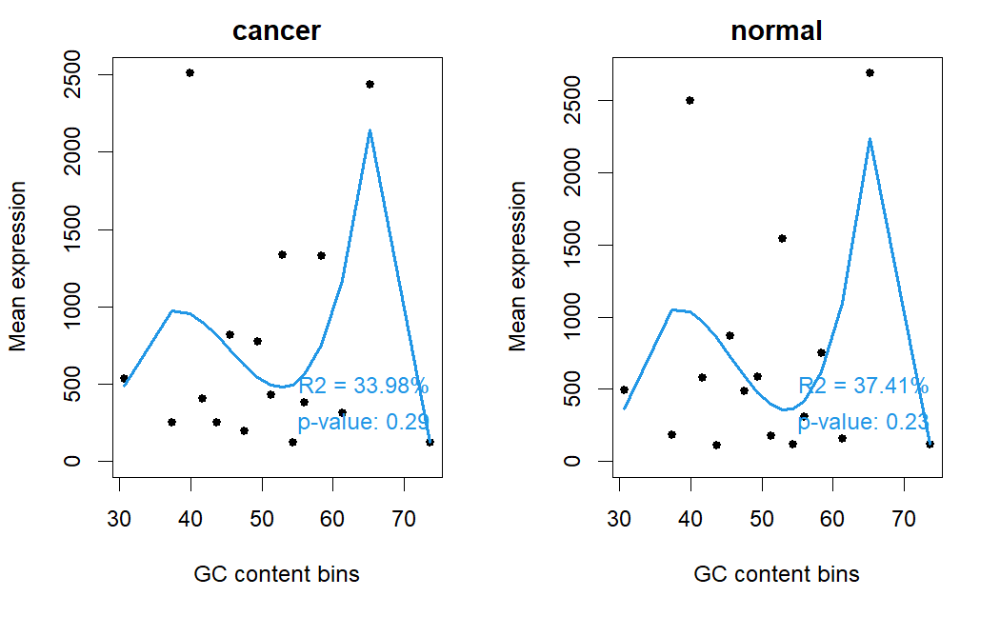
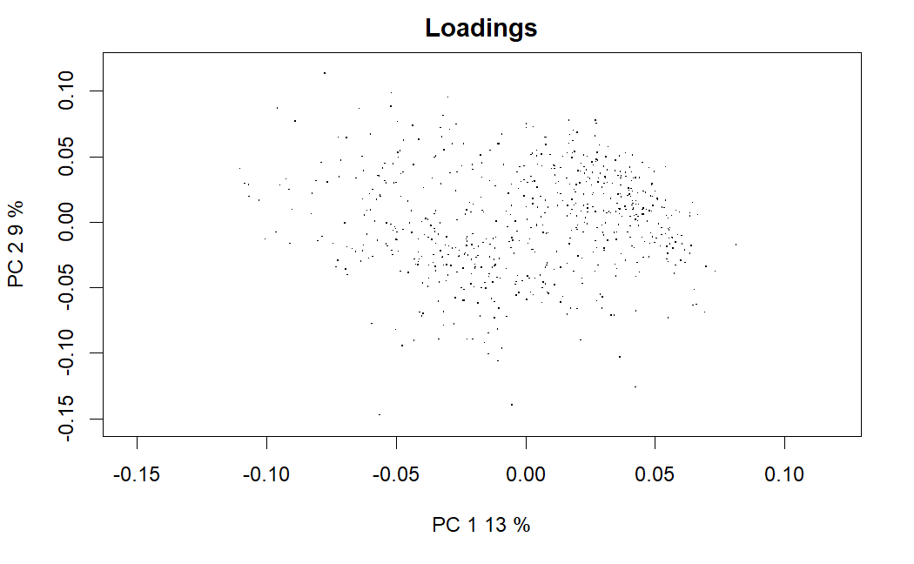
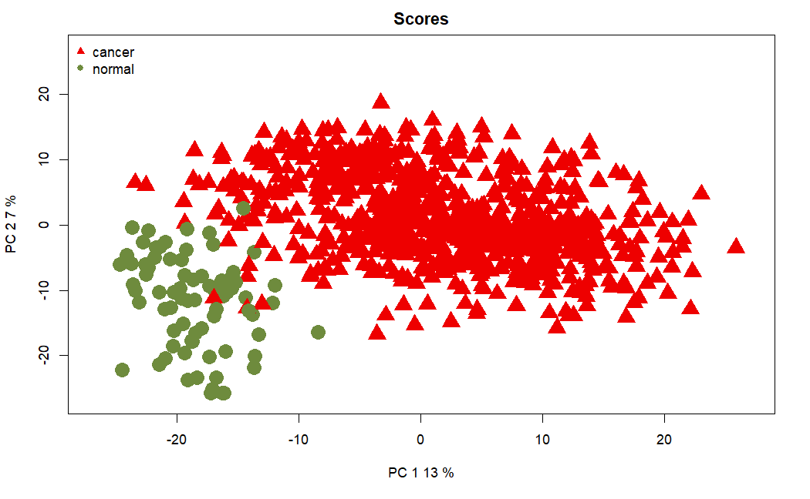
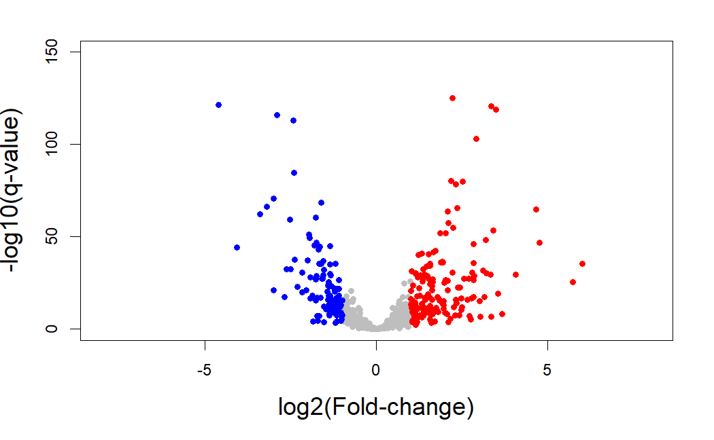
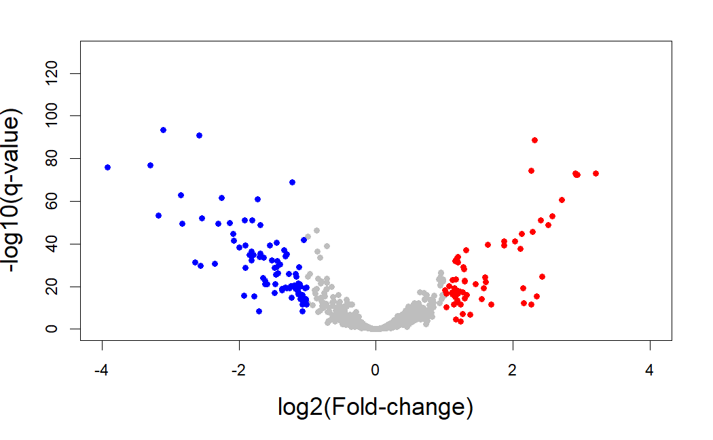
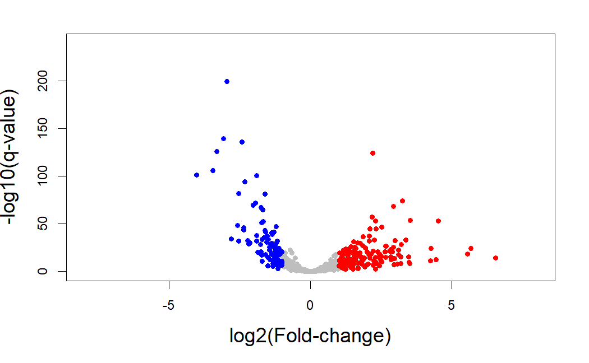

```{r setup, include=FALSE}
```

# Loading

For each miRNA, we have different counts depending on the region it matched (precursor, mature, stem-loop, etc...). However, we are only interested in mature miRNAs as these are the ones that biologically target transcripts and thus regulate gene expression. For example, miRNA hsa-let-7a-1 has two mature isoforms: mature,MIMAT0000062, which would be  hsa-let-7a-5p; and mature,MIMAT0004481 which is hsa-let-7a-3p. For each of these two regions there are many count readings (because they map to different coordinates in the genome) so we need to get the sum of all counts for each region.

```{r}
load("data/raw/miRNA-Seq/miRNA.rda")

head(mirna)[, 1:4]
```


```{r, eval = FALSE}
# taken from https://github.com/rptashkin/TCGA_miRNASeq_matrix

filenames = dir(path="GDCdata/TCGA-BRCA/harmonized/Transcriptome_Profiling/Isoform_Expression_Quantification/", recursive = TRUE, pattern="*isoforms.quantification.txt$", include.dirs = TRUE, full.names = TRUE)

library(splitstackshape)
library(qdap)
library(plyr)
library(reshape)

update_miRname = function(infile)
{
  tempFile = read.table(infile, header=TRUE, stringsAsFactors=FALSE)
  tempFile =cSplit(tempFile, "miRNA_region", sep=",")
  full_list = read.table("results/preprocessing/cookingmiRNASeq/hsa_miR_accessionTOname.txt", header=TRUE, stringsAsFactors=FALSE)
  
  tempFile$fullName = lookup(tempFile$miRNA_region_2, full_list$Alias, full_list$Name)
  temp2 = data.frame(tempFile$fullName, tempFile$read_count)
  colnames(temp2) = c("miRNA", "Count")
  write.table(tempFile, file=paste(infile, ".names.txt", sep=""),sep="\t",col.names=TRUE, row.names=FALSE)
  write.table(temp2, file=paste(infile, ".counts.txt", sep=""),sep="\t",col.names=TRUE, row.names=FALSE)
  
  
  temp3 = temp2[!(is.na(temp2[,1])),]
  temp3 = temp3[order(temp3[,1]), ]
  temp3 = aggregate(data=temp3, temp3[,2] ~ temp3[,1], FUN=sum)
  colnames(temp3) = c("miRNA", infile)
  write.table(temp3, file=paste(infile, ".sumSort.txt", sep=""),sep="\t",col.names=TRUE, row.names=FALSE)
  
}

lapply(filenames, update_miRname)

#next need to join all the data matrix files into one matrix

mergeFiles = list.files(path="GDCdata/TCGA-BRCA/harmonized/Transcriptome_Profiling/Isoform_Expression_Quantification", pattern="*sumSort.txt", recursive = TRUE, include.dirs = TRUE, full.names = TRUE)

for (file in mergeFiles){
  if(!exists("mirNames")){
    mirNames = read.table(file, header=TRUE, stringsAsFactors=FALSE)
  }
  if(exists("mirNames")){
    temp_dataset = read.table(file, header=TRUE, stringsAsFactors=FALSE)
    mirNames = rbind.fill(mirNames, temp_dataset)
    rm(temp_dataset)
  }
  
}

mirNames = as.matrix(mirNames[,1])
mirNames = as.data.frame((sort(unique(mirNames))))
colnames(mirNames) = "miRNA"

# merge each file with this generated names column, putting zero if no match

import.list <- llply(mergeFiles, read.table, header=TRUE)

mirna.raw.counts =join(mirNames, as.data.frame(import.list[1]), by= "miRNA", type="left")

for(i in 2:length(mergeFiles)){
  mirna.raw.counts =join(mirna.raw.counts, as.data.frame(import.list[i]), by= "miRNA", type="left")
}


mirna.raw.counts[is.na(mirna.raw.counts)] = 0

barcodes <- colnames(mirna.raw.counts)
barcodes <- barcodes[-1]
barcodes <- substr(barcodes, 126, 161)
barcodes <- gsub(".", "-", barcodes, fixed = TRUE)

mirna.metadata <- read.table("results/preprocessing/cookingmiRNASeq/mirna.metadata.txt", sep = "\t", header = TRUE)

mirna.metadata$file_name <- substr(mirna.metadata$file_name, 1, 36)

colnames(mirna.raw.counts) <- c("miRNA", mirna.metadata[match(barcodes, mirna.metadata$file_name), "cases"])
```

Some of the samples are duplicated, so we need to either remove one of them or take the average. We have 15 patients for which more than one file is available, which is too much to look into one by one. What we'll do instead is follow the guidelines set by the Broad Institute, using [their replicate samples table](https://gdac.broadinstitute.org/runs/tmp/sample_report__2018_01_17/Replicate_Samples.html).

```{r, eval = FALSE}
mirna.raw.counts[,c("TCGA-A7-A26F-01B-04R-A22P-13", "TCGA-A7-A26J-01A-11R-A168-13", "TCGA-A7-A26J-01B-02R-A27D-13", "TCGA-A7-A13G-01B-04R-A22P-13", "TCGA-A7-A26E-01B-06R-A27D-13", "TCGA-A7-A26E-01A-11R-A168-13", "TCGA-B6-A1KC-01A-11R-A13P-13", "TCGA-AC-A2QH-01B-04R-A22P-13", "TCGA-AC-A3QQ-01A-11R-A22I-13", "TCGA-A7-A13E-01A-11R-A12O-13", "TCGA-A7-A13E-01B-06R-A27D-13", "TCGA-A7-A0DC-01A-11R-A010-13", "TCGA-A7-A13D-01A-13R-A12O-13", "TCGA-A7-A13D-01B-04R-A27D-13", "TCGA-AC-A3OD-01A-11R-A21U-13", "TCGA-A7-A26I-01B-06R-A22P-13")] <- NULL

rownames(mirna.raw.counts) <- mirna.raw.counts$miRNA
mirna.raw.counts$miRNA <- NULL
  
write.table(mirna.raw.counts, file="results/preprocessing/cookingmiRNASeq/mirna.raw.counts.txt", sep="\t", col.names=NA, row.names=TRUE)
```


Let's look at the data.

```{r, eval = FALSE}
mirna.raw.counts <- read.table(file ="results/preprocessing/cookingmiRNASeq/mirna.raw.counts.txt", sep = "\t")
colnames(mirna.raw.counts) <- mirna.raw.counts[1, ]
mirna.raw.counts <- mirna.raw.counts[-1, ]
mirna.names <- mirna.raw.counts[, 1]
mirna.raw.counts <- mirna.raw.counts[, -1]
mirna.raw.counts <- as.data.frame(sapply(mirna.raw.counts, as.numeric))
rownames(mirna.raw.counts) <- mirna.names

boxplot(mirna.raw.counts[, 1:50] + 1, log = "y", outline = FALSE, las = 2, names = substr(colnames(mirna.raw.counts), 6, 12)[1:50])
```


# Filtering

We already have our miRNA data in `mirna.raw.counts`, but we still have to define our factors as `condition`, `tss`, `plate`, `portion`and `sample`, which we can easily extract with the `TCGAbiolinks` function `get_IDs`.

```{r, eval = FALSE}
library(NOISeq)
library(TCGAbiolinks)
```


```{r, eval = FALSE}
barcodes <- get_IDs(mirna.raw.counts)
myfactors <- data.frame(barcodes$tss, barcodes$portion, barcodes$plate, barcodes$condition)
head(myfactors)
```

Choosing a CPM threshold.

```{r, eval = FALSE}
library(SummarizedExperiment)
library(edgeR)
library(limma)
library(ggplot2)

mean_log_cpm <- aveLogCPM(mirna.raw.counts)

filter_threshold <- log2(0.5)

ggplot() + aes(x=mean_log_cpm) +
    geom_histogram(binwidth=0.2) +
    geom_vline(xintercept=filter_threshold) +
    ggtitle("Histogram of logCPM before filtering")
```


```{r, eval = FALSE}
ggplot() + aes(x=mean_log_cpm) +
    geom_density() +
    geom_vline(xintercept=filter_threshold) +
    ggtitle("Density plot of logCPM before filtering") +
    xlim(-6.1, 13.5)
```


So let's try CPM filtering with a `CPM threshold = 0.2, 0.5 and 1` and a `cv.cutoff = 500`, so that we remove those features with low expression (but not with low variability). We will also apply Wilcoxon test filtering and compare the results.

```{r, eval = FALSE}
myfiltCPM01 <- filtered.data(mirna.raw.counts, factor = myfactors$barcodes.condition, norm = FALSE, depth = NULL, method = 1, cv.cutoff = 500, cpm = 0.1, p.adj = "fdr") # 988 features are to be kept for differential expression analysis with filtering method 1

myfiltCPM02 <- filtered.data(mirna.raw.counts, factor = myfactors$barcodes.condition, norm = FALSE, depth = NULL, method = 1, cv.cutoff = 500, cpm = 0.2, p.adj = "fdr") # 837 features are to be kept for differential expression analysis with filtering method 1

myfiltCPM05 <- filtered.data(mirna.raw.counts, factor = myfactors$barcodes.condition, norm = FALSE, depth = NULL, method = 1, cv.cutoff = 500, cpm = 0.5, p.adj = "fdr") # 646 features are to be kept for differential expression analysis with filtering method 1

myfiltCPM1 <- filtered.data(mirna.raw.counts, factor = myfactors$barcodes.condition, norm = FALSE, depth = NULL, method = 1, cv.cutoff = 500, cpm = 1, p.adj = "fdr") # 550 features are to be kept for differential expression analysis with filtering method 1

myfiltWilcoxon <- filtered.data(mirna.raw.counts, factor = myfactors$barcodes.condition, norm = FALSE, depth = NULL, method = 2, p.adj = "fdr") # 1993 features are to be kept for differential expression analysis with filtering method 2
```


```{r, eval = FALSE}
boxplot(log10(myfiltCPM02[, 1:50])+1, outline = FALSE, las = 2, names = substr(colnames(myfiltCPM02), 6, 12)[1:50])
```


```{r, eval = FALSE}
boxplot(log10(myfiltCPM05[, 1:50])+1, outline = FALSE, las = 2, names = substr(colnames(myfiltCPM05), 6, 12)[1:50])
```


```{r, eval = FALSE}
boxplot(log10(myfiltCPM1[, 1:50])+1, outline = FALSE, las = 2, names = substr(colnames(myfiltCPM1), 6, 12)[1:50])
```


```{r, eval = FALSE}
boxplot(log10(myfiltWilcoxon[, 1:50])+1, outline = FALSE, las = 2, names = substr(colnames(myfiltWilcoxon), 6, 12)[1:50])
```


We'll choose method 1 with a CPM threshold of 0.5, which leaves us with 29% of the total miRNAs.

# Exploring

```{r, eval = FALSE}
mirna.filt.counts <- myfiltCPM05

rm(myfiltCPM05)

save(mirna.filt.counts, file = "data/cooked/miRNA-Seq/miRNA.filt.rda")
```

And we'll need GC content information. First, we need to convert mature miRNAs to their precursors and then to accession (e.g. MI0003772), which we can then input into biomaRt to get GC-content information.

```{r, eval = FALSE}
load(file = "data/cooked/miRNA-Seq/miRNA.filt.rda")
library(miRBaseConverter)
precursors <- miRNA_MatureToPrecursor(miRNANames = rownames(mirna.filt.counts))
accessions <- miRNA_NameToAccession(miRNANames = precursors$Precursor, version = "v20")

library(biomaRt)
mart = useMart(biomart="ensembl", dataset="hsapiens_gene_ensembl")
length(unique(accessions$Accession)) # 452 accessions to convert
GC.content.miRNA <- getBM(filters="mirbase_accession",
                         attributes=c("mirbase_accession", "percentage_gene_gc_content"), 
                         values=accessions$Accession,
                         mart=mart)

missing.accessions <- setdiff( accessions$Accession, GC.content.miRNA$mirbase_accession)
length(missing.accessions) # 8 missing accessions
```
There are 8 miRNA accessions for which we are lacking GC-content information, but we can get the miRNA sequence, convert it to DNA and calculate GC-content from there.

```{r, eval = FALSE}
sequences <- getMiRNASequence(accessions$Accession)
sequences$miRNASequence_v22 <- gsub(x = sequences$miRNASequence_v22, pattern = "U", replacement = "T")

calculate.GC.content <- function(sequence)
{
    sequence_vec <- unlist(strsplit(sequence, split = ""))
    C_total <- sum(sequence_vec == "C")
    G_total <- sum(sequence_vec == "G")
    GC <- C_total + G_total
    GC.content <- GC/length(sequence_vec)*100
    GC.content <- round(as.numeric(GC.content), 2)
    return(GC.content)
}

sequences$GC.content <- lapply(X = sequences$miRNASequence_v22, FUN = calculate.GC.content)

dead.mirnas <- which(is.na(sequences$GC.content)) # 44 336 349 423

sequences[dead.mirnas, "Accession"]
# [1] "MI0006388" "MI0015997" "MI0016053" "MI0016807"

miRNA.information <- cbind(precursors, accessions, sequences)
miRNA.information <- miRNA.information[, c(-3, -4, -6)]
colnames(miRNA.information) <- c("Mature", "Precursor", "Accession", "GC.content")

miRNA.information <- apply(miRNA.information,2,as.character)

mirna.filt.counts <- mirna.filt.counts[-dead.mirnas, ]
miRNA.information <- miRNA.information[-dead.mirnas, ]

write.table(miRNA.information, file = "results/preprocessing/cookingmiRNASeq/miRNA.information.txt", sep = "\t", quote = FALSE, row.names = FALSE)

save(mirna.filt.counts, file = "data/cooked/miRNA-Seq/miRNA.filt.rda")
```

There are 4 miRNAs that are still missing - why? Well, our matrix was preprocessed using information from miRBase v20, which did contain these miRNAs; however, they are dead in the latest version (v22) which is why we are unable to retrieve their sequences. We will have to delete the mature miRNAs generating from it from the filtered counts matrix as well.

```{r, eval = FALSE}
library(TCGAbiolinks)
library(NOISeq)

load(file = "data/cooked/miRNA-Seq/miRNA.filt.rda")
miRNA.information <- read.table("results/preprocessing/cookingmiRNASeq/miRNA.information.txt", header = TRUE)

mygc = c(miRNA.information$GC.content)
names(mygc) = c(miRNA.information$Mature)

barcodes <- get_IDs(mirna.filt.counts)
myfactors <- data.frame(barcodes$tss, barcodes$portion, barcodes$plate, barcodes$condition)
head(myfactors)

mymirnadata.filt <- NOISeq::readData(data = mirna.filt.counts, factors = myfactors, gc = mygc)
```

Since the number of miRNAs (642) was too low to be able to plot GC bias (given that by default, `NOISeq` makes each bin have 200 features) I had to change the source code of the functions so that each bin had 40 features instead.

```{r, eval = FALSE}
source(file = "scripts/preprocessing/GCbias.R")
GC.plot(GC.dat(mymirnadata.filt, factor = "barcodes.condition"))
```


Although there seems to be no GC-content bias, we'll try normalizing for it with `cqn` and `EDASeq` to compare the results.

```{r, eval = FALSE}
library(NOISeq)
mymirnaPCA = dat(mymirnadata.filt, type = "PCA")
par(cex = 0.75)
explo.plot(mymirnaPCA, factor = "barcodes.condition", plottype = "scores")
```


```{r, eval = FALSE}
explo.plot(mymirnaPCA, factor = "barcodes.condition", plottype = "loadings")
```


```{r, eval = FALSE}
explo.plot(mymirnaPCA, factor = "barcodes.tss")
```


```{r, eval = FALSE}
explo.plot(mymirnaPCA, factor = "barcodes.portion")
```


```{r, eval = FALSE}
explo.plot(mymirnaPCA, factor = "barcodes.plate")
```


# Normalizing

## cqn

`cqn` with all length = 1000.

```{r, eval = FALSE}
library(cqn)
sizeFactors.mirna <- colSums(mirna.filt.counts)

mirna.cqn.norm <- cqn(mirna.filt.counts, lengthMethod = "fixed", lengths = rep(100, 642), x = mygc, sizeFactors = sizeFactors.mirna, verbose = TRUE)

save(mirna.cqn.norm, file = "reports/preprocessing/files/cookingmiRNASeq/miRNA.cqn.norm.rda")

# Extract normalized data to check for bias on NOISeq
mirna.cqn.norm.expression <- mirna.cqn.norm$y + mirna.cqn.norm$offset
mirna.cqn.norm.expression <- as.data.frame(mirna.cqn.norm.expression)
```

## EDASeq

Now `EDASeq`.

```{r, eval = FALSE}
library(EDASeq)

feature <- data.frame(gc=mygc)

data <- newSeqExpressionSet(counts=as.matrix(mirna.filt.counts), featureData=feature, phenoData=data.frame(conditions=barcodes$condition, row.names=barcodes$barcode))

dataWithin <- withinLaneNormalization(data, "gc", which="full")
mirna.eda.norm <- betweenLaneNormalization(dataWithin, which="full")

save(mirna.eda.norm, file = "reports/preprocessing/files/cookingmiRNASeq/miRNA.eda.norm.rda")

load("reports/preprocessing/files/cookingmiRNASeq/miRNA.eda.norm.rda")
```

"Normalization factors should be on the scale of the counts, like size factors, and unlike offsets which are typically on the scale of the predictors (i.e. the logarithmic scale for the negative binomial GLM). At the time of writing, the transformation from the matrices provided by these packages should be":

```{r, eval = FALSE}
# Extract the offset, which will be input directly into DEseq2 to normalise the counts. 
normFactors <- withinLaneNormalization(data,"gc",
                                       which="full", offset=TRUE)
normFactors <- betweenLaneNormalization(normFactors,
                                        which="full", offset=TRUE)

normFactors <- exp(-1 * normFactors@assayData$offset)
save(normFactors, file = "reports/preprocessing/files/cookingmiRNASeq/miRNA.normFactors.rda")
```


```{r, eval = FALSE}
# Extract normalized counts to check for bias on NOISeq
mirna.eda.counts <- mirna.eda.norm@assayData$normalizedCounts
mirna.eda.counts <- as.data.frame(mirna.eda.counts)
```

Check if it fixed bias.

```{r, eval = FALSE}
mymirnadata.norm.cqn <- NOISeq::readData(data = mirna.cqn.norm.expression, factors = myfactors, gc = mygc)
GC.plot(GC.dat(mymirnadata.norm.cqn, factor = "barcodes.condition"))
```


```{r, eval = FALSE}
mymirnadata.norm.eda <- NOISeq::readData(data = mirna.eda.counts, factors = myfactors, gc = mygc)
GC.plot(GC.dat(mymirnadata.norm.eda, factor = "barcodes.condition"))
```



```{r, eval = FALSE}
mymirnaPCA = dat(mymirnadata.norm.cqn, type = "PCA", logtransf = TRUE)
par(cex = 0.75)
explo.plot(mymirnaPCA, factor = "barcodes.condition", plottype = "scores")
```


```{r, eval = FALSE}
explo.plot(mymirnaPCA, factor = "barcodes.condition", plottype = "loadings")
```



```{r, eval = FALSE}
mymirnaPCA = dat(mymirnadata.norm.eda, type = "PCA")
par(cex = 0.75)
explo.plot(mymirnaPCA, factor = "barcodes.condition", plottype = "scores")
```



```{r, eval = FALSE}
explo.plot(mymirnaPCA, factor = "barcodes.condition", plottype = "loadings")
```


There is no point normalizing in this case, since we can't see GC-content bias (not just that, but normalizing seems to increase it) and the only possible source of bias is sequencing depth, which is already accounted for when performing differential expression analysis when calculating normalization factors.

# Analyzing differential expression

## DESeq2

```{r, eval = FALSE}
library(DESeq2)
library(TCGAbiolinks)

load("data/cooked/miRNA-Seq/miRNA.filt.rda")

library(TCGAbiolinks)
barcodes <- get_IDs(mirna.filt.counts)
barcodes$condition <- as.factor(barcodes$condition)
barcodes$condition <- relevel(barcodes$condition, ref = "normal")
myfactors <- data.frame(barcodes$tss, barcodes$portion, barcodes$plate, barcodes$condition)

dds <- DESeqDataSetFromMatrix(countData = mirna.filt.counts,
                              colData = barcodes,
                              design = ~ condition)

dds <- DESeq(dds)
resultsNames(dds) # lists the coefficients
# [1] "Intercept"                          
# [2] "condition_cancer_vs_normal"
res.deseq2 <- results(dds, alpha = 0.05)
summary(res.deseq2)
```

```{r, eval = FALSE}
out of 642 with nonzero total read count
adjusted p-value < 0.05
LFC > 0 (up)       : 302, 47%
LFC < 0 (down)     : 218, 34%
outliers [1]       : 0, 0%
low counts [2]     : 0, 0%
(mean count < 0)
```

Let's paint a PCA plot using the normalized data inside `dds` to see if it improved sample separation.

```{r, eval = FALSE}
vsd <- varianceStabilizingTransformation(dds, blind=FALSE)
plotPCA(vsd)
```


We had to decrease our lFC threshold from 2 to 1, as otherwise we ended up getting a ridiculous number of DEGs (9 in total, after intersecting all DEA methods).

We'll select as significant those genes with a p.adj < 0.05 and a lFC > 1 or lFC < -1. We get a total of 205 upregulated DEGs (a 32% of the filtered genes) in cancer samples, compared to normal ones; and 151 downregulated DEGs (a 23.5% of the filtered genes), from a total of 642 filtered miRNAs (originally 2,209 miRNAs in our raw data).

```{r, eval = FALSE}
log.fold.change <- res.deseq2$log2FoldChange
q.value <- res.deseq2$padj
genes.ids <- rownames(mirna.filt.counts)
names(log.fold.change) <- genes.ids
names(q.value) <- genes.ids
activated.genes.deseq2 <- genes.ids[log.fold.change > 1 & q.value < 0.05]
activated.genes.deseq2 <- activated.genes.deseq2[!is.na(activated.genes.deseq2)]
repressed.genes.deseq2 <- genes.ids[log.fold.change < - 1 & q.value < 0.05]
repressed.genes.deseq2 <- repressed.genes.deseq2[!is.na(repressed.genes.deseq2)]
length(activated.genes.deseq2) # 156
length(repressed.genes.deseq2) # 112

log.q.val <- -log10(q.value)
plot(log.fold.change,log.q.val,pch=19,col="grey",cex=0.8,
xlim=c(-8,8),ylim = c(0,150),
xlab="log2(Fold-change)",ylab="-log10(q-value)",cex.lab=1.5)
points(x = log.fold.change[activated.genes.deseq2],
y = log.q.val[activated.genes.deseq2],col="red",cex=0.8,pch=19)
points(x = log.fold.change[repressed.genes.deseq2],
y = log.q.val[repressed.genes.deseq2],col="blue",cex=0.8,pch=19)
```



We don't have to convert our DEGs IDs, since they are using standard miRNA IDs. Let's just save them.

```{r, eval = FALSE}
write.table(activated.genes.deseq2, file = "results/preprocessing/cookingmiRNASeq/DESeq2.up.txt", row.names = FALSE, col.names = FALSE, quote = FALSE)

write.table(repressed.genes.deseq2, file = "results/preprocessing/cookingmiRNASeq/DESeq2.down.txt", row.names = FALSE, col.names = FALSE, quote = FALSE)

resOrdered <- res.deseq2[order(res.deseq2$padj),]
head(resOrdered)
resOrderedDF <- as.data.frame(resOrdered)
resOrderedDF <- na.omit(resOrderedDF)
write.table(resOrderedDF, file = "results/preprocessing/cookingmiRNASeq/DESeq2.ordered.tsv", row.names=TRUE, col.names=TRUE, sep="\t", quote=FALSE)
```

## limma

```{r, eval = FALSE}
library(limma)
library(edgeR)

dge <- DGEList(counts=mirna.filt.counts)
dge <- calcNormFactors(dge) # TMM normalization from edgeR
logCPM <- cpm(dge, log=TRUE, prior.count=3) # logCPM conversion from edgeR
# average count to be added to each observation to avoid taking log of zero

design <- model.matrix(~ barcodes$condition)

fit1 <- lmFit(logCPM, design)

fit2 <- eBayes(fit1)

top.limma <- topTable(fit2, coef = 2, number = Inf)

log.fold.change <- top.limma$logFC
q.value <- top.limma$adj.P.Val
genes.ids <- rownames(top.limma)
names(log.fold.change) <- genes.ids
names(q.value) <- genes.ids

activated.genes.limma <- genes.ids[log.fold.change > 1 & q.value < 0.05]
repressed.genes.limma <- genes.ids[log.fold.change < -1 & q.value < 0.05]

length(activated.genes.limma) # 63
length(repressed.genes.limma) # 88

log.q.val <- -log10(q.value)
plot(log.fold.change,log.q.val,pch=19,col="grey",cex=0.8,
xlim=c(-4,4),ylim = c(0,130),
xlab="log2(Fold-change)",ylab="-log10(q-value)",cex.lab=1.5)
points(x = log.fold.change[activated.genes.limma],
y = log.q.val[activated.genes.limma],col="red",cex=0.8,pch=19)
points(x = log.fold.change[repressed.genes.limma],
y = log.q.val[repressed.genes.limma],col="blue",cex=0.8,pch=19)
```



```{r, eval = FALSE}
write.table(activated.genes.limma, file = "results/preprocessing/cookingmiRNASeq/limma.up.txt", row.names = FALSE, col.names = FALSE, quote = FALSE)

write.table(repressed.genes.limma, file = "results/preprocessing/cookingmiRNASeq/limma.down.txt", row.names = FALSE, col.names = FALSE, quote = FALSE)

topOrdered <- top.limma[order(top.limma$adj.P.Val),]
topOrderedDF <- as.data.frame(topOrdered)
topOrderedDF <- na.omit(topOrderedDF)
write.table(topOrderedDF, file = "results/preprocessing/cookingmiRNASeq/limma.ordered.tsv", row.names=TRUE, col.names=TRUE, sep="\t", quote=FALSE)
```

## limma-voom

When the library sizes are quite variable between samples, then the voom approach is theoretically more powerful than limma-trend, which could be the case here.

```{r, eval = FALSE}
v <- voom(mirna.filt.counts, design, plot=TRUE)
fit <- lmFit(v, design)
fit2 <- eBayes(fit)
top.limma.voom <- topTable(fit2, coef=ncol(design), number = Inf)

log.fold.change <- top.limma.voom$logFC
q.value <- top.limma.voom$adj.P.Val
genes.ids <- rownames(top.limma.voom)
names(log.fold.change) <- genes.ids
names(q.value) <- genes.ids

activated.genes.limma.voom <- genes.ids[log.fold.change > 1 & q.value < 0.05]
repressed.genes.limma.voom <- genes.ids[log.fold.change < -1 & q.value < 0.05]

length(activated.genes.limma.voom) # 87
length(repressed.genes.limma.voom) # 127

log.q.val <- -log10(q.value)
plot(log.fold.change,log.q.val,pch=19,col="grey",cex=0.8,
xlim=c(-6,6),ylim = c(0,150),
xlab="log2(Fold-change)",ylab="-log10(q-value)",cex.lab=1.5)
points(x = log.fold.change[activated.genes.limma.voom],
y = log.q.val[activated.genes.limma.voom],col="red",cex=0.8,pch=19)
points(x = log.fold.change[repressed.genes.limma.voom],
y = log.q.val[repressed.genes.limma.voom],col="blue",cex=0.8,pch=19)
```


We get quite a different result with `limma-voom` compared to `limma`. In order to end up with a sizeable number of DEGs, we'll use `limma-voom` instead of `limma`.

```{r, eval = FALSE}
write.table(activated.genes.limma.voom, file = "results/preprocessing/cookingmiRNASeq/limma.voom.up.txt", row.names = FALSE, col.names = FALSE, quote = FALSE)

write.table(repressed.genes.limma.voom, file = "results/preprocessing/cookingmiRNASeq/limma.voom.down.txt", row.names = FALSE, col.names = FALSE, quote = FALSE)

topOrdered <- top.limma.voom[order(top.limma.voom$adj.P.Val),]
topOrderedDF <- as.data.frame(topOrdered)
topOrderedDF <- na.omit(topOrderedDF)
write.table(topOrderedDF, file = "results/preprocessing/cookingmiRNASeq/limma.voom.ordered.tsv", row.names=TRUE, col.names=TRUE, sep="\t", quote=FALSE)
```

## edgeR

```{r, eval = FALSE}
library(edgeR)

y <- DGEList(counts = mirna.filt.counts, lib.size = colSums(mirna.filt.counts), group = barcodes$condition, genes = rownames(mirna.filt.counts))
```

```{r, eval = FALSE}
design <- model.matrix(~ barcodes$condition)

y <- estimateCommonDisp(y, design = design)
y <- estimateTagwiseDisp(y, design = design)
plotBCV(y)
```


This time it's also better to estimate dispersions tagwise instead of using a common one for all genes.

```{r, eval = FALSE}
et <- exactTest(y) # performs pair-wise tests for differential expression between two groups
top.edger <- topTags(et, n = Inf) # takes the output from exactTest(), adjusts the raw p-values using the False Discovery Rate (FDR) correction, and returns the top differentially expressed genes

summary(decideTestsDGE(et, lfc = 1, p.value = 0.05))

#        cancer-normal
# Down             103
# NotSig           381
# Up               158
```

```{r, eval = FALSE}
top.edger <- top.edger$table
top.edger <- top.edger[order(top.edger$genes), ]
log.fold.change <- top.edger$logFC
q.value <- top.edger$FDR
genes.ids <- rownames(mirna.filt.counts)
names(log.fold.change) <- genes.ids
names(q.value) <- genes.ids
activated.genes.edger <- genes.ids[log.fold.change > 1 & q.value < 0.05] # 158
activated.genes.edger <- activated.genes.edger[!is.na(activated.genes.edger)]
repressed.genes.edger <- genes.ids[log.fold.change < - 1 & q.value < 0.05] # 103
repressed.genes.edger <- repressed.genes.edger[!is.na(repressed.genes.edger)]

log.q.val <- -log10(q.value)
plot(log.fold.change,log.q.val,pch=19,col="grey",cex=0.8,
xlim=c(-8,8),ylim = c(0,240),
xlab="log2(Fold-change)",ylab="-log10(q-value)",cex.lab=1.5)
points(x = log.fold.change[activated.genes.edger],
y = log.q.val[activated.genes.edger],col="red",cex=0.8,pch=19)
points(x = log.fold.change[repressed.genes.edger],
y = log.q.val[repressed.genes.edger],col="blue",cex=0.8,pch=19)
```


```{r, eval = FALSE}
write.table(activated.genes.edger, file = "results/preprocessing/cookingmiRNASeq/edgeR.up.txt", row.names = FALSE, col.names = FALSE, quote = FALSE)

write.table(repressed.genes.edger, file = "results/preprocessing/cookingmiRNASeq/edgeR.down.txt", row.names = FALSE, col.names = FALSE, quote = FALSE)

top.edger <- as.data.frame(top.edger)

topOrdered <- top.edger[order(top.edger$FDR),]
topOrderedDF <- as.data.frame(topOrdered)
topOrderedDF <- na.omit(topOrderedDF)
write.table(topOrderedDF, file = "results/preprocessing/cookingmiRNASeq/edgeR.ordered.tsv", row.names=TRUE, col.names=TRUE, sep="\t", quote=FALSE)
```

## Intersecting DEGs

```{r, eval = FALSE}
# with DESeq2, limma and edgeR
common.activated <- intersect(intersect(activated.genes.deseq2, activated.genes.edger), activated.genes.limma) # 62
common.repressed <- intersect(intersect(repressed.genes.deseq2, repressed.genes.edger), repressed.genes.limma) # 69

# with DESeq2, limma-voom and edgeR
common.activated <- intersect(intersect(activated.genes.deseq2, activated.genes.edger), activated.genes.limma.voom) # 86
common.repressed <- intersect(intersect(repressed.genes.deseq2, repressed.genes.edger), repressed.genes.limma.voom) # 91

# with DESeq2, limma, limma-voom and edgeR
common.activated <- intersect(intersect(intersect(activated.genes.deseq2, activated.genes.edger), activated.genes.limma.voom), activated.genes.limma) # 61
common.repressed <- intersect(intersect(intersect(repressed.genes.deseq2, repressed.genes.edger), repressed.genes.limma.voom), repressed.genes.limma) # 69
```

We'll select as DEGs as those intersecting for `DESeq2`, `limma-voom` and `edgeR`, since `limma` appears to miss out on quite a few of them.

```{r, eval = FALSE}
# with DESeq2, limma-voom and edgeR
common.activated <- intersect(intersect(activated.genes.deseq2, activated.genes.edger), activated.genes.limma.voom) # 86
common.repressed <- intersect(intersect(repressed.genes.deseq2, repressed.genes.edger), repressed.genes.limma.voom) # 91

write.table(common.activated, file = "results/preprocessing/cookingmiRNASeq/common.up.txt", row.names = FALSE, col.names = FALSE, quote = FALSE)

write.table(common.repressed, file = "results/preprocessing/cookingmiRNASeq/common.down.txt", row.names = FALSE, col.names = FALSE, quote = FALSE)
```

|     DEGs     | DESeq2 | limma-voom  | edgeR  | Common |
|:------------:|:------:|:------:|:------:|:-------:|
| *Activated*  |  132   |  79   |  129   |   67   |
| *Repressed* |  83  |  93   |  76   |   56   |
|   *Total*    | *215* | *172* | *205* | *123*  |

We have 177 DEGs, a 27.6% of the filtered miRNAs (642) and a 8% of the original miRNAs (2,209).

We will use the logFC results from `limma-voom` as input for Paintomics 4.

```{r, eval = FALSE}
dea.limma.voom.mirna <- read.table("results/preprocessing/cookingmiRNASeq/limma.voom.ordered.tsv")
mirna.expression <- as.data.frame(dea.limma.voom.mirna[, 1])
rownames(mirna.expression) <- rownames(dea.limma.voom.mirna)

write.table(mirna.expression, file = "results/associations/miRNA-gene/miRNA.expression.txt", sep = "\t", quote = FALSE, col.names = FALSE)
```