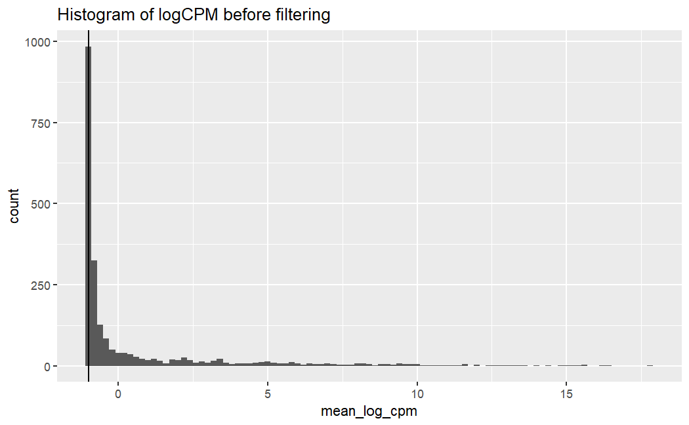
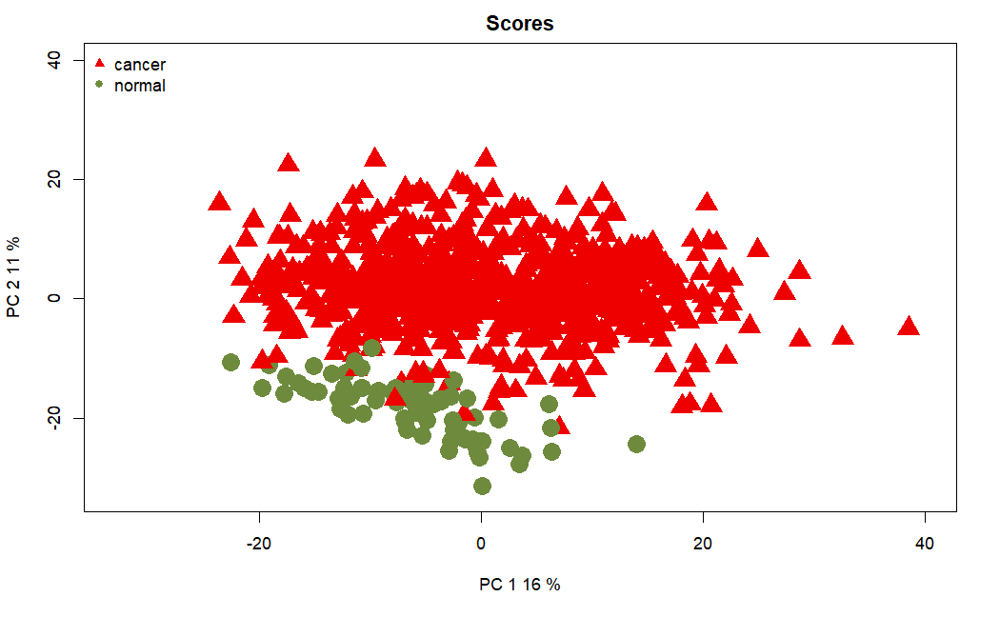
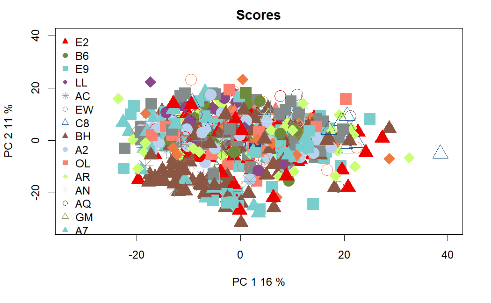
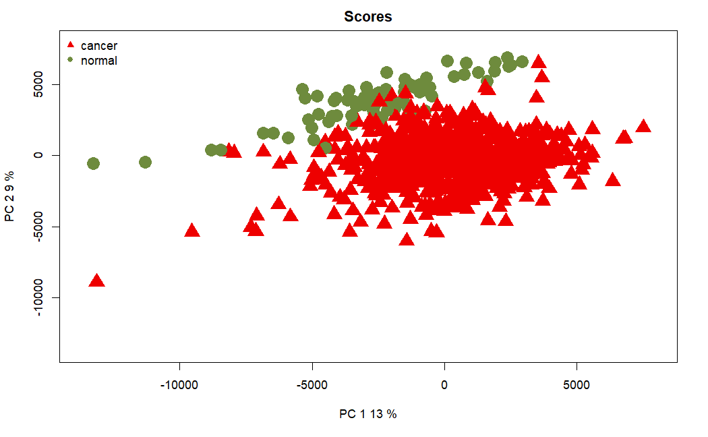
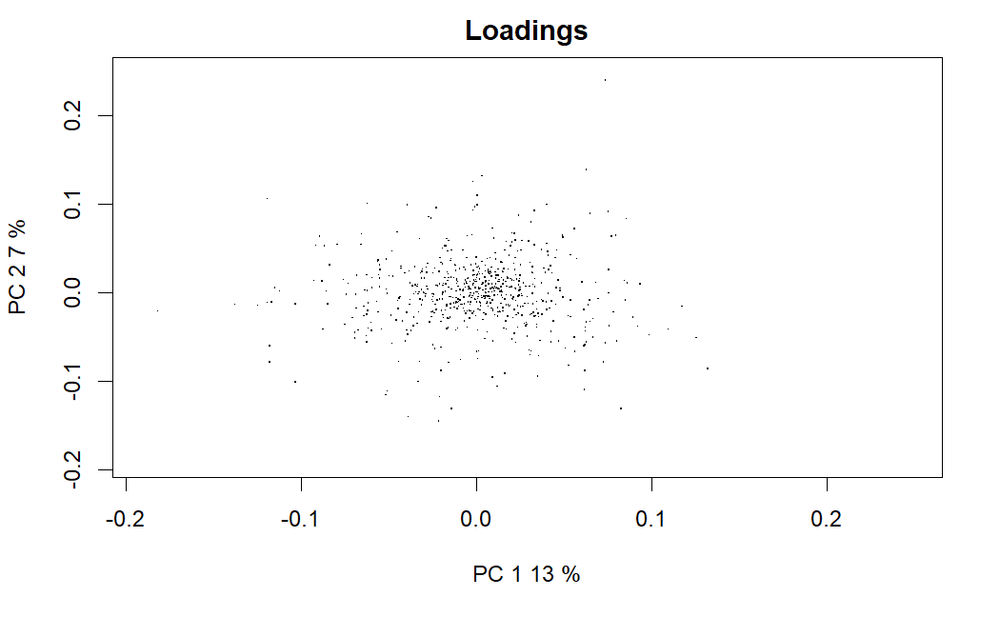
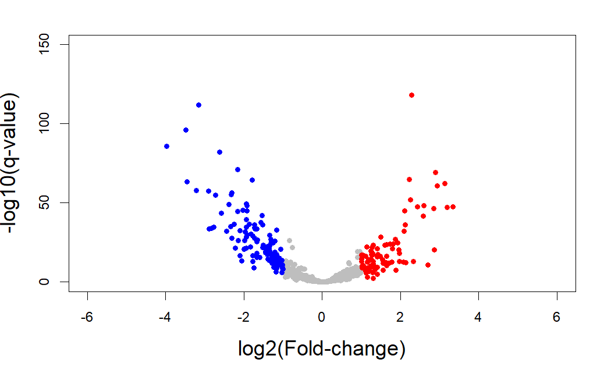

```{r setup, include=FALSE}
```

# Loading

We have information for 1,881 miRNAs, in rows, and 2,593 columns. For each sample, there are 3 columns: `read_count` (raw counts), `reads_per_million_miRNA_mapped` (counts normalized by dividing the read counts of a miRNA by the total read counts of the sample) and `cross-mapped` (which can be Y for YES or N for NO; if Y, it indicates that a single read aligns to more than one miRNA). Let's just use the raw counts (`read_count`) for now.

```{r}
load("data/raw/miRNA-Seq/miRNA.rda")

head(mirna)[, 1:4]
dim(mirna)

rownames(mirna) <- mirna$miRNA_ID
mirna <- mirna[, -1]

mirna.raw.counts <- colnames(mirna)[grep("count", colnames(mirna))]
mirna.raw.counts <- mirna[,mirna.raw.counts]
colnames(mirna.raw.counts) <- gsub("read_count_","", colnames(mirna.raw.counts))
rm(mirna)
```

Let's look at the data.

```{r, eval = FALSE}
boxplot(mirna.raw.counts[, 1:50] + 1, log = "y", outline = FALSE, las = 2)
```


# Filtering

We already have our miRNA data in `mirna.raw.counts`, but we still have to define our factors as `condition`, `tss`, `plate`, `portion`and `sample`, which we can easily extract with the `TCGAbiolinks` function `get_IDs`.

```{r, message = FALSE}
library(NOISeq)
library(TCGAbiolinks)
```


```{r}
barcodes <- get_IDs(mirna.raw.counts)
myfactors <- data.frame(barcodes$tss, barcodes$portion, barcodes$plate, barcodes$condition)
head(myfactors)
```

Choosing a CPM threshold.

```{r, eval = FALSE}
library(SummarizedExperiment)
library(edgeR)
library(limma)
library(ggplot2)

mean_log_cpm <- aveLogCPM(mirna.raw.counts)

filter_threshold <- log2(0.5)

ggplot() + aes(x=mean_log_cpm) +
    geom_histogram(binwidth=0.2) +
    geom_vline(xintercept=filter_threshold) +
    ggtitle("Histogram of logCPM before filtering")
```



```{r, eval = FALSE}
ggplot() + aes(x=mean_log_cpm) +
    geom_density() +
    geom_vline(xintercept=filter_threshold) +
    ggtitle("Density plot of logCPM before filtering") +
    xlim(-6.1, 13.5)
```


So let's try CPM filtering with a `CPM threshold = 0.2, 0.5 and 1` and a `cv.cutoff = 500`, so that we remove those features with low expression (but not with low variability). We will also apply Wilcoxon test filtering and compare the results.

```{r, eval = FALSE}
myfiltCPM01 <- filtered.data(mirna.raw.counts, factor = myfactors$barcodes.condition, norm = FALSE, depth = NULL, method = 1, cv.cutoff = 500, cpm = 0.1, p.adj = "fdr") # 799 features (35.2%) are to be kept for differential expression analysis with filtering method 1

myfiltCPM02 <- filtered.data(mirna.raw.counts, factor = myfactors$barcodes.condition, norm = FALSE, depth = NULL, method = 1, cv.cutoff = 500, cpm = 0.2, p.adj = "fdr") # 662 features (35.2%) are to be kept for differential expression analysis with filtering method 1

myfiltCPM05 <- filtered.data(mirna.raw.counts, factor = myfactors$barcodes.condition, norm = FALSE, depth = NULL, method = 1, cv.cutoff = 500, cpm = 0.5, p.adj = "fdr") # 501 features (26.6%) are to be kept for differential expression analysis with filtering method 1

myfiltCPM1 <- filtered.data(mirna.raw.counts, factor = myfactors$barcodes.condition, norm = FALSE, depth = NULL, method = 1, cv.cutoff = 500, cpm = 1, p.adj = "fdr") # 420 features (22.3%) are to be kept for differential expression analysis with filtering method 1

myfiltWilcoxon <- filtered.data(mirna.raw.counts, factor = myfactors$barcodes.condition, norm = FALSE, depth = NULL, method = 2, p.adj = "fdr") # 1434 (76.2%) features are to be kept for differential expression analysis with filtering method 2
```


```{r, eval = FALSE}
boxplot(log10(myfiltCPM02[, 1:50])+1, outline = FALSE, las = 2)
```


```{r, eval = FALSE}
boxplot(log10(myfiltCPM05[, 1:50])+1, outline = FALSE, las = 2)
```


```{r, eval = FALSE}
boxplot(log10(myfiltCPM1[, 1:50])+1, outline = FALSE, las = 2)
```


```{r, eval = FALSE}
boxplot(log10(myfiltWilcoxon[, 1:50])+1, outline = FALSE, las = 2)
```


We'll choose method 1 with a CPM threshold of 0.5.

# Exploring

```{r, eval = FALSE}
mirna.filt.counts <- myfiltCPM05

rm(myfiltCPM05)

save(mirna.filt.counts, file = "data/cooked/miRNA-Seq/miRNA.filt.rda")
```

And we'll need GC content information.

```{r, eval = FALSE}
# save ids to input into biomart
# write.csv(rownames(mirna.filt.counts), "results/preprocessing/cookingmiRNASeq/miRNA.IDs.txt", row.names = FALSE, col.names = FALSE, quote = FALSE)

GCcontent <- read.csv("results/preprocessing/cookingmiRNASeq/miRNA.biomart.txt", sep = "\t")

mygc = c(GCcontent$Gene...GC.content)
names(mygc) = c(GCcontent$miRBase.ID)
mygc = mygc[rownames(mirna.filt.counts)]
names(mygc) = rownames(mirna.filt.counts)

mygc <- na.omit(mygc) # 10 mirnas without information

mirna.filt.counts <- mirna.filt.counts[names(mygc),]

save(mygc, file = "results/preprocessing/cookingmiRNASeq/GC.miRNA.rda")

mymirnadata.filt <- NOISeq::readData(data = mirna.filt.counts, factors = myfactors, gc = mygc)
```

Since the number of miRNAs (491) was too low to be able to plot GC bias (given that by default, `NOISeq` makes each bin have 200 features) I had to change the source code of the functions so that each bin had 40 features instead.

```{r, eval = FALSE}
source(file = "scripts/preprocessing/GCbias.R")
GC.plot(GC.dat(mymirnadata.filt, factor = "barcodes.condition"))
```


There seems to be some GC content bias, so we'll trying normalizing those out with `cqn` and `EDASeq`.

```{r, eval = FALSE}
library(NOISeq)
mymirnaPCA = dat(mymirnadata.filt, type = "PCA")
par(cex = 0.75)
explo.plot(mymirnaPCA, factor = "barcodes.condition", plottype = "scores")
```



```{r, eval = FALSE}
explo.plot(mymirnaPCA, factor = "barcodes.condition", plottype = "loadings")
```


```{r, eval = FALSE}
explo.plot(mymirnaPCA, factor = "barcodes.tss")
```



```{r, eval = FALSE}
explo.plot(mymirnaPCA, factor = "barcodes.portion")
```


```{r, eval = FALSE}
explo.plot(mymirnaPCA, factor = "barcodes.plate")
```


# Normalizing

## cqn

`cqn` with all length = 1000.

```{r, eval = FALSE}
library(cqn)
load("results/preprocessing/cookingmiRNASeq/GC.miRNA.rda")
sizeFactors.mirna <- colSums(mirna.filt.counts)

mirna.cqn.norm <- cqn(mirna.filt.counts, lengthMethod = "fixed", lengths = rep(100, 491), x = mygc, sizeFactors = sizeFactors.mirna, verbose = TRUE)

save(mirna.cqn.norm, file = "reports/preprocessing/files/cookingmiRNASeq/miRNA.cqn.norm.rda")

# Extract normalized data to check for bias on NOISeq
mirna.cqn.norm.expression <- mirna.cqn.norm$y + mirna.cqn.norm$offset
mirna.cqn.norm.expression <- as.data.frame(mirna.cqn.norm.expression)
```

## EDASeq

Now `EDASeq`.

```{r, eval = FALSE}
library(EDASeq)

feature <- data.frame(gc=mygc)

data <- newSeqExpressionSet(counts=as.matrix(mirna.filt.counts), featureData=feature, phenoData=data.frame(conditions=barcodes$condition, row.names=barcodes$barcode))

dataWithin <- withinLaneNormalization(data, "gc", which="full")
mirna.eda.norm <- betweenLaneNormalization(dataWithin, which="full")

save(mirna.eda.norm, file = "reports/preprocessing/files/cookingmiRNASeq/miRNA.eda.norm.rda")

load("reports/preprocessing/files/cookingmiRNASeq/miRNA.eda.norm.rda")
```

"Normalization factors should be on the scale of the counts, like size factors, and unlike offsets which are typically on the scale of the predictors (i.e. the logarithmic scale for the negative binomial GLM). At the time of writing, the transformation from the matrices provided by these packages should be":

```{r, eval = FALSE}
# Extract the offset, which will be input directly into DEseq2 to normalise the counts. 
normFactors <- withinLaneNormalization(data,"gc",
                                       which="full", offset=TRUE)
normFactors <- betweenLaneNormalization(normFactors,
                                        which="full", offset=TRUE)

normFactors <- exp(-1 * normFactors@assayData$offset)
save(normFactors, file = "reports/preprocessing/files/cookingmiRNASeq/miRNA.normFactors.rda")
```


```{r, eval = FALSE}
# Extract normalized counts to check for bias on NOISeq
mirna.eda.counts <- mirna.eda.norm@assayData$normalizedCounts
mirna.eda.counts <- as.data.frame(mirna.eda.counts)
```

Check if it fixed bias.

```{r, eval = FALSE}
mymirnadata.norm.cqn <- NOISeq::readData(data = mirna.cqn.norm.expression, factors = myfactors, gc = mygc)
GC.plot(GC.dat(mymirnadata.norm.cqn, factor = "barcodes.condition"))
```


```{r, eval = FALSE}
mymirnadata.norm.eda <- NOISeq::readData(data = mirna.eda.counts, factors = myfactors, gc = mygc)
GC.plot(GC.dat(mymirnadata.norm.eda, factor = "barcodes.condition"))
```


`cqn` normalization seems to increase mean expression by a lot, so we'll choose `EDASeq` as it also does a good job of reducing GC content bias. In any case, we'll check the separation of the samples in PCA plots to help us make up our mind.

```{r, eval = FALSE}
mymirnaPCA = dat(mymirnadata.norm.cqn, type = "PCA", logtransf = TRUE)
par(cex = 0.75)
explo.plot(mymirnaPCA, factor = "barcodes.condition", plottype = "scores")
```



```{r, eval = FALSE}
explo.plot(mymirnaPCA, factor = "barcodes.condition", plottype = "loadings")
```


```{r, eval = FALSE}
mymirnaPCA = dat(mymirnadata.norm.eda, type = "PCA")
par(cex = 0.75)
explo.plot(mymirnaPCA, factor = "barcodes.condition", plottype = "scores")
```


```{r, eval = FALSE}
explo.plot(mymirnaPCA, factor = "barcodes.condition", plottype = "loadings")
```



`EDASeq` does a much better job at separating the sample groups by scores, as they seem to be more spread out horizontally (even though the variance explained by PC1 is the same in both cases: 12%). We'll use `EDASeq` normalization from now on.

Some of the samples are duplicated, so we need to either remove one of them or take the average.

```{r, eval = FALSE}
load("data/cooked/miRNA-Seq/miRNA.filt.rda")

mirna.patients <- substr(colnames(mirna.filt.counts), 1, 15)
duplicated.mirna.patients <- which(duplicated(mirna.patients)) 
# 30 188 189 192 198 199 310 314 546 643 644 657 719 720 801 815
duplicated.mirna.patients <- unique(sort(c(duplicated.mirna.patients, duplicated.mirna.patients-1)))

colnames(mirna.filt.counts)[duplicated.mirna.patients]
 [1] "TCGA-A7-A26F-01B-04R-A22P-13" "TCGA-A7-A26F-01A-21R-A168-13"
 [3] "TCGA-A7-A26J-01A-11R-A168-13" "TCGA-A7-A26J-01A-11R-A27D-13"
 [5] "TCGA-A7-A26J-01B-02R-A27D-13" "TCGA-A7-A13G-01B-04R-A22P-13"
 [7] "TCGA-A7-A13G-01A-11R-A13P-13" "TCGA-A7-A26E-01B-06R-A27D-13"
 [9] "TCGA-A7-A26E-01A-11R-A168-13" "TCGA-A7-A26E-01A-11R-A27D-13"
[11] "TCGA-B6-A1KC-01B-11R-A156-13" "TCGA-B6-A1KC-01A-11R-A13P-13"
[13] "TCGA-AC-A2QH-01B-04R-A22P-13" "TCGA-AC-A2QH-01A-11R-A18L-13"
[15] "TCGA-AC-A3QQ-01B-06R-A22P-13" "TCGA-AC-A3QQ-01A-11R-A22I-13"
[17] "TCGA-A7-A13E-01A-11R-A12O-13" "TCGA-A7-A13E-01A-11R-A27D-13"
[19] "TCGA-A7-A13E-01B-06R-A27D-13" "TCGA-A7-A0DC-01B-04R-A22P-13"
[21] "TCGA-A7-A0DC-01A-11R-A010-13" "TCGA-A7-A13D-01A-13R-A12O-13"
[23] "TCGA-A7-A13D-01A-13R-A27D-13" "TCGA-A7-A13D-01B-04R-A27D-13"
[25] "TCGA-AC-A3OD-01A-11R-A21U-13" "TCGA-AC-A3OD-01B-06R-A22P-13"
[27] "TCGA-A7-A26I-01A-11R-A168-13" "TCGA-A7-A26I-01B-06R-A22P-13"
```

This time we have 15 patients for which more than one file is available, which is too much to look into one by one. What we'll do instead is follow the guidelines set by the Broad Institute, using [their replicate samples table](https://gdac.broadinstitute.org/runs/tmp/sample_report__2018_01_17/Replicate_Samples.html).

```{r, eval = FALSE}
mirna.filt.counts[,c("TCGA-A7-A26F-01B-04R-A22P-13", "TCGA-A7-A26J-01A-11R-A168-13", "TCGA-A7-A26J-01B-02R-A27D-13", "TCGA-A7-A13G-01B-04R-A22P-13", "TCGA-A7-A26E-01B-06R-A27D-13", "TCGA-A7-A26E-01A-11R-A168-13", "TCGA-B6-A1KC-01A-11R-A13P-13", "TCGA-AC-A2QH-01B-04R-A22P-13", "TCGA-AC-A3QQ-01A-11R-A22I-13", "TCGA-A7-A13E-01A-11R-A12O-13", "TCGA-A7-A13E-01B-06R-A27D-13", "TCGA-A7-A0DC-01A-11R-A010-13", "TCGA-A7-A13D-01A-13R-A12O-13", "TCGA-A7-A13D-01B-04R-A27D-13", "TCGA-AC-A3OD-01A-11R-A21U-13", "TCGA-A7-A26I-01B-06R-A22P-13")] <- NULL

save(mirna.filt.counts, file = "data/cooked/miRNA-Seq/miRNA.filt.rda")
```

Let's repeat normalization.

```{r, eval = FALSE}
library(EDASeq)
library(TCGAbiolinks)

load("data/cooked/miRNA-Seq/miRNA.filt.rda")
barcodes <- get_IDs(mirna.filt.counts)

load("results/preprocessing/cookingmiRNASeq/GC.miRNA.rda")
feature <- data.frame(gc=mygc)

data <- newSeqExpressionSet(counts=as.matrix(mirna.filt.counts), featureData=feature, phenoData=data.frame(conditions=barcodes$condition, row.names=barcodes$barcode))

dataWithin <- withinLaneNormalization(data, "gc", which="full")
mirna.eda.norm <- betweenLaneNormalization(dataWithin, which="full")

save(mirna.eda.norm, file = "reports/preprocessing/files/cookingmiRNASeq/miRNA.eda.norm.rda")

# Extract the offset, which will be input directly into DEseq2 to normalise the counts. 
normFactors <- withinLaneNormalization(data,"gc",
                                       which="full", offset=TRUE)
normFactors <- betweenLaneNormalization(normFactors,
                                        which="full", offset=TRUE)

normFactors <- exp(-1 * normFactors@assayData$offset)
save(normFactors, file = "reports/preprocessing/files/cookingmiRNASeq/miRNA.normFactors.rda")
```

# Analyzing differential expression

## DESeq2

```{r, eval = FALSE}
library(DESeq2)
library(TCGAbiolinks)

load("data/cooked/miRNA-Seq/miRNA.filt.rda")

library(TCGAbiolinks)
barcodes <- get_IDs(mirna.filt.counts)
barcodes$condition <- as.factor(barcodes$condition)
barcodes$condition <- relevel(barcodes$condition, ref = "normal")
myfactors <- data.frame(barcodes$tss, barcodes$portion, barcodes$plate, barcodes$condition)

dds <- DESeqDataSetFromMatrix(countData = mirna.filt.counts,
                              colData = barcodes,
                              design = ~ condition)

load("data/cooked/miRNA-Seq/miRNA.normFactors.rda")
# Before inputing normalizationFactors into DESeq2, you should divide out the geometric mean
normFactors <- normFactors / exp(rowMeans(log(normFactors)))
normalizationFactors(dds) <- normFactors

dds <- DESeq(dds)
resultsNames(dds) # lists the coefficients
# [1] "Intercept"                          
# [2] "condition_cancer_vs_normal"
res.deseq2 <- results(dds, alpha = 0.05)
summary(res.deseq2)
```

```{r, eval = FALSE}
out of 491 with nonzero total read count
adjusted p-value < 0.05
LFC > 0 (up)       : 243, 49%
LFC < 0 (down)     : 141, 29%
outliers [1]       : 0, 0%
low counts [2]     : 0, 0%
(mean count < 0)
```

We had to decrease our lFC threshold from 2 to 1, as otherwise we ended up getting a ridiculous number of DEGs (9 in total, after intersecting all DEA methods).

We'll select as significant those genes with a p.adj < 0.05 and a lFC > 1 or lFC < -1. We get a total of 132 upregulated DEGs (a 27% of the filtered genes) in cancer samples, compared to normal ones; and 83 downregulated DEGs (a 16.5% of the filtered genes), from a total of 491 filtered miRNAs (originally 1,881 miRNAs in our raw data).

```{r, eval = FALSE}
log.fold.change <- res.deseq2$log2FoldChange
q.value <- res.deseq2$padj
genes.ids <- rownames(mirna.filt.counts)
names(log.fold.change) <- genes.ids
names(q.value) <- genes.ids
activated.genes.deseq2 <- genes.ids[log.fold.change > 1 & q.value < 0.05]
activated.genes.deseq2 <- activated.genes.deseq2[!is.na(activated.genes.deseq2)]
repressed.genes.deseq2 <- genes.ids[log.fold.change < - 1 & q.value < 0.05]
repressed.genes.deseq2 <- repressed.genes.deseq2[!is.na(repressed.genes.deseq2)]
length(activated.genes.deseq2) # 132
length(repressed.genes.deseq2) # 83

log.q.val <- -log10(q.value)
plot(log.fold.change,log.q.val,pch=19,col="grey",cex=0.8,
xlim=c(-8,8),ylim = c(0,150),
xlab="log2(Fold-change)",ylab="-log10(q-value)",cex.lab=1.5)
points(x = log.fold.change[activated.genes.deseq2],
y = log.q.val[activated.genes.deseq2],col="red",cex=0.8,pch=19)
points(x = log.fold.change[repressed.genes.deseq2],
y = log.q.val[repressed.genes.deseq2],col="blue",cex=0.8,pch=19)
```


We don't have to convert our DEGs IDs, since they are using standard miRNA IDs. Let's just save them.

```{r, eval = FALSE}
write.table(activated.genes.deseq2, file = "results/preprocessing/cookingmiRNASeq/DESeq2.up.txt", row.names = FALSE, col.names = FALSE, quote = FALSE)

write.table(repressed.genes.deseq2, file = "results/preprocessing/cookingmiRNASeq/DESeq2.down.txt", row.names = FALSE, col.names = FALSE, quote = FALSE)

resOrdered <- res.deseq2[order(res.deseq2$padj),]
head(resOrdered)
resOrderedDF <- as.data.frame(resOrdered)
resOrderedDF <- na.omit(resOrderedDF)
write.table(resOrderedDF, file = "results/preprocessing/cookingmiRNASeq/DESeq2.ordered.tsv", row.names=TRUE, col.names=TRUE, sep="\t", quote=FALSE)
```

## limma

```{r, eval = FALSE}
library(limma)
load("data/cooked/miRNA-Seq/miRNA.norm.rda")

mirna.norm.expression <- log(mirna.norm@assayData$normalizedCounts)

design <- model.matrix(~ barcodes$condition)

fit1 <- lmFit(mirna.norm.expression, design)

fit2 <- eBayes(fit1)

top.limma <- topTable(fit2, coef = 2, number = Inf)

log.fold.change <- top.limma$logFC
q.value <- top.limma$adj.P.Val
genes.ids <- rownames(top.limma)
names(log.fold.change) <- genes.ids
names(q.value) <- genes.ids

activated.genes.limma <- genes.ids[log.fold.change > 1 & q.value < 0.05]
repressed.genes.limma <- genes.ids[log.fold.change < -1 & q.value < 0.05]

length(activated.genes.limma) # 43
length(repressed.genes.limma) # 49

log.q.val <- -log10(q.value)
plot(log.fold.change,log.q.val,pch=19,col="grey",cex=0.8,
xlim=c(-4,4),ylim = c(0,130),
xlab="log2(Fold-change)",ylab="-log10(q-value)",cex.lab=1.5)
points(x = log.fold.change[activated.genes.limma],
y = log.q.val[activated.genes.limma],col="red",cex=0.8,pch=19)
points(x = log.fold.change[repressed.genes.limma],
y = log.q.val[repressed.genes.limma],col="blue",cex=0.8,pch=19)
```


```{r, eval = FALSE}
write.table(activated.genes.limma, file = "results/preprocessing/cookingmiRNASeq/limma.up.txt", row.names = FALSE, col.names = FALSE, quote = FALSE)

write.table(repressed.genes.limma, file = "results/preprocessing/cookingmiRNASeq/limma.down.txt", row.names = FALSE, col.names = FALSE, quote = FALSE)

topOrdered <- top.limma[order(top.limma$adj.P.Val),]
topOrderedDF <- as.data.frame(topOrdered)
topOrderedDF <- na.omit(topOrderedDF)
write.table(topOrderedDF, file = "results/preprocessing/cookingmiRNASeq/limma.ordered.tsv", row.names=TRUE, col.names=TRUE, sep="\t", quote=FALSE)
```

## limma-voom

Even though it says expression, they are (normalized) counts, so we can apply `limma-voom`.

```{r, eval = FALSE}
mirna.norm.expression <- mirna.norm@assayData$normalizedCounts
v <- voom(mirna.norm.expression, design, plot=TRUE)
fit <- lmFit(v, design)
fit2 <- eBayes(fit)
top.limma.voom <- topTable(fit2, coef=ncol(design), number = Inf)

log.fold.change <- top.limma.voom$logFC
q.value <- top.limma.voom$adj.P.Val
genes.ids <- rownames(top.limma.voom)
names(log.fold.change) <- genes.ids
names(q.value) <- genes.ids

activated.genes.limma.voom <- genes.ids[log.fold.change > 1 & q.value < 0.05]
repressed.genes.limma.voom <- genes.ids[log.fold.change < -1 & q.value < 0.05]

length(activated.genes.limma.voom) # 79
length(repressed.genes.limma.voom) # 93

log.q.val <- -log10(q.value)
plot(log.fold.change,log.q.val,pch=19,col="grey",cex=0.8,
xlim=c(-6,6),ylim = c(0,150),
xlab="log2(Fold-change)",ylab="-log10(q-value)",cex.lab=1.5)
points(x = log.fold.change[activated.genes.limma.voom],
y = log.q.val[activated.genes.limma.voom],col="red",cex=0.8,pch=19)
points(x = log.fold.change[repressed.genes.limma.voom],
y = log.q.val[repressed.genes.limma.voom],col="blue",cex=0.8,pch=19)
```


We get quite a different result with `limma-voom` compared to `limma`. In order to end up with a sizeable number of DEGs, we'll use `limma-voom` instead of `limma`.

```{r, eval = FALSE}
write.table(activated.genes.limma.voom, file = "results/preprocessing/cookingmiRNASeq/limma.voom.up.txt", row.names = FALSE, col.names = FALSE, quote = FALSE)

write.table(repressed.genes.limma.voom, file = "results/preprocessing/cookingmiRNASeq/limma.voom.down.txt", row.names = FALSE, col.names = FALSE, quote = FALSE)

topOrdered <- top.limma.voom[order(top.limma.voom$adj.P.Val),]
topOrderedDF <- as.data.frame(topOrdered)
topOrderedDF <- na.omit(topOrderedDF)
write.table(topOrderedDF, file = "results/preprocessing/cookingmiRNASeq/limma.voom.ordered.tsv", row.names=TRUE, col.names=TRUE, sep="\t", quote=FALSE)
```

## edgeR

```{r, eval = FALSE}
library(edgeR)

y <- DGEList(counts = mirna.filt.counts, lib.size = colSums(mirna.filt.counts), group = barcodes$condition, genes = rownames(mirna.filt.counts))

y$offset <- normFactors
```

```{r, eval = FALSE}
design <- model.matrix(~ barcodes$condition)

y <- estimateCommonDisp(y, design = design)
y <- estimateTagwiseDisp(y, design = design)
plotBCV(y)
```


This time it's also better to estimate dispersions tagwise instead of using a common one for all genes.

```{r, eval = FALSE}
et <- exactTest(y) # performs pair-wise tests for differential expression between two groups
top.edger <- topTags(et, n = Inf) # takes the output from exactTest(), adjusts the raw p-values using the False Discovery Rate (FDR) correction, and returns the top differentially expressed genes

topSig <- top.edger[top.edger$table$FDR < 0.05, ] # we select DEGs with alpha=0.05
dim(topSig)
topSig <- topSig[abs(top.edger$table$logFC) >= 1, ] # we filter the output of dataDEGs by abs(LogFC) >=1
dim(topSig)

# is equivalent to doing

summary(decideTestsDGE(et, lfc = 1, p.value = 0.05))

       cancer-normal
Down              76
NotSig           286
Up               129
```

```{r, eval = FALSE}
activated.genes.edger <- topSig$table$genes[topSig$table$logFC > 0] # 129
repressed.genes.edger <- topSig$table$genes[topSig$table$logFC < 0] # 76

top.edger <- top.edger$table
top.edger <- top.edger[order(top.edger$genes), ]
log.fold.change <- top.edger$logFC
q.value <- top.edger$FDR
genes.ids <- rownames(mirna.filt.counts)
names(log.fold.change) <- genes.ids
names(q.value) <- genes.ids
activated.genes.edger <- genes.ids[log.fold.change > 1 & q.value < 0.05]
activated.genes.edger <- activated.genes.edger[!is.na(activated.genes.edger)]
repressed.genes.edger <- genes.ids[log.fold.change < - 1 & q.value < 0.05]
repressed.genes.edger <- repressed.genes.edger[!is.na(repressed.genes.edger)]

log.q.val <- -log10(q.value)
plot(log.fold.change,log.q.val,pch=19,col="grey",cex=0.8,
xlim=c(-8,8),ylim = c(0,240),
xlab="log2(Fold-change)",ylab="-log10(q-value)",cex.lab=1.5)
points(x = log.fold.change[activated.genes.edger],
y = log.q.val[activated.genes.edger],col="red",cex=0.8,pch=19)
points(x = log.fold.change[repressed.genes.edger],
y = log.q.val[repressed.genes.edger],col="blue",cex=0.8,pch=19)
```


```{r, eval = FALSE}
write.table(activated.genes.edger, file = "results/preprocessing/cookingmiRNASeq/edgeR.up.txt", row.names = FALSE, col.names = FALSE, quote = FALSE)

write.table(repressed.genes.edger, file = "results/preprocessing/cookingmiRNASeq/edgeR.down.txt", row.names = FALSE, col.names = FALSE, quote = FALSE)

top.edger <- as.data.frame(top.edger)

topOrdered <- top.edger[order(top.edger$FDR),]
topOrderedDF <- as.data.frame(topOrdered)
topOrderedDF <- na.omit(topOrderedDF)
write.table(topOrderedDF, file = "results/preprocessing/cookingmiRNASeq/edgeR.ordered.tsv", row.names=TRUE, col.names=TRUE, sep="\t", quote=FALSE)
```

## Intersecting DEGs

```{r, eval = FALSE}
# with DESeq2, limma and edgeR
common.activated <- intersect(intersect(activated.genes.deseq2, activated.genes.edger), activated.genes.limma) # 37
common.repressed <- intersect(intersect(repressed.genes.deseq2, repressed.genes.edger), repressed.genes.limma) # 36

# with DESeq2, limma-voom and edgeR
common.activated <- intersect(intersect(activated.genes.deseq2, activated.genes.edger), activated.genes.limma.voom) # 67
common.repressed <- intersect(intersect(repressed.genes.deseq2, repressed.genes.edger), repressed.genes.limma.voom) # 56

# with DESeq2, limma, limma-voom and edgeR
common.activated <- intersect(intersect(intersect(activated.genes.deseq2, activated.genes.edger), activated.genes.limma.voom), activated.genes.limma) # 36
common.repressed <- intersect(intersect(intersect(repressed.genes.deseq2, repressed.genes.edger), repressed.genes.limma.voom), repressed.genes.limma) # 36
```

We'll select as DEGs as those intersecting for `DESeq2`, `limma-voom` and `edgeR`, since `limma` appears to miss out on quite a few of them.

```{r, eval = FALSE}
# with DESeq2, limma-voom and edgeR
common.activated <- intersect(intersect(activated.genes.deseq2, activated.genes.edger), activated.genes.limma.voom) # 67
common.repressed <- intersect(intersect(repressed.genes.deseq2, repressed.genes.edger), repressed.genes.limma.voom) # 56

write.table(common.activated, file = "results/preprocessing/cookingmiRNASeq/common.up.txt", row.names = FALSE, col.names = FALSE, quote = FALSE)

write.table(common.repressed, file = "results/preprocessing/cookingmiRNASeq/common.down.txt", row.names = FALSE, col.names = FALSE, quote = FALSE)
```

|     DEGs     | DESeq2 | limma-voom  | edgeR  | Common |
|:------------:|:------:|:------:|:------:|:-------:|
| *Activated*  |  132   |  79   |  129   |   67   |
| *Repressed* |  83  |  93   |  76   |   56   |
|   *Total*    | *215* | *172* | *205* | *123*  |

We have 123 DEGs, a 25% of the filtered miRNAs (491) and a 6.5% of the original miRNAs (1,881).

We will use the logFC results from `limma-voom` as input for Paintomics4.

```{r, eval = FALSE}
dea.limma.voom.mirna <- read.table("results/preprocessing/cookingmiRNASeq/limma.voom.ordered.tsv")
mirna.expression <- as.data.frame(dea.limma.voom.mirna[, 1])
rownames(mirna.expression) <- rownames(dea.limma.voom.mirna)

write.table(mirna.expression, file = "results/associations/miRNA-gene/miRNA.expression.txt", sep = "\t", quote = FALSE, col.names = FALSE)
```