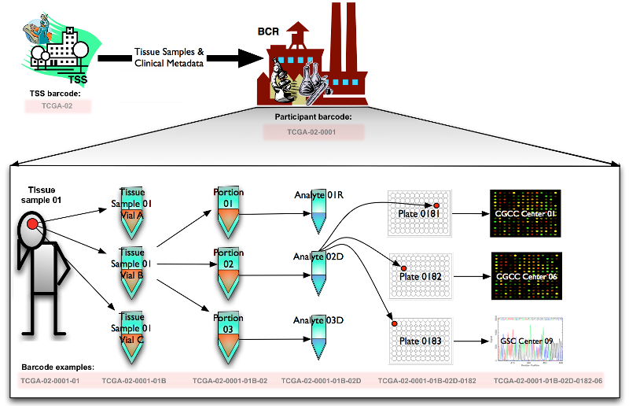
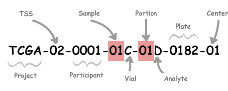

TCGA-BRCA data exploration
================
Pilar González Marchante

- <a href="#what-is-tcga-brca" id="toc-what-is-tcga-brca">What is
  TCGA-BRCA?</a>
- <a href="#how-to-download-tcga-data-with-tcgabiolinks"
  id="toc-how-to-download-tcga-data-with-tcgabiolinks">How to download
  TCGA data with <code>TCGAbiolinks</code></a>
- <a href="#finding-intersecting-samples-for-all-omics"
  id="toc-finding-intersecting-samples-for-all-omics">Finding intersecting
  samples for all omics</a>
- <a
  href="#downloading-intersecting-samples-for-rna-seq-mirna-seq-and-methylation"
  id="toc-downloading-intersecting-samples-for-rna-seq-mirna-seq-and-methylation">Downloading
  intersecting samples for RNA-Seq, miRNA-Seq and methylation</a>
- <a
  href="#downloading-intersecting-samples-for-rna-seq-mirna-seq-methylation-and-proteomics"
  id="toc-downloading-intersecting-samples-for-rna-seq-mirna-seq-methylation-and-proteomics">Downloading
  intersecting samples for RNA-Seq, miRNA-Seq, methylation and
  proteomics</a>

# What is TCGA-BRCA?

When looking for a suitable data set, the minimum requirements to
satisfy were the following:

- Has gene expression data (such as RNA-Seq).
- Has data for at least 2 regulatory omics (miRNA-Seq, ChIP-Seq,
  ATAC-Seq, DNA methylation, etc.).
- Is related to human disease.
- Has clinical variables and more importantly, survival time.
- Has data for the same omics types for at least 100 patients.
- Needs to state clearly if data is raw or normalized, and if so, how.

In the end, we opted for The Cancer Genome Atlas Breast Cancer
(**TCGA-BRCA**) data set, which at the time of writing (Data Release
v33.0, released on May 3 2022) had on GDC Data Portal 1,098 cases and
52,659 files (note that for a specific data type, there might be more
files than cases; and not all patients were measured for all data
types). The data categories available are:

- **Transcriptome profiling**: by RNA-Seq (Gene Expression
  Quantification) and miRNA-Seq (Isoform Expression Quantification and
  miRNA Expression Quantification).
- **SNV**: Simple Nucleotide Variation by WXS.
- **CNV**: Copy Number Variation by genotyping array.
- **Methylation**: DNA methylation by methylation array.
- **Proteome profiling**: by Reverse Phase Protein Array.
- **Clinical data**.


# How to download TCGA data with `TCGAbiolinks`

There are multiple ways to access and download TCGA data sets: mainly,
using the GDC Data Portal to download a `MANIFEST.txt` file with all
required information and downloading the data through command line
package `gdc-client`; or using the R/Bioconductor package
`TCGAbiolinks`. For convenience, we will use the latter. Let’s load the
packages we’ll need.

``` r
library(SummarizedExperiment)
library(TCGAbiolinks)
library(dplyr)
library(DT)
library(sesame)
```

There are two methods to download GDC data using `TCGAbiolinks`: client
(which creates a `MANIFEST.txt` and downloads the data using GDC Data
Transfer Tool; slower but reliable) and api (faster but has higher
probability of download failure). We’ll try to use the latter.

In general, to download TCGA data with `TCGAbiolinks` we need to (1)
query the TCGA database through R with the function `GDCquery`, (2)
download the files into our computer with `GDCdownload` and (3) read the
files and make R data structures with `GDCprepare`.

In the end, we won’t be using SNV and CNV data, since there only seems
to be mutation data coming from tumor tissue. That leaves us with
expression data/RNA-Seq, miRNA-Seq, proteomics, methylation and clinical
data. We will use proteomics data to verify our analysis, but won’t be
including them in our models, due to its small sample size. Now the
question is, how do we select for samples with available data for all
these omics types?

And the answer lies in **barcodes**. Taking the image as an example,
starting from the Tissue Source Site (TSS) and the participant (who
donated a tissue sample to the TSS), the barcodes TCGA-02 and
TCGA-02-0001 are assigned respectively. The sample itself is algo
assigned a barcode: TCGA-O2-0001-01. The sample is split into vials
(e.g. TCGA-02-0001-01B) which are divided into portions
(e.g. TCGA-02-0001-01B-02). Analytes (e.g. TCGA-02-0001-01B-02D) are
extracted from each portion and distributed across one or more plates
(e.g. TCGA-02-0001-01B-02D-0182), where each well is identified as an
aliquot (e.g. TCGA-02-0001-01B-02D-0182-06). These plates are sent to
GCCs or GSCs for characterization and sequencing.



In a nutshell, in our case we need to look at the **TCGA-XX-XXXX-XX**
part (e.g. TCGA-02-0001-01) since that means the reads come from the
same participant and sample (sample = tumor type; tumor types range from
01-09, normal types from 10-19 and control samples from 20-29). We can’t
simply look at the participant part of the barcode, as many patients
donated both tumor and normal tissue.



# Finding intersecting samples for all omics

With `TCGAbiolinks` there’s a very simple way to check for intersecting
samples between different omics types belonging to a certain project,
without having to download said samples. First, we query all available
samples.

``` r
query.exp <- GDCquery(
    project = "TCGA-BRCA",
    data.category = "Transcriptome Profiling",
    data.type = "Gene Expression Quantification", 
    workflow.type = "STAR - Counts"
)
 
query.mirna <- GDCquery(
    project = "TCGA-BRCA",
    data.category = "Transcriptome Profiling",
    experimental.strategy = "miRNA-Seq",
    workflow.type = "BCGSC miRNA Profiling",
    data.type = "miRNA Expression Quantification",
    data.format = "TXT"
)
 
query.met <- GDCquery(
  project = "TCGA-BRCA",
  data.category = "DNA Methylation",
  legacy = FALSE,
  platform = c("Illumina Human Methylation 450")
)

query.prot <- GDCquery(
  project = "TCGA-BRCA",
  data.category = "Proteome Profiling",
  legacy = FALSE,
)
```

Now we create a list of barcodes that exist in all queries (one with and
one without proteomics).

``` r
# we extract substrings of the barcode from 1 to 15 because the sample is designated by TCGA-XX-XXXX-XX (15 characters in total)

common.samples <- intersect(
    substr(getResults(query.mirna, cols = "cases"), 1, 15),
    substr(getResults(query.exp, cols = "cases"), 1, 15))

common.samples <- intersect(common.samples, 
    substr(getResults(query.met, cols = "cases"), 1, 15))

common.samples.prot <- intersect(common.samples, 
    substr(getResults(query.prot, cols = "cases"), 1, 15))

length(common.samples) # 853 samples
length(common.samples.prot) # 647 samples
```

We have **853 samples with data for expression, miRNA-Seq and
methylation**. If we add **proteomics data, we end up with 647
samples**. Let’s download two versions of the data sets: one without and
one with proteomics data (with.prot).

# Downloading intersecting samples for RNA-Seq, miRNA-Seq and methylation

We resubmit our queries, now only with the barcodes of intersecting
samples.

``` r
query.exp <- GDCquery(
    project = "TCGA-BRCA",
    data.category = "Transcriptome Profiling",
    data.type = "Gene Expression Quantification", 
    workflow.type = "STAR - Counts",
    barcode = common.samples,
    sample.type = c("Primary Tumor", "Solid Tissue Normal")
)

query.mirna <- GDCquery(
    project = "TCGA-BRCA",
    data.category = "Transcriptome Profiling",
    experimental.strategy = "miRNA-Seq",
    workflow.type = "BCGSC miRNA Profiling",
    data.type = "miRNA Expression Quantification",
    data.format = "TXT",
    barcode = common.samples,
    sample.type = c("Primary Tumor", "Solid Tissue Normal")
)

query.met <- GDCquery(
    project = "TCGA-BRCA",
    data.category = "DNA Methylation",
    legacy = FALSE,
    platform = c("Illumina Human Methylation 450"),
    barcode = common.samples,
    data.type = "Methylation Beta Value",
    sample.type = c("Primary Tumor", "Solid Tissue Normal")
)
```

And let’s download them. Note: for some reason, we had found 853
intersecting samples (e.g. “TCGA-E2-A1L7-01”) but when using those as
query we ended up downloading 869 files
(e.g. “TCGA-AO-A129-01A-21R-A10I-13”), meaning there probably are
different vials for a handful of samples.

``` r
GDCdownload(query = query.exp, method = "api")
rna <- GDCprepare(query = query.exp, save = TRUE, save.filename = "data/raw/RNA-Seq/RNA.rda")

GDCdownload(query = query.mirna, method = "api")
mirna <- GDCprepare(query = query.mirna, save = TRUE, save.filename = "data/raw/miRNA-Seq/miRNA.rda")

GDCdownload(query = query.met, method = "api")
met <- GDCprepare(query = query.met, save = TRUE, save.filename = "data/raw/met/met.rda")
```

Since we saved it to `.RData` files, we can easily load the objects
without having to download the data again.

``` r
load("data/raw/RNA-Seq/RNA.rda")

load("data/raw/miRNA-Seq/miRNA.rda")
 
load("data/raw/met/met.rda")
```

# Downloading intersecting samples for RNA-Seq, miRNA-Seq, methylation and proteomics

For convenience, let’s re-download the samples that also have proteomics
data, using the reduced list of barcodes.

``` r
query.exp <- GDCquery(
    project = "TCGA-BRCA",
    data.category = "Transcriptome Profiling",
    data.type = "Gene Expression Quantification", 
    workflow.type = "STAR - Counts",
    barcode = common.samples.prot,
    sample.type = c("Primary Tumor", "Solid Tissue Normal")
)

query.mirna <- GDCquery(
    project = "TCGA-BRCA",
    data.category = "Transcriptome Profiling",
    experimental.strategy = "miRNA-Seq",
    workflow.type = "BCGSC miRNA Profiling",
    data.type = "miRNA Expression Quantification",
    data.format = "TXT",
    barcode = common.samples.prot,
    sample.type = c("Primary Tumor", "Solid Tissue Normal")
)
 
query.met <- GDCquery(
    project = "TCGA-BRCA",
    data.category = "DNA Methylation",
    legacy = FALSE,
    platform = c("Illumina Human Methylation 450"),
    barcode = common.samples.prot,
    data.type = "Methylation Beta Value",
    sample.type = c("Primary Tumor", "Solid Tissue Normal")
)
 
query.prot <- GDCquery(
  project = "TCGA-BRCA",
  data.category = "Proteome Profiling",
  legacy = FALSE,
  data.type = "Protein Expression Quantification",
  experimental.strategy = "Reverse Phase Protein Array",
  barcode = common.samples.prot,
  sample.type = c("Primary Tumor", "Solid Tissue Normal")
)
 
GDCdownload(query = query.exp, method = "api")
rna.with.prot <- GDCprepare(query = query.exp, save = TRUE, save.filename = "data/raw/RNA-Seq/RNA.with.prot.rda")
 
GDCdownload(query = query.mirna, method = "api")
mirna.with.prot <- GDCprepare(query = query.mirna, save = TRUE, save.filename = "data/raw/miRNA-Seq/miRNA.with.prot.rda")
 
GDCdownload(query = query.met, method = "api")
met.with.prot <- GDCprepare(query = query.met, save = TRUE, save.filename = "data/raw/met/met.with.prot.rda")
 
GDCdownload(query = query.prot, method = "api")
prot <- GDCprepare(query = query.prot, save = TRUE, save.filename = "data/raw/prot/prot.rda")
 
load("data/raw/RNA-Seq/RNA.with.prot.rda")
 
load("data/raw/miRNA-Seq/miRNA.with.prot.rda")

load("data/raw/met/met.with.prot.rda")

load("data/raw/prot/prot.rda")
```
