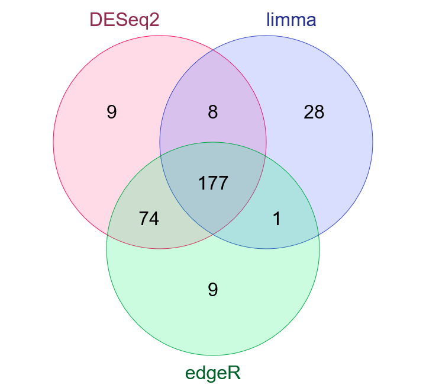

# Cooking miRNA-Seq data

## Filtering

Low counts miRNAs were filtered out with `NOISeq`'s `filtered.data` function using the first method, which removes those genes that have an average expression per condition less than `0.5` cpm (in our case) and a coefficient of variation higher than `500`. This filtering allowed us to go from 2,209 miRNAs to 646, a 29% of the total.

## Normalizing

No sample-specific GC-content bias was observed using `NOIseq`.

## Analyzing differential expression

Differential expression analysis was performed using `DESeq2`, `limma-voom` and `edgeR`. Differentially expressed genes (DEGs) were selected as those with a q.value/p.adj/FDR < 0.05 and a logFoldChange > 1 or < -1. Intersecting DEGs among the three methods were selected, giving a total of [177 miRNAs](/results/preprocessing/cookingmiRNASeq/common.miRNA.DEGs.txt) (a 27% of the filtered miRNAs and a 8% of the raw miRNAs), 86 being upregulated in cancer samples when compared to normal samples and 91 being downregulated.

|    DEGs     | DESeq2 | limma-voom | edgeR | Common |
|:-----------:|:------:|:----------:|:-----:|:------:|
| *Activated* |  156   |     87     |  163  |   86   |
| *Repressed* |   112   |     127     |  97   |   91   |
|   *Total*   | *268*  |   *214*    | *260* | *177*  |

