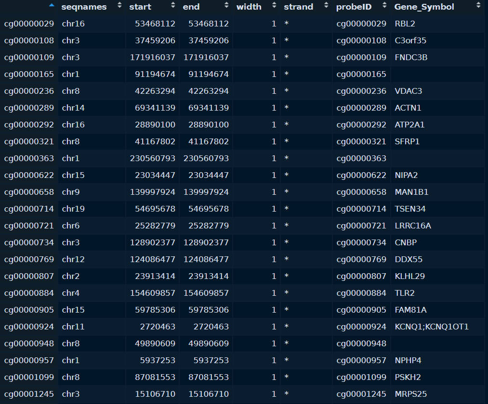

```{r setup, include=FALSE}
```

# Associating CpG sites to Gene Symbols

All the used methylation arrays are Illumina Human Methylation 450.



```{r, eval = FALSE}
library(TCGAbiolinks)
library(SummarizedExperiment)

load("data/raw/met/met.rda")

met.genes.info <- as.data.frame(rowRanges(met))
```

# Converting Gene Symbols to ENSEMBL IDs

We will now convert the filtered CpG sites (tested for differential expression) and significantly methylated sites into ENSEMBL IDs.

```{r, eval = FALSE}
dea.limma.met <- read.table("results/preprocessing/cookingMet/limma.ordered.tsv")

sites.to.convert <- rownames(dea.limma.met)

met.genes.info <- met.genes.info[sites.to.convert, ]
```

Some CpG probes map to several Gene Symbols, so we will have to split them into several rows.

```{r, eval = FALSE}
library(tidyr)
met.genes.info <- separate_rows(met.genes.info, Gene_Symbol, sep = ";")

met.genes.info <- met.genes.info[-which(met.genes.info$Gene_Symbol == ""), ]
```

```{r, eval = FALSE}
length(unique(met.genes.info$Gene_Symbol)) # 20796 genes to convert

library(biomaRt)
mart = useMart(biomart="ensembl", dataset="hsapiens_gene_ensembl")
gene.conversion <- getBM(filters="hgnc_symbol",
              attributes=c("ensembl_gene_id", "hgnc_symbol"), 
              values=unique(met.genes.info$Gene_Symbol),
              mart=mart)

missing.genes <- setdiff(unique(met.genes.info$Gene_Symbol), gene.conversion$hgnc_symbol) # 3360

write.table(missing.genes, file = "scripts/associations/met-gene/missing.genes.to.convert.txt", quote = FALSE, col.names = FALSE, row.names = FALSE)

gene.conversion <- gene.conversion[order(gene.conversion$hgnc_symbol), ]
rownames(gene.conversion) <- c(1:length(gene.conversion$ensembl_gene_id))

duplicated.genes <- which(duplicated(gene.conversion$hgnc_symbol))
duplicated.genes <- duplicated.genes-1 # we keep the last one, as this is the main sequence as opposed to alternative sequences (haplotypes/patches)
gene.conversion <- gene.conversion[-duplicated.genes, ]
```

We have two problems to deal with: missing genes and genes with multiple ENSEMBL IDs. For the missing genes part, we can input them into [this multisymbol checker](https://www.genenames.org/tools/multi-symbol-checker/) to get the latest version of the gene name.

```{r, eval = FALSE}
symbol.check <- read.table(file = "scripts/associations/met-gene/hgnc-symbol-check.csv", sep = ",")
colnames(symbol.check) <- symbol.check[1, ]
symbol.check <- symbol.check[-1, ]
symbol.check <- symbol.check[order(symbol.check$Input), ]
which(duplicated(symbol.check$Input))

missing.gene.conversion <- getBM(filters="hgnc_symbol",
              attributes=c("ensembl_gene_id", "hgnc_symbol"), 
              values=symbol.check$`Approved symbol`,
              mart=mart)

missing.genes <- setdiff(unique(symbol.check$`Approved symbol`), missing.gene.conversion$hgnc_symbol) # 116

missing.gene.conversion <- missing.gene.conversion[order(missing.gene.conversion$hgnc_symbol), ]
rownames(missing.gene.conversion) <- c(1:length(missing.gene.conversion$ensembl_gene_id))

duplicated.genes <- which(duplicated(missing.gene.conversion$hgnc_symbol))
duplicated.genes <- duplicated.genes-1 # we keep the last one, as this is the main sequence as opposed to alternative sequences (haplotypes/patches)
missing.gene.conversion <- missing.gene.conversion[-duplicated.genes, ]

missing.gene.conversion$hgnc_symbol <- symbol.check$Input[match(missing.gene.conversion$hgnc_symbol, symbol.check$`Approved symbol`)] # replace new names by old names, so that it finds them in the associations

gene.conversion <- rbind(gene.conversion, missing.gene.conversion)

gene.conversion <- gene.conversion[order(gene.conversion$hgnc_symbol), ]
rownames(gene.conversion) <- c(1:length(gene.conversion$ensembl_gene_id))

gene.conversion <- gene.conversion[order(gene.conversion$hgnc_symbol), ]
rownames(gene.conversion) <- c(1:length(gene.conversion$ensembl_gene_id))
duplicated.genes <- which(duplicated(gene.conversion$hgnc_symbol))
duplicated.genes <- duplicated.genes-1 # we keep the last one, as this is the main sequence as opposed to alternative sequences (haplotypes/patches)
gene.conversion <- gene.conversion[-duplicated.genes, ]

met.genes.info$Gene_Symbol <- gene.conversion$ensembl_gene_id[match(met.genes.info$Gene_Symbol, gene.conversion$hgnc_symbol)]

met.genes.info <- na.omit(met.genes.info)

met.associations <- met.genes.info[, c(6,7)]
```

Since I couldn't get Paintomics to work with a methylation associations file, I had to remap expression and relevant features to ENSEMBL IDs, deleting those CpG islands without an association.

```{r, eval = FALSE}
dea.limma.met <- read.table(file = "results/preprocessing/cookingMet/limma.ordered.tsv")
dea.limma.met <- cbind(rownames(dea.limma.met), dea.limma.met$logFC)
dea.limma.met <- as.data.frame(dea.limma.met)

dea.limma.met$V1 <- met.associations$Gene_Symbol[match(dea.limma.met$V1, met.associations$probeID)]
dea.limma.met <- na.omit(dea.limma.met)

write.table(dea.limma.met, file = "results/associations/met-gene/met.expression.tab", sep = "\t", quote = FALSE, row.names = FALSE, col.names = FALSE)
```

```{r, eval = FALSE}
met.DEGs <- read.table(file = "results/preprocessing/cookingMet/met.DEGs.txt")
met.DEGs$V1 <- met.associations$Gene_Symbol[match(met.DEGs$V1, met.associations$probeID)]
met.DEGs <- na.omit(met.DEGs)
write.table(met.DEGs, file = "results/associations/met-gene/met.DEGs.tab", sep = "\t", quote = FALSE, row.names = FALSE, col.names = FALSE)
```

