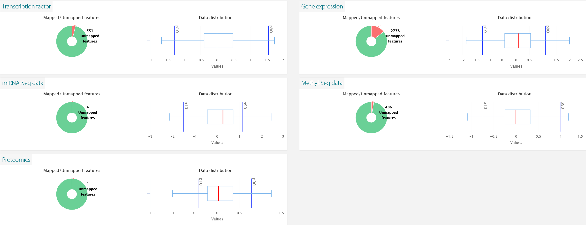

# PaintOmics

The input files can be found in [this folder](/input/). The data was input as seen in the following image.

Some features could not be mapped, as seen in the next image.

Note: even though Reactome database was also available for human, only KEGG was used, as KEGG + Reactome kept timing out due to the large amount of data.