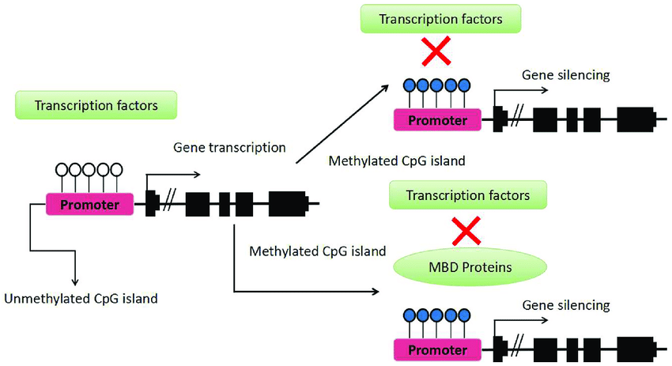
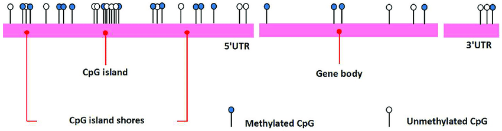
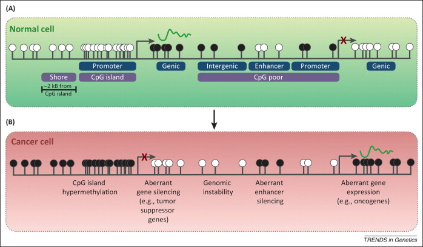
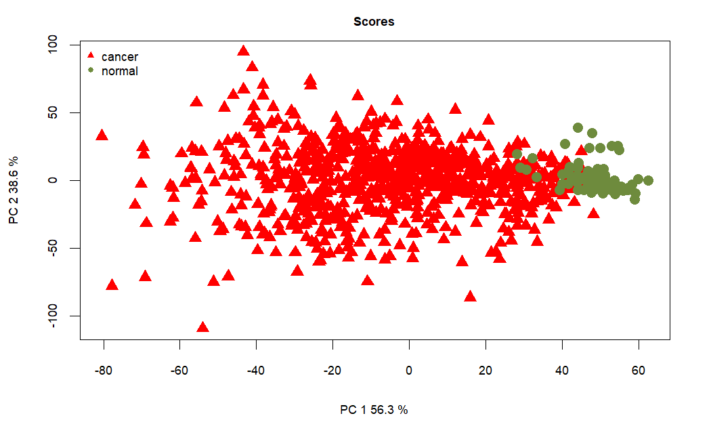
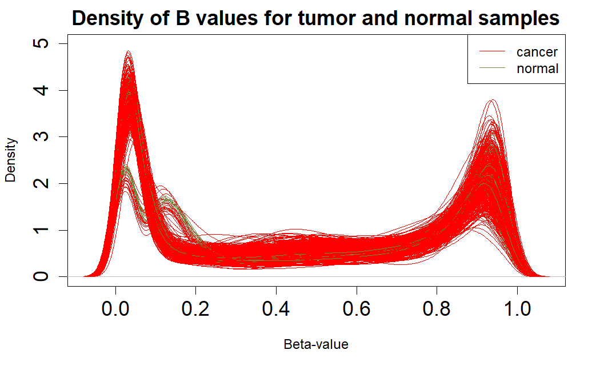
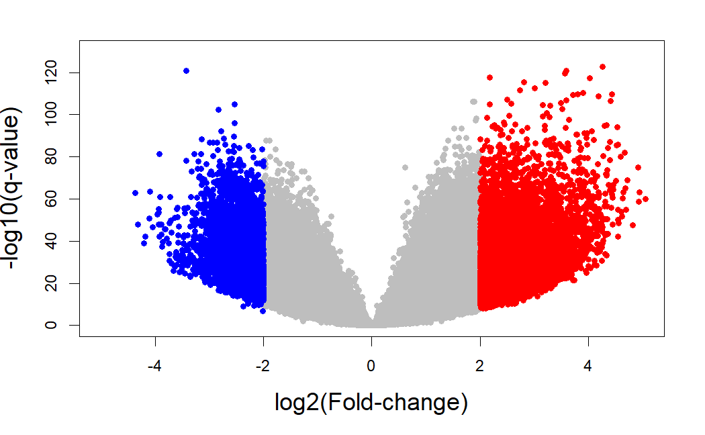
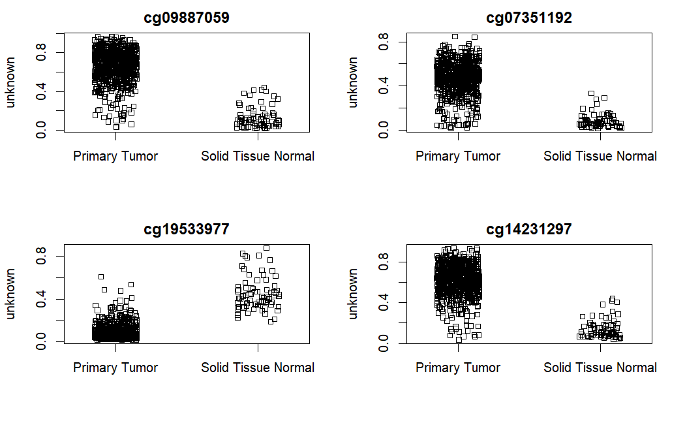

Cooking methylation data
================
Pilar González Marchante

-   <a href="#loading" id="toc-loading">Loading</a>
-   <a href="#filtering" id="toc-filtering">Filtering</a>
-   <a href="#converting" id="toc-converting">Converting</a>
-   <a href="#exploring" id="toc-exploring">Exploring</a>
-   <a href="#analyzing-differential-expression"
    id="toc-analyzing-differential-expression">Analyzing differential
    expression</a>
    -   <a href="#limma" id="toc-limma">limma</a>

# Loading

DNA methylation is an epigenetic mechanism that in vertebrates occurs
most frequently at cytosines followed by guanines (CpG). This
modification regulates gene expression and can be inherited through cell
division, thus being essential for preserving tissue identities and
guiding normal cellular development \[1\]. Hypermethylation of CpG
islands located in the promoter regions of tumor suppressor genes has
been firmly established as one of the most common mechanisms for gene
regulation in cancer \[2,3\].



As investigating the human DNA methylome has gained interest, several
methods have been developed to detect cytosine methylation on a genomic
scale. Among these, Illumina’s Infinium Methylation Assay is a
hybridization-based technique that offers quantitative methylation
measurements at the single-CpG-site level providing as accurate results
as sequencing-based methylation assays (e.g. MethylCap-seq, MeDIP-seq,
RRBS) \[4\]. Microarray-based Illumina Infinium methylation assay has
been recently used in epigenomic studies \[5-7\] due to its high
throughput, good accuracy, small sample requirement and relatively low
cost. To date, available Infinium Illumina platforms for methylation
analysis are: the HumanMethylation27 BeadChip with 27,578 CpG sites,
covering \>14,000 genes; and, the new HumanMethylation450 BeadChip
comprising \>450,000 methylation sites. To estimate the methylation
status, the Illumina Infinium assay utilizes a pair of probes (a
methylated probe and an unmethylated probe) to measure the intensities
of the methylated and unmethylated alleles at the interrogated CpG site
\[8\]. The methylation level is then estimated based on the measured
intensities of this pair of probes.





The processed DNA methylation data measure the level of methylation at
known CpG sites as beta-values, calculated from array intensities as
Beta = M/(M+U) which ranges from 0 being unmethylated and 1 fully
methylated. We have information for 485,577 CpG sites and 857 samples.
All the used methylation arrays are Illumina Human Methylation 450.

Methylation annotation was retrieved from Methylation Array Gene
Annotation File (v36)
(<https://gdc.cancer.gov/about-data/gdc-data-processing/gdc-reference-files>).

``` r
library(TCGAbiolinks)
library(SummarizedExperiment)

load("data/raw/met/met.rda")
```

``` r
met.beta.values <- as.data.frame(assay(met))
head(met.beta.values)[, 1:4]
```

    ##            TCGA-E2-A1L7-01A-11D-A145-05 TCGA-E2-A1L7-11A-33D-A145-05
    ## cg00000029                    0.2430791                    0.1840524
    ## cg00000108                           NA                           NA
    ## cg00000109                           NA                           NA
    ## cg00000165                    0.3530916                    0.1810136
    ## cg00000236                    0.9253811                    0.9002757
    ## cg00000289                    0.7618574                    0.7871540
    ##            TCGA-BH-A28O-01A-11D-A22B-05 TCGA-D8-A1XU-01A-11D-A14N-05
    ## cg00000029                    0.1232914                   0.07022178
    ## cg00000108                           NA                           NA
    ## cg00000109                           NA                           NA
    ## cg00000165                    0.2743830                   0.21779422
    ## cg00000236                    0.9142209                   0.91614906
    ## cg00000289                    0.7463535                   0.70180321

``` r
met.genes.info <- as.data.frame(rowRanges(met))
head(met.genes.info)
```

    ##            seqnames     start       end width strand    probeID Gene_Symbol
    ## cg00000029    chr16  53468112  53468112     1      * cg00000029        RBL2
    ## cg00000108     chr3  37459206  37459206     1      * cg00000108     C3orf35
    ## cg00000109     chr3 171916037 171916037     1      * cg00000109      FNDC3B
    ## cg00000165     chr1  91194674  91194674     1      * cg00000165            
    ## cg00000236     chr8  42263294  42263294     1      * cg00000236       VDAC3
    ## cg00000289    chr14  69341139  69341139     1      * cg00000289       ACTN1

``` r
met.sample.info <- as.data.frame(met@colData)
```

# Filtering

We need to remove all probes that have any NA values.

``` r
probe.na <- rowSums(is.na(met.beta.values))
table(probe.na == 0)
#  FALSE   TRUE 
# 121558 364019 

probe <- probe.na[probe.na == 0]
met.beta.values <- met.beta.values[row.names(met.beta.values) %in% names(probe), ]
```

We should also remove probes with all 0 values, although in this case
there are none.

``` r
probe.0 <- rowSums(met.beta.values)
table(probe.0 == 0)
#   FALSE 
#  364019 
```

We need to remove duplicated patients.

``` r
met.patients <- substr(rownames(met.sample.info), 1, 15)
duplicated.met.patients <- which(duplicated(met.patients))
# 30 188 189 192 198 199 310 314 546 643 644 657 719 720 801 815
duplicated.met.patients <- unique(sort(c(duplicated.met.patients, duplicated.met.patients-1)))
rownames(met.sample.info)[duplicated.met.patients]

 [1] "TCGA-A7-A26F-01B-04D-A22R-05" "TCGA-A7-A26F-01A-21D-A16A-05" "TCGA-A7-A26J-01B-02D-A27B-05"
 [4] "TCGA-A7-A26J-01A-11D-A16A-05" "TCGA-A7-A26J-01A-11D-A27B-05" "TCGA-A7-A13G-01B-04D-A22R-05"
 [7] "TCGA-A7-A13G-01A-11D-A13K-05" "TCGA-A7-A26E-01A-11D-A27B-05" "TCGA-A7-A26E-01B-06D-A27B-05"
[10] "TCGA-A7-A26E-01A-11D-A16A-05" "TCGA-B6-A1KC-01A-11D-A13K-05" "TCGA-B6-A1KC-01B-11D-A161-05"
[13] "TCGA-AC-A2QH-01A-11D-A18O-05" "TCGA-AC-A2QH-01B-04D-A22R-05" "TCGA-AC-A3OD-01A-11D-A21R-05"
[16] "TCGA-AC-A3OD-01B-06D-A22R-05"
```

``` r
met.beta.values[,c("TCGA-A7-A26F-01A-21D-A16A-05", "TCGA-A7-A26J-01A-11D-A16A-05", "TCGA-A7-A26J-01A-11D-A27B-05", "TCGA-A7-A13G-01A-11D-A13K-05", "TCGA-A7-A26E-01B-06D-A27B-05", "TCGA-A7-A26E-01A-11D-A16A-05", "TCGA-B6-A1KC-01A-11D-A13K-05", "TCGA-AC-A2QH-01B-04D-A22R-05", "TCGA-AC-A3OD-01A-11D-A21R-05")] <- NULL
```

# Converting

Let’s convert beta-values to M-values.

``` r
bval <- met.beta.values
save(bval, file = "data/cooked/met/bval.rda")

max(bval)
# 0.99716
# max isn't 1 so there's no problem with applying logarithm transformation from B to M

# converting beta values to m_values
# m = log2(beta/1-beta)
mval <- t(apply(met.beta.values, 1, function(x) log2(x/(1-x))))
save(mval, file = "data/cooked/met/mval.rda")

# to load
load("data/cooked/met/mval.rda")
load("data/cooked/met/bval.rda")
```

# Exploring

We can plot a PCA to see if there’s good separation between the groups.

``` r
pc = prcomp(t(bval), scale = FALSE)
bcodes <- substr(rownames(pc$x), 1, 15)
tumor <- substr(bcodes, 14, 15) == "01"
loads <- round(pc$sdev^2/sum(pc$sdev)*100, 1)
xlab <- c(paste("PC 1", loads[1], "%"))
ylab <- c(paste("PC 2", loads[2], "%"))
plot(pc$x[ , 1], pc$x[ , 2], xlab = xlab, ylab = ylab, type = "n",
main = "Scores", cex.axis = 0.75, cex.lab = 0.75, cex.main = 0.75)
points(pc$x[tumor, 1] , pc$x[tumor, 2], col = "red", pch = 17, cex = 1.4)
points(pc$x[!tumor, 1] , pc$x[!tumor, 2], col = "darkolivegreen4", pch = 16, cex = 1.4)
legend("topleft", bty = "n", legend = c("cancer" , "normal" ), pch = c(17, 16), col = c("red", "darkolivegreen4"), cex = 0.75)
```



``` r
boxplot(mval[, 1:50], outline = FALSE, las = 2, names = substr(colnames(mval), 6, 12)[1:50], main = "Methylation M-values")
```

We can also plot the density of beta-values.

``` r
bcodes = substr(colnames(bval), 1, 15)
tumor <- substr(bcodes, 14, 15) == "01"

plot(density(bval[, 1]), type = "n", ylim = c(0,5), main = "Density of B values for tumor and normal samples", cex.axis = 1.5, xlab = "Beta-value", ylab = "Density", cex.main = 1.5)
for (i in 1:length(bcodes)) {
  if (tumor[i] == T) {
    points(density(bval[, i]), col = "red", type = "l")
  }
  else {
    points(density(bval[, i]), col = "darkolivegreen4", type = "l")
  }
}
legend("topright", legend = c("cancer", "normal"), col = c("red", "darkolivegreen4"), lty = 1)
```



We can’t see any significant differences between tumor and normal
samples from this graph alone, although cancer samples do seem to peak
higher.

# Analyzing differential expression

## limma

Why do we use M-values for analyzing differential expression?

“Regardless of the Illumina array version, for each CpG, there are two
measurements: a methylated intensity (denoted by M) and an unmethylated
intensity (denoted by U). These intensity values can be used to
determine the proportion of methylation at each CpG locus. Methylation
levels are commonly reported as either beta values (β=M/(M+U)) or
M-values (Mvalue=log2(M/U)). For practical purposes, a small offset, α,
can be added to the denominator of the β value equation to avoid
dividing by small values, which is the default behaviour of the getBeta
function in minfi. The default value for α is 100. Beta values and
M-values are related through a logit transformation. Beta values are
generally preferable for describing the level of methylation at a locus
or for graphical presentation because percentage methylation is easily
interpretable. However, due to their distributional properties, M-values
are more appropriate for statistical testing.”

``` r
library(limma)
library(ggplot2)

met.sample.info <- met.sample.info[-c(30, 188, 189, 192, 198, 199, 309, 314, 794), ]

group <- as.factor(met.sample.info$sample_type)

group <- relevel(group, ref = "Solid Tissue Normal")

design <- model.matrix(~ group)

fit <- lmFit(mval, design)
fit2 <- eBayes(fit)
top <- topTable(fit2, coef=ncol(design), number = Inf)

log.fold.change <- top$logFC
q.value <- top$adj.P.Val
genes.ids <- rownames(top)
names(log.fold.change) <- genes.ids
names(q.value) <- genes.ids

activated.genes.limma <- genes.ids[log.fold.change > 2 & q.value < 0.05]
repressed.genes.limma <- genes.ids[log.fold.change < -2 & q.value < 0.05]

length(activated.genes.limma) # 8687
length(repressed.genes.limma) # 4393

log.q.val <- -log10(q.value)
plot(log.fold.change,log.q.val,pch=19,col="grey",cex=0.8,
xlim=c(-5,5),ylim = c(0,130),
xlab="log2(Fold-change)",ylab="-log10(q-value)",cex.lab=1.5)
points(x = log.fold.change[activated.genes.limma],
y = log.q.val[activated.genes.limma],col="red",cex=0.8,pch=19)
points(x = log.fold.change[repressed.genes.limma],
y = log.q.val[repressed.genes.limma],col="blue",cex=0.8,pch=19)

write.table(activated.genes.limma, file = "results/preprocessing/cookingMet/limma.up.txt", row.names = FALSE, col.names = FALSE, quote = FALSE)

write.table(repressed.genes.limma, file = "results/preprocessing/cookingMet/limma.down.txt", row.names = FALSE, col.names = FALSE, quote = FALSE)

topOrdered <- top[order(top$adj.P.Val),]
topOrderedDF <- as.data.frame(topOrdered)
topOrderedDF <- na.omit(topOrderedDF)
write.table(topOrderedDF, file = "results/preprocessing/cookingMet/limma.ordered.tsv", row.names=TRUE, col.names=TRUE, sep="\t", quote=FALSE)
```



It is always useful to plot sample-wise methylation levels for the top
differentially methylated CpG sites to quickly ensure the results make
sense. If the plots do not look as expected, it is usually an indication
of an error in the code, or in setting up the design matrix. It is
easier to interpret methylation levels on the beta value scale, so
although the analysis is performed on the M-value scale, we visualise
data on the beta value scale. The `plotCpg` function in `minfi` is a
convenient way to plot the sample-wise beta values stratified by the
grouping variable.

``` r
topOrderedDF <- read.csv(file = "results/preprocessing/cookingMet/limma.ordered.csv", sep = "\t")

library(minfi)

bval <- readRDS("data/cooked/met/bval.RDS")

# plot the top 4 most significantly differentially methylated CpGs
par(mfrow=c(2,2))
sapply(rownames(topOrderedDF)[1:4], function(cpg){
  plotCpg(bval, cpg=cpg, pheno=met.sample.info$sample_type)
})
```


