Cooking miRNA-Seq data
================
Pilar González Marchante

-   <a href="#loading" id="toc-loading">Loading</a>
-   <a href="#filtering" id="toc-filtering">Filtering</a>
-   <a href="#exploring" id="toc-exploring">Exploring</a>
-   <a href="#normalizing" id="toc-normalizing">Normalizing</a>
    -   <a href="#cqn" id="toc-cqn">cqn</a>
    -   <a href="#edaseq" id="toc-edaseq">EDASeq</a>
-   <a href="#analyzing-differential-expression"
    id="toc-analyzing-differential-expression">Analyzing differential
    expression</a>
    -   <a href="#deseq2" id="toc-deseq2">DESeq2</a>
    -   <a href="#limma" id="toc-limma">limma</a>
    -   <a href="#limma-voom" id="toc-limma-voom">limma-voom</a>
    -   <a href="#edger" id="toc-edger">edgeR</a>
    -   <a href="#intersecting-degs" id="toc-intersecting-degs">Intersecting
        DEGs</a>

# Loading

For each miRNA, we have different counts depending on the region it
matched (precursor, mature, stem-loop, etc…). However, we are only
interested in mature miRNAs as these are the ones that biologically
target transcripts and thus regulate gene expression. For example, miRNA
hsa-let-7a-1 has two mature isoforms: mature,MIMAT0000062, which would
be hsa-let-7a-5p; and mature,MIMAT0004481 which is hsa-let-7a-3p. For
each of these two regions there are many count readings (because they
map to different coordinates in the genome) so we need to get the sum of
all counts for each region.

``` r
load("data/raw/miRNA-Seq/miRNA.rda")

head(mirna)[, 1:4]
```

    ##       miRNA_ID                isoform_coords read_count
    ## 1 hsa-let-7a-1 hg38:chr9:94175942-94175962:+          1
    ## 2 hsa-let-7a-1 hg38:chr9:94175943-94175962:+          1
    ## 3 hsa-let-7a-1 hg38:chr9:94175961-94175979:+          1
    ## 4 hsa-let-7a-1 hg38:chr9:94175961-94175981:+          3
    ## 5 hsa-let-7a-1 hg38:chr9:94175961-94175982:+         19
    ## 6 hsa-let-7a-1 hg38:chr9:94175961-94175983:+         22
    ##   reads_per_million_miRNA_mapped
    ## 1                       0.096814
    ## 2                       0.096814
    ## 3                       0.096814
    ## 4                       0.290443
    ## 5                       1.839471
    ## 6                       2.129914

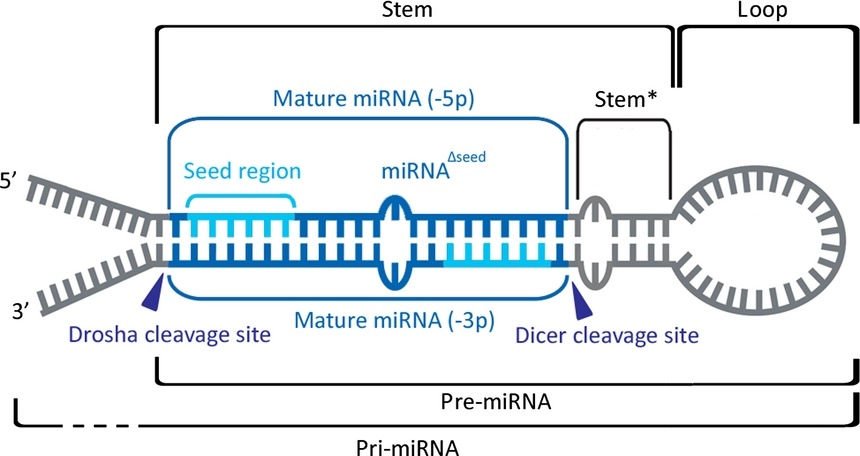

``` r
# taken from https://github.com/rptashkin/TCGA_miRNASeq_matrix

filenames = dir(path="GDCdata/TCGA-BRCA/harmonized/Transcriptome_Profiling/Isoform_Expression_Quantification/", recursive = TRUE, pattern="*isoforms.quantification.txt$", include.dirs = TRUE, full.names = TRUE)

library(splitstackshape)
library(qdap)
library(plyr)
library(reshape)

update_miRname = function(infile)
{
  tempFile = read.table(infile, header=TRUE, stringsAsFactors=FALSE)
  tempFile =cSplit(tempFile, "miRNA_region", sep=",")
  full_list = read.table("results/preprocessing/cookingmiRNASeq/hsa_miR_accessionTOname.txt", header=TRUE, stringsAsFactors=FALSE)
  
  tempFile$fullName = lookup(tempFile$miRNA_region_2, full_list$Alias, full_list$Name)
  temp2 = data.frame(tempFile$fullName, tempFile$read_count)
  colnames(temp2) = c("miRNA", "Count")
  write.table(tempFile, file=paste(infile, ".names.txt", sep=""),sep="\t",col.names=TRUE, row.names=FALSE)
  write.table(temp2, file=paste(infile, ".counts.txt", sep=""),sep="\t",col.names=TRUE, row.names=FALSE)
  
  
  temp3 = temp2[!(is.na(temp2[,1])),]
  temp3 = temp3[order(temp3[,1]), ]
  temp3 = aggregate(data=temp3, temp3[,2] ~ temp3[,1], FUN=sum)
  colnames(temp3) = c("miRNA", infile)
  write.table(temp3, file=paste(infile, ".sumSort.txt", sep=""),sep="\t",col.names=TRUE, row.names=FALSE)
  
}

lapply(filenames, update_miRname)

#next need to join all the data matrix files into one matrix

mergeFiles = list.files(path="GDCdata/TCGA-BRCA/harmonized/Transcriptome_Profiling/Isoform_Expression_Quantification", pattern="*sumSort.txt", recursive = TRUE, include.dirs = TRUE, full.names = TRUE)

for (file in mergeFiles){
  if(!exists("mirNames")){
    mirNames = read.table(file, header=TRUE, stringsAsFactors=FALSE)
  }
  if(exists("mirNames")){
    temp_dataset = read.table(file, header=TRUE, stringsAsFactors=FALSE)
    mirNames = rbind.fill(mirNames, temp_dataset)
    rm(temp_dataset)
  }
  
}

mirNames = as.matrix(mirNames[,1])
mirNames = as.data.frame((sort(unique(mirNames))))
colnames(mirNames) = "miRNA"

# merge each file with this generated names column, putting zero if no match

import.list <- llply(mergeFiles, read.table, header=TRUE)

mirna.raw.counts =join(mirNames, as.data.frame(import.list[1]), by= "miRNA", type="left")

for(i in 2:length(mergeFiles)){
  mirna.raw.counts =join(mirna.raw.counts, as.data.frame(import.list[i]), by= "miRNA", type="left")
}

mirna.raw.counts[is.na(mirna.raw.counts)] = 0

barcodes <- colnames(mirna.raw.counts)
barcodes <- barcodes[-1]
barcodes <- substr(barcodes, 126, 161)
barcodes <- gsub(".", "-", barcodes, fixed = TRUE)

mirna.metadata <- read.table("results/preprocessing/cookingmiRNASeq/mirna.metadata.txt", sep = "\t", header = TRUE)

mirna.metadata$file_name <- substr(mirna.metadata$file_name, 1, 36)

colnames(mirna.raw.counts) <- c("miRNA", mirna.metadata[match(barcodes, mirna.metadata$file_name), "cases"])
```

Some of the samples are duplicated, so we need to either remove one of
them or take the average. We have 15 patients for which more than one
file is available, which is too much to look into one by one. What we’ll
do instead is follow the guidelines set by the Broad Institute, using
[their replicate samples
table](https://gdac.broadinstitute.org/runs/tmp/sample_report__2018_01_17/Replicate_Samples.html).

``` r
mirna.raw.counts[,c("TCGA-A7-A26F-01B-04R-A22P-13", "TCGA-A7-A26J-01A-11R-A168-13", "TCGA-A7-A26J-01B-02R-A27D-13", "TCGA-A7-A13G-01B-04R-A22P-13", "TCGA-A7-A26E-01B-06R-A27D-13", "TCGA-A7-A26E-01A-11R-A168-13", "TCGA-B6-A1KC-01A-11R-A13P-13", "TCGA-AC-A2QH-01B-04R-A22P-13", "TCGA-AC-A3QQ-01A-11R-A22I-13", "TCGA-A7-A13E-01A-11R-A12O-13", "TCGA-A7-A13E-01B-06R-A27D-13", "TCGA-A7-A0DC-01A-11R-A010-13", "TCGA-A7-A13D-01A-13R-A12O-13", "TCGA-A7-A13D-01B-04R-A27D-13", "TCGA-AC-A3OD-01A-11R-A21U-13", "TCGA-A7-A26I-01B-06R-A22P-13")] <- NULL

rownames(mirna.raw.counts) <- mirna.raw.counts$miRNA
mirna.raw.counts$miRNA <- NULL
  
write.table(mirna.raw.counts, file="results/preprocessing/cookingmiRNASeq/mirna.raw.counts.txt", sep="\t", col.names=NA, row.names=TRUE)
```

Let’s look at the data.

``` r
mirna.raw.counts <- read.table(file ="results/preprocessing/cookingmiRNASeq/mirna.raw.counts.txt", sep = "\t")
colnames(mirna.raw.counts) <- mirna.raw.counts[1, ]
mirna.raw.counts <- mirna.raw.counts[-1, ]
mirna.names <- mirna.raw.counts[, 1]
mirna.raw.counts <- mirna.raw.counts[, -1]
mirna.raw.counts <- as.data.frame(sapply(mirna.raw.counts, as.numeric))
rownames(mirna.raw.counts) <- mirna.names

boxplot(mirna.raw.counts[, 1:50] + 1, log = "y", outline = FALSE, las = 2, names = substr(colnames(mirna.raw.counts), 6, 12)[1:50], main = "Unfiltered miRNA-Seq counts")
```

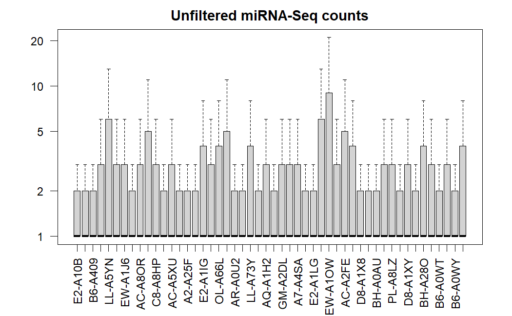

# Filtering

We already have our miRNA data in `mirna.raw.counts`, but we still have
to define our factors as `condition`, `tss`, `plate`, `portion`and
`sample`, which we can easily extract with the `TCGAbiolinks` function
`get_IDs`.

``` r
library(NOISeq)
library(TCGAbiolinks)
```

``` r
barcodes <- get_IDs(mirna.raw.counts)
myfactors <- data.frame(barcodes$tss, barcodes$portion, barcodes$plate, barcodes$condition)
head(myfactors)
```

Choosing a CPM threshold.

``` r
library(SummarizedExperiment)
library(edgeR)
library(limma)
library(ggplot2)

mean_log_cpm <- aveLogCPM(mirna.raw.counts)

filter_threshold <- log2(0.5)

ggplot() + aes(x=mean_log_cpm) +
    geom_histogram(binwidth=0.2) +
    geom_vline(xintercept=filter_threshold, linetype = "dashed", size = 0.7) +
    ggtitle("Unfiltered miRNA-Seq counts") +
    labs(x = "logCPM", y = "Frequency") + 
    theme(plot.title = element_text(hjust = 0.5)) +
    annotate(x=0.95, y=+Inf, label="CPM = 0.5", vjust=2.1, geom="label")
```

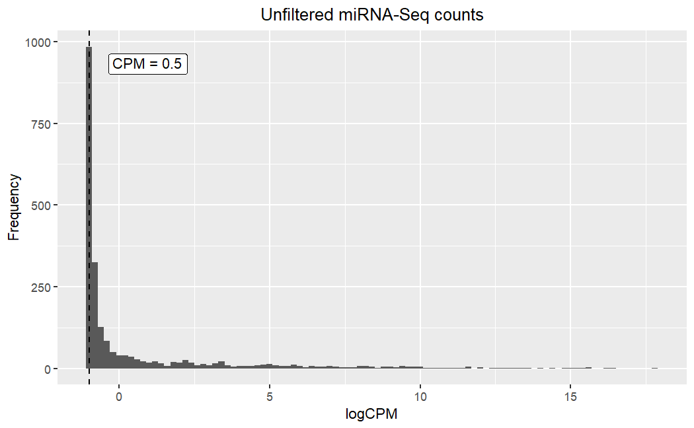

``` r
ggplot() + aes(x=mean_log_cpm) +
    geom_density() +
    geom_vline(xintercept=filter_threshold, linetype = "dashed", size = 0.7) +
    ggtitle("Unfiltered miRNA-Seq counts") +
    xlim(-2, 13.5) + 
    annotate(x=0.95, y=+Inf, label="CPM = 0.5", vjust=1.5, geom="label") +
    theme(plot.title = element_text(hjust = 0.5)) +
    labs(x = "logCPM", y = "Density")
```

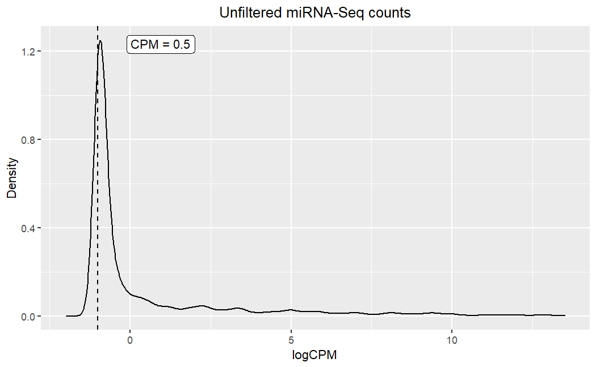

So let’s try CPM filtering with a `CPM threshold = 0.2, 0.5 and 1` and a
`cv.cutoff = 500`, so that we remove those features with low expression.
We will also apply Wilcoxon test filtering and compare the results.

``` r
myfiltCPM01 <- filtered.data(mirna.raw.counts, factor = myfactors$barcodes.condition, norm = FALSE, depth = NULL, method = 1, cv.cutoff = 500, cpm = 0.1, p.adj = "fdr") # 988 features are to be kept for differential expression analysis with filtering method 1

myfiltCPM02 <- filtered.data(mirna.raw.counts, factor = myfactors$barcodes.condition, norm = FALSE, depth = NULL, method = 1, cv.cutoff = 500, cpm = 0.2, p.adj = "fdr") # 837 features are to be kept for differential expression analysis with filtering method 1

myfiltCPM05 <- filtered.data(mirna.raw.counts, factor = myfactors$barcodes.condition, norm = FALSE, depth = NULL, method = 1, cv.cutoff = 500, cpm = 0.5, p.adj = "fdr") # 646 features are to be kept for differential expression analysis with filtering method 1

myfiltCPM1 <- filtered.data(mirna.raw.counts, factor = myfactors$barcodes.condition, norm = FALSE, depth = NULL, method = 1, cv.cutoff = 500, cpm = 1, p.adj = "fdr") # 550 features are to be kept for differential expression analysis with filtering method 1

myfiltWilcoxon <- filtered.data(mirna.raw.counts, factor = myfactors$barcodes.condition, norm = FALSE, depth = NULL, method = 2, p.adj = "fdr") # 1993 features are to be kept for differential expression analysis with filtering method 2
```

``` r
boxplot(log10(myfiltCPM02[, 1:50])+1, outline = FALSE, las = 2, names = substr(colnames(myfiltCPM02), 6, 12)[1:50], main = "Filtered miRNA-Seq counts with CPM > 0.2")
```

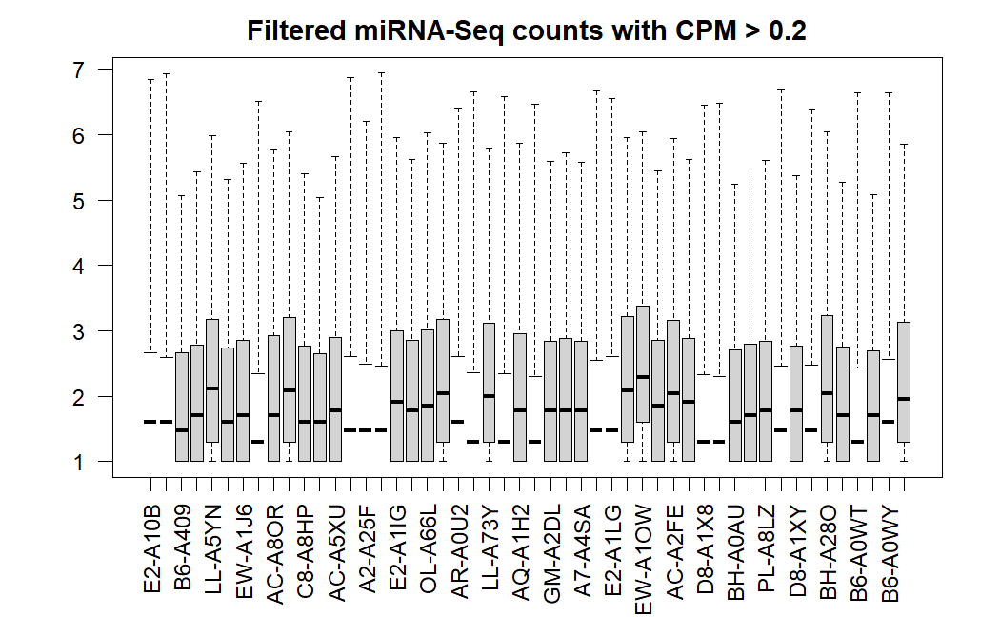

``` r
boxplot(log10(myfiltCPM05[, 1:50])+1, outline = FALSE, las = 2, names = substr(colnames(myfiltCPM05), 6, 12)[1:50], main = "Filtered miRNA-Seq counts with CPM > 0.5")
```

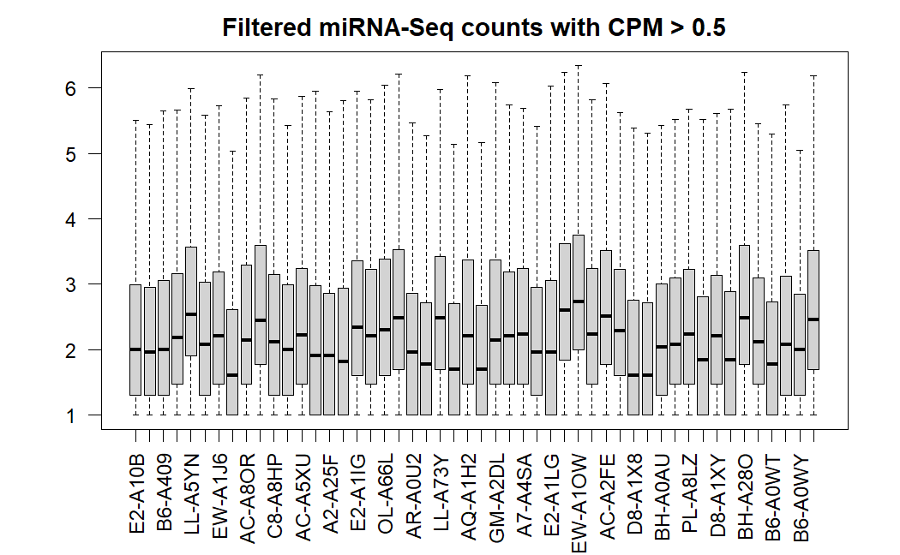

``` r
boxplot(log10(myfiltCPM1[, 1:50])+1, outline = FALSE, las = 2, names = substr(colnames(myfiltCPM1), 6, 12)[1:50], main = "Filtered miRNA-Seq counts with CPM > 1")
```

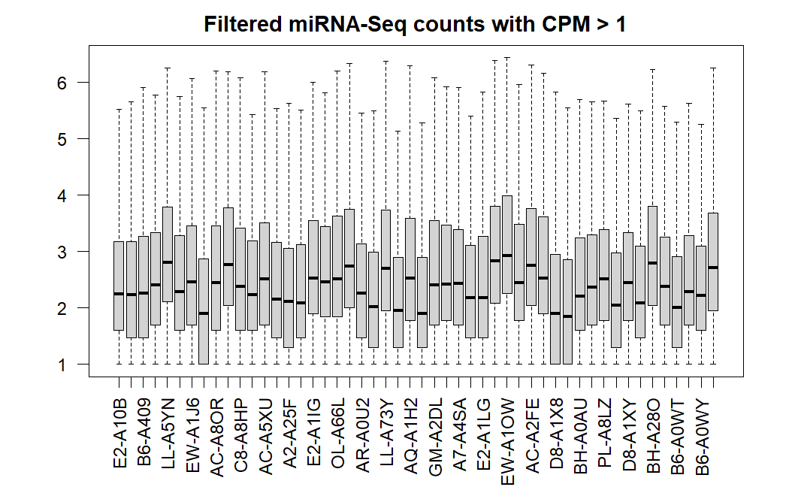

``` r
boxplot(log10(myfiltWilcoxon[, 1:50])+1, outline = FALSE, las = 2, names = substr(colnames(myfiltWilcoxon), 6, 12)[1:50], main = "Filtered miRNA-Seq counts with Wilcoxon test")
```

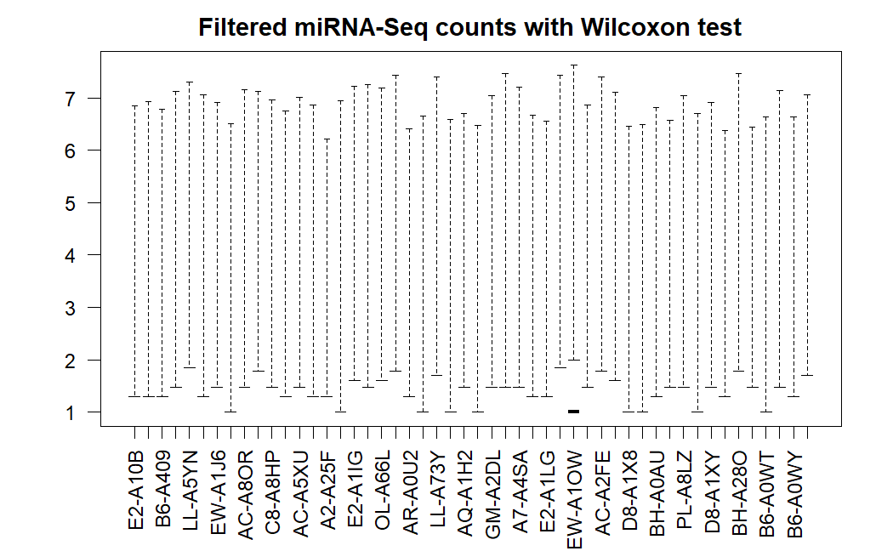

We’ll choose method 1 with a CPM threshold of 0.5, which leaves us with
29% of the total miRNAs.

``` r
mirna.filt.counts <- myfiltCPM05

rm(myfiltCPM05)

save(mirna.filt.counts, file = "data/cooked/miRNA-Seq/miRNA.filt.rda")
```

``` r
mean_log_cpm <- aveLogCPM(mirna.raw.counts)

filter_threshold <- log2(0.5)

ggplot() + aes(x=mean_log_cpm) +
    geom_histogram(binwidth=0.2) +
    geom_vline(xintercept=filter_threshold, linetype = "dashed", size = 0.7) +
    ggtitle("Filtered miRNA-Seq counts") +
    labs(x = "logCPM", y = "Frequency") + 
    theme(plot.title = element_text(hjust = 0.5)) +
    annotate(x=0.95, y=+Inf, label="CPM = 0.5", vjust=2.1, geom="label")
```

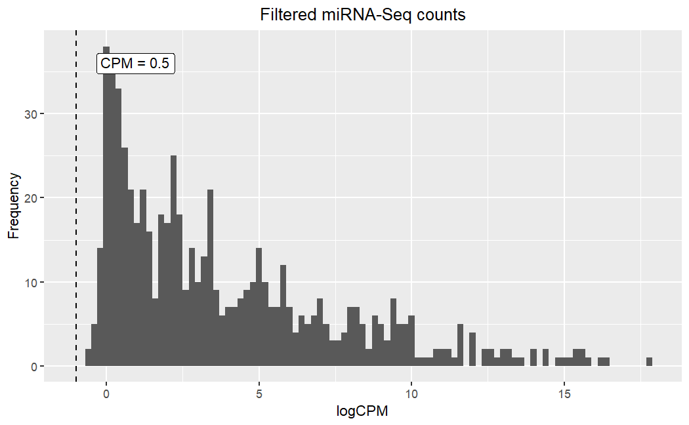

``` r
ggplot() + aes(x=mean_log_cpm) +
    geom_density() +
    geom_vline(xintercept=filter_threshold, linetype = "dashed", size = 0.7) +
    ggtitle("Filtered miRNA-Seq counts") +
    xlim(-2, 13.5) + 
    annotate(x=0.95, y=+Inf, label="CPM = 0.5", vjust=1.5, geom="label") +
    theme(plot.title = element_text(hjust = 0.5)) +
    labs(x = "logCPM", y = "Density")
```

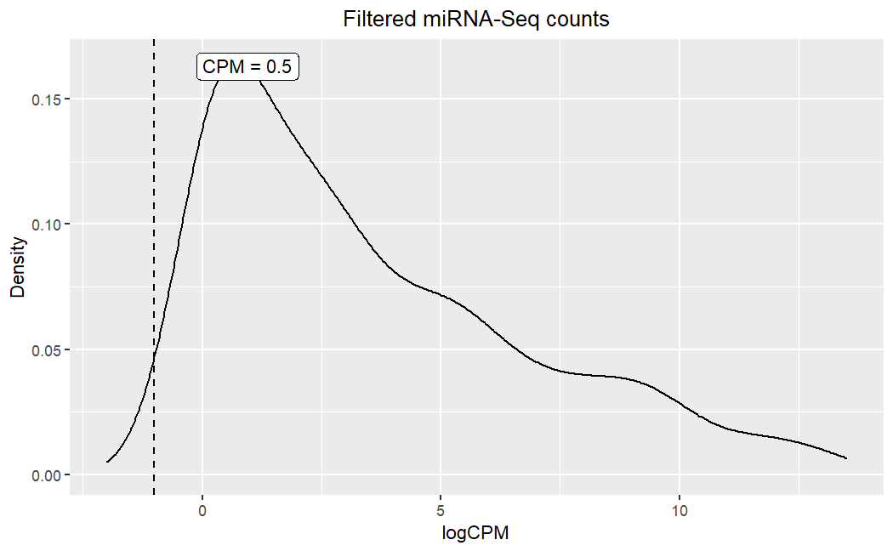

# Exploring

And we’ll need GC content information. First, we need to convert mature
miRNAs to their precursors and then to accession (e.g. MI0003772), which
we can then input into biomaRt to get GC-content information.

``` r
load(file = "data/cooked/miRNA-Seq/miRNA.filt.rda")
library(miRBaseConverter)
precursors <- miRNA_MatureToPrecursor(miRNANames = rownames(mirna.filt.counts))
accessions <- miRNA_NameToAccession(miRNANames = precursors$Precursor, version = "v20")

library(biomaRt)
mart = useMart(biomart="ensembl", dataset="hsapiens_gene_ensembl")
length(unique(accessions$Accession)) # 452 accessions to convert
GC.content.miRNA <- getBM(filters="mirbase_accession",
                         attributes=c("mirbase_accession", "percentage_gene_gc_content"), 
                         values=accessions$Accession,
                         mart=mart)

missing.accessions <- setdiff(accessions$Accession, GC.content.miRNA$mirbase_accession)
length(missing.accessions) # 8 missing accessions
```

There are 8 miRNA accessions for which we are lacking GC-content
information, but we can get the miRNA sequence, convert it to DNA and
calculate GC-content from there.

``` r
sequences <- getMiRNASequence(accessions$Accession)
sequences$miRNASequence_v22 <- gsub(x = sequences$miRNASequence_v22, pattern = "U", replacement = "T")

calculate.GC.content <- function(sequence)
{
    sequence_vec <- unlist(strsplit(sequence, split = ""))
    C_total <- sum(sequence_vec == "C")
    G_total <- sum(sequence_vec == "G")
    GC <- C_total + G_total
    GC.content <- GC/length(sequence_vec)*100
    GC.content <- round(as.numeric(GC.content), 2)
    return(GC.content)
}

sequences$GC.content <- lapply(X = sequences$miRNASequence_v22, FUN = calculate.GC.content)

dead.mirnas <- which(is.na(sequences$GC.content)) # 44 336 349 423

sequences[dead.mirnas, "Accession"]
# [1] "MI0006388" "MI0015997" "MI0016053" "MI0016807"

miRNA.information <- cbind(precursors, accessions, sequences)
miRNA.information <- miRNA.information[, c(-3, -4, -6)]
colnames(miRNA.information) <- c("Mature", "Precursor", "Accession", "GC.content")

miRNA.information <- apply(miRNA.information,2,as.character)

mirna.filt.counts <- mirna.filt.counts[-dead.mirnas, ]
miRNA.information <- miRNA.information[-dead.mirnas, ]

write.table(miRNA.information, file = "results/preprocessing/cookingmiRNASeq/miRNA.information.txt", sep = "\t", quote = FALSE, row.names = FALSE)

save(mirna.filt.counts, file = "data/cooked/miRNA-Seq/miRNA.filt.rda")
```

There are 4 miRNAs that are still missing - why? Well, our matrix was
preprocessed using information from miRBase v20, which did contain these
miRNAs; however, they are dead in the latest version (v22) which is why
we are unable to retrieve their sequences. We will have to delete the
mature miRNAs generating from it from the filtered counts matrix as
well.

``` r
library(TCGAbiolinks)
library(NOISeq)

load(file = "data/cooked/miRNA-Seq/miRNA.filt.rda")
miRNA.information <- read.table("results/preprocessing/cookingmiRNASeq/miRNA.information.txt", header = TRUE)

mygc = c(miRNA.information$GC.content)
names(mygc) = c(miRNA.information$Mature)

barcodes <- get_IDs(mirna.filt.counts)
myfactors <- data.frame(barcodes$tss, barcodes$portion, barcodes$plate, barcodes$condition)
head(myfactors)

mymirnadata.filt <- NOISeq::readData(data = mirna.filt.counts, factors = myfactors, gc = mygc)
```

Since the number of miRNAs (642) was too low to be able to plot GC bias
(given that by default, `NOISeq` makes each bin have 200 features) I had
to change the source code of the functions so that each bin had 40
features instead.

``` r
source(file = "scripts/preprocessing/GCbias.R")
GC.plot(GC.dat(mymirnadata.filt, factor = "barcodes.condition"))
```

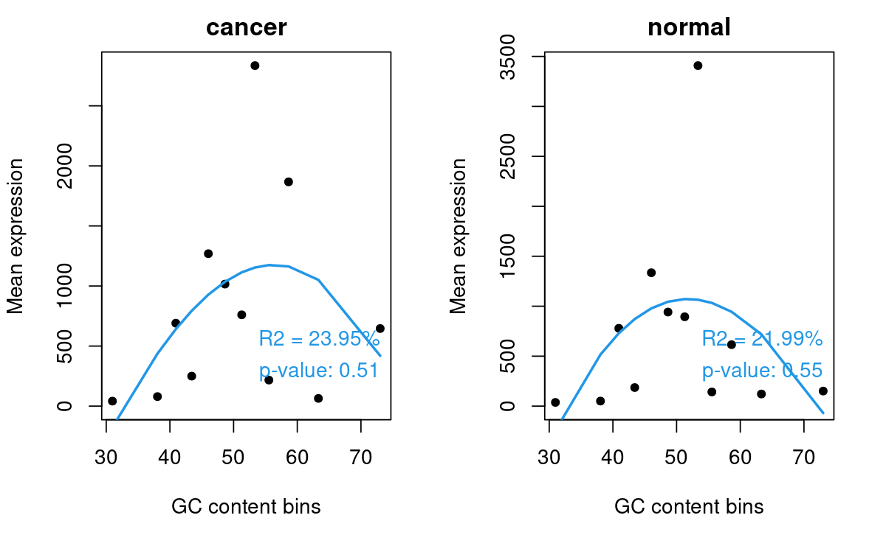

Although there seems to be no GC-content bias, we’ll try normalizing for
it with `cqn` and `EDASeq` to compare the results.

``` r
library(NOISeq)
mymirnaPCA = dat(mymirnadata.filt, type = "PCA")
par(cex = 0.75)
explo.plot(mymirnaPCA, factor = "barcodes.condition", plottype = "scores")
```


``` r
explo.plot(mymirnaPCA, factor = "barcodes.condition", plottype = "loadings")
```

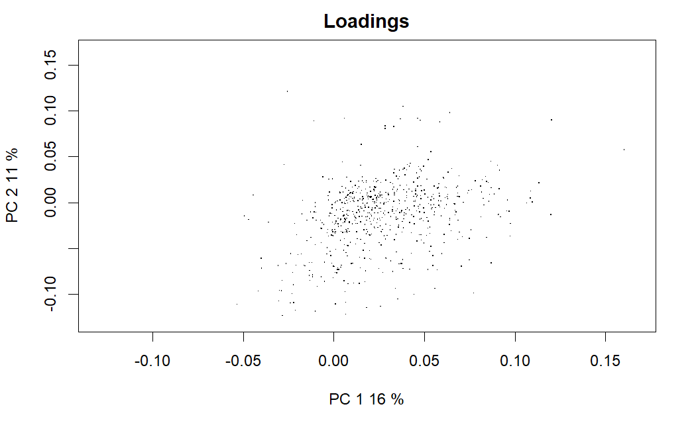

``` r
explo.plot(mymirnaPCA, factor = "barcodes.tss")
```


``` r
explo.plot(mymirnaPCA, factor = "barcodes.portion")
```


``` r
explo.plot(mymirnaPCA, factor = "barcodes.plate")
```

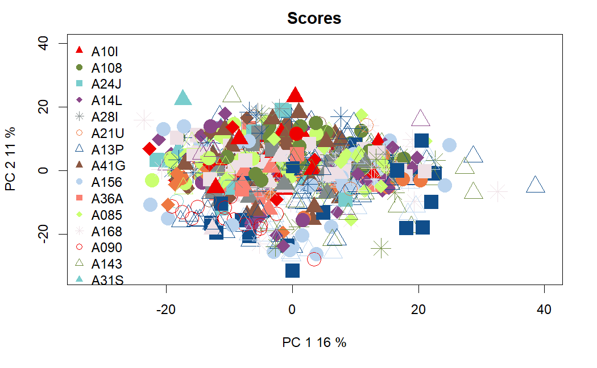

# Normalizing

## cqn

`cqn` with all length = 1000.

``` r
library(cqn)
sizeFactors.mirna <- colSums(mirna.filt.counts)

mirna.cqn.norm <- cqn(mirna.filt.counts, lengthMethod = "fixed", lengths = rep(100, 642), x = mygc, sizeFactors = sizeFactors.mirna, verbose = TRUE)

save(mirna.cqn.norm, file = "scripts/preprocessing/files/cookingmiRNASeq/miRNA.cqn.norm.rda")

# Extract normalized data to check for bias on NOISeq
mirna.cqn.norm.expression <- mirna.cqn.norm$y + mirna.cqn.norm$offset
mirna.cqn.norm.expression <- as.data.frame(mirna.cqn.norm.expression)
```

## EDASeq

Now `EDASeq`.

``` r
library(EDASeq)

feature <- data.frame(gc=mygc)

data <- newSeqExpressionSet(counts=as.matrix(mirna.filt.counts), featureData=feature, phenoData=data.frame(conditions=barcodes$condition, row.names=barcodes$barcode))

dataWithin <- withinLaneNormalization(data, "gc", which="full")
mirna.eda.norm <- betweenLaneNormalization(dataWithin, which="full")

save(mirna.eda.norm, file = "scripts/preprocessing/files/cookingmiRNASeq/miRNA.eda.norm.rda")

load("scripts/preprocessing/files/cookingmiRNASeq/miRNA.eda.norm.rda")
```

“Normalization factors should be on the scale of the counts, like size
factors, and unlike offsets which are typically on the scale of the
predictors (i.e. the logarithmic scale for the negative binomial GLM).
At the time of writing, the transformation from the matrices provided by
these packages should be”:

``` r
# Extract the offset, which will be input directly into DEseq2 to normalise the counts. 
normFactors <- withinLaneNormalization(data,"gc",
                                       which="full", offset=TRUE)
normFactors <- betweenLaneNormalization(normFactors,
                                        which="full", offset=TRUE)

normFactors <- exp(-1 * normFactors@assayData$offset)
save(normFactors, file = "scripts/preprocessing/files/cookingmiRNASeq/miRNA.normFactors.rda")
```

``` r
# Extract normalized counts to check for bias on NOISeq
mirna.eda.counts <- mirna.eda.norm@assayData$normalizedCounts
mirna.eda.counts <- as.data.frame(mirna.eda.counts)
```

Check if it fixed bias.

``` r
mymirnadata.norm.cqn <- NOISeq::readData(data = mirna.cqn.norm.expression, factors = myfactors, gc = mygc)
GC.plot(GC.dat(mymirnadata.norm.cqn, factor = "barcodes.condition"))
```

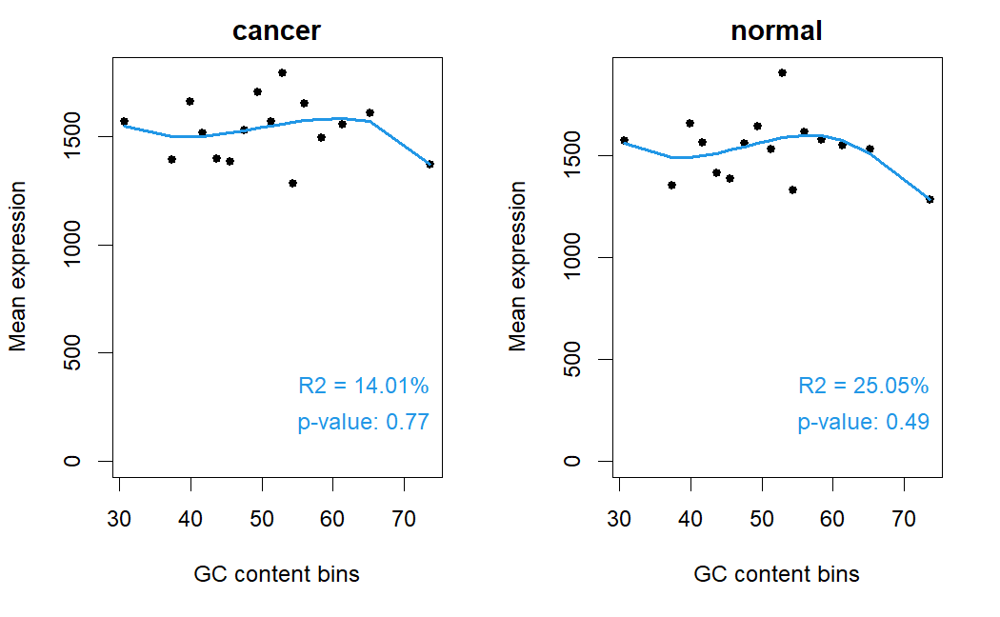

``` r
mymirnadata.norm.eda <- NOISeq::readData(data = mirna.eda.counts, factors = myfactors, gc = mygc)
GC.plot(GC.dat(mymirnadata.norm.eda, factor = "barcodes.condition"))
```


``` r
mymirnaPCA = dat(mymirnadata.norm.cqn, type = "PCA", logtransf = TRUE)
par(cex = 0.75)
explo.plot(mymirnaPCA, factor = "barcodes.condition", plottype = "scores")
```


``` r
explo.plot(mymirnaPCA, factor = "barcodes.condition", plottype = "loadings")
```

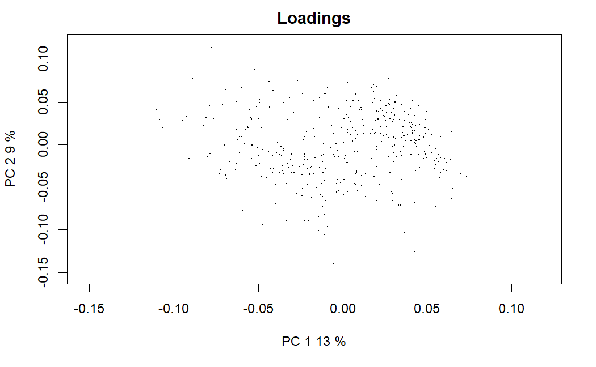

``` r
mymirnaPCA = dat(mymirnadata.norm.eda, type = "PCA")
par(cex = 0.75)
explo.plot(mymirnaPCA, factor = "barcodes.condition", plottype = "scores")
```

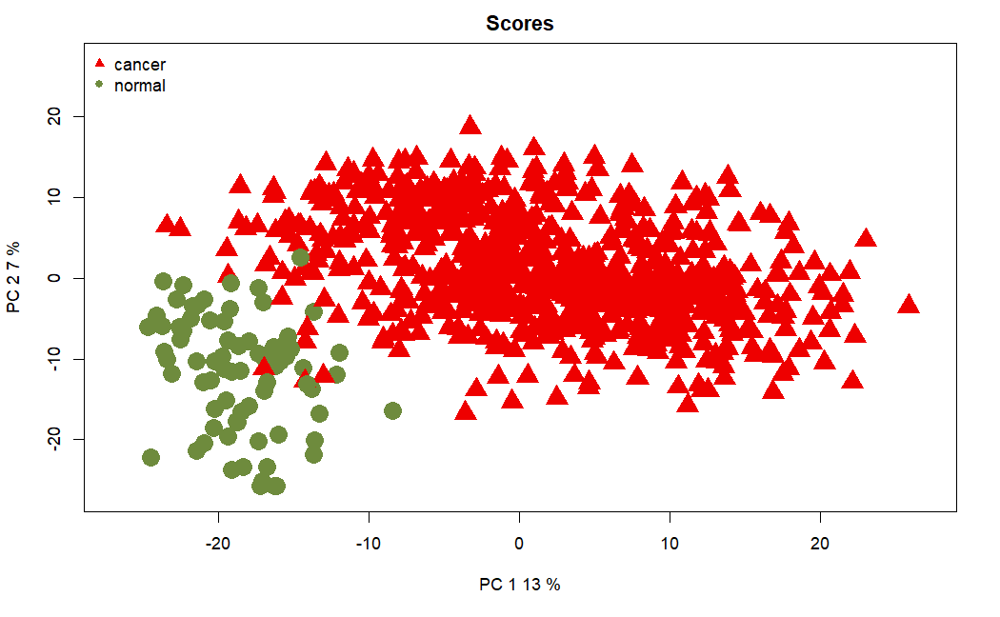

``` r
explo.plot(mymirnaPCA, factor = "barcodes.condition", plottype = "loadings")
```


There is no point normalizing in this case, since we can’t see
GC-content bias (not just that, but normalizing seems to increase it)
and the only possible source of bias is sequencing depth, which is
already accounted for when performing differential expression analysis
when calculating normalization factors.

# Analyzing differential expression

## DESeq2

``` r
library(DESeq2)
library(TCGAbiolinks)
library(ggplot2)

load("data/cooked/miRNA-Seq/miRNA.filt.rda")

library(TCGAbiolinks)
barcodes <- get_IDs(mirna.filt.counts)
barcodes$condition <- as.factor(barcodes$condition)
barcodes$condition <- relevel(barcodes$condition, ref = "normal")
myfactors <- data.frame(barcodes$tss, barcodes$portion, barcodes$plate, barcodes$condition)

dds <- DESeqDataSetFromMatrix(countData = mirna.filt.counts,
                              colData = barcodes,
                              design = ~ condition)

dds <- DESeq(dds)
resultsNames(dds) # lists the coefficients
# [1] "Intercept"                          
# [2] "condition_cancer_vs_normal"
res.deseq2 <- results(dds, alpha = 0.05)
summary(res.deseq2)
```

``` r
# out of 642 with nonzero total read count
# adjusted p-value < 0.05
# LFC > 0 (up)       : 302, 47%
# LFC < 0 (down)     : 218, 34%
# outliers [1]       : 0, 0%
# low counts [2]     : 0, 0%
# (mean count < 0)
```

Let’s paint a PCA plot using the normalized data inside `dds` to see if
it improved sample separation.

``` r
vsd <- varianceStabilizingTransformation(dds, blind=FALSE)
# plotPCA(vsd)

pc = prcomp(t(assay(vsd)), scale = FALSE)
bcodes <- substr(rownames(pc$x), 1, 15)
tumor <- substr(bcodes, 14, 15) == "01"
loads <- round(pc$sdev^2/sum(pc$sdev)*100, 1)
xlab <- c(paste("PC 1", loads[1], "%"))
ylab <- c(paste("PC 2", loads[2], "%"))
plot(pc$x[ , 1], pc$x[ , 2], xlab = xlab, ylab = ylab, type = "n",
main = "Scores", cex.axis = 0.75, cex.lab = 0.75, cex.main = 0.75)
points(pc$x[tumor, 1] , pc$x[tumor, 2], col = "red", pch = 17, cex = 1.4)
points(pc$x[!tumor, 1] , pc$x[!tumor, 2], col = "darkolivegreen4", pch = 16, cex = 1.4)
legend("topleft", bty = "n", legend = c("cancer" , "normal" ), pch = c(17, 16), col = c("red", "darkolivegreen4"), cex = 0.75)
```

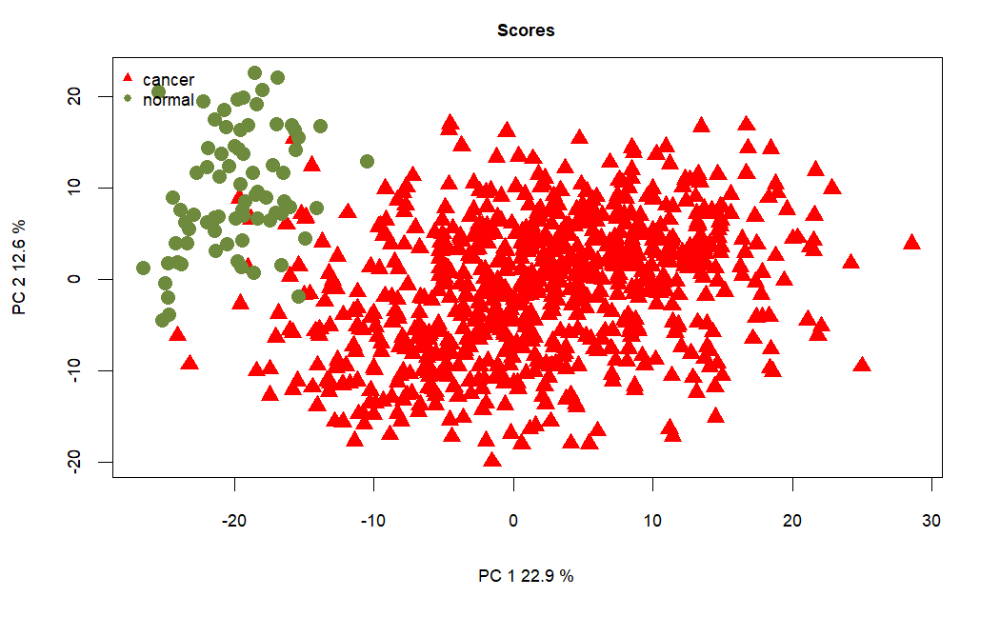

We had to decrease our lFC threshold from 2 to 1, as otherwise we ended
up getting a ridiculous number of DEGs (9 in total, after intersecting
all DEA methods).

We’ll select as significant those genes with a p.adj \< 0.05 and a lFC
\> 1 or lFC \< -1. We get a total of 205 upregulated DEGs (a 32% of the
filtered genes) in cancer samples, compared to normal ones; and 151
downregulated DEGs (a 23.5% of the filtered genes), from a total of 642
filtered miRNAs (originally 2,209 miRNAs in our raw data).

``` r
log.fold.change <- res.deseq2$log2FoldChange
q.value <- res.deseq2$padj
genes.ids <- rownames(mirna.filt.counts)
names(log.fold.change) <- genes.ids
names(q.value) <- genes.ids
activated.genes.deseq2 <- genes.ids[log.fold.change > 1 & q.value < 0.05]
activated.genes.deseq2 <- activated.genes.deseq2[!is.na(activated.genes.deseq2)]
repressed.genes.deseq2 <- genes.ids[log.fold.change < - 1 & q.value < 0.05]
repressed.genes.deseq2 <- repressed.genes.deseq2[!is.na(repressed.genes.deseq2)]
length(activated.genes.deseq2) # 156
length(repressed.genes.deseq2) # 112

log.q.val <- -log10(q.value)
plot(log.fold.change,log.q.val,pch=19,col="grey",cex=0.8,
xlim=c(-8,8),ylim = c(0,150),
xlab="log2(Fold-change)",ylab="-log10(q-value)",cex.lab=1.5)
points(x = log.fold.change[activated.genes.deseq2],
y = log.q.val[activated.genes.deseq2],col="red",cex=0.8,pch=19)
points(x = log.fold.change[repressed.genes.deseq2],
y = log.q.val[repressed.genes.deseq2],col="blue",cex=0.8,pch=19)
```


We don’t have to convert our DEGs IDs, since they are using standard
miRNA IDs. Let’s just save them.

``` r
write.table(activated.genes.deseq2, file = "results/preprocessing/cookingmiRNASeq/DESeq2.up.txt", row.names = FALSE, col.names = FALSE, quote = FALSE)

write.table(repressed.genes.deseq2, file = "results/preprocessing/cookingmiRNASeq/DESeq2.down.txt", row.names = FALSE, col.names = FALSE, quote = FALSE)

resOrdered <- res.deseq2[order(res.deseq2$padj),]
head(resOrdered)
resOrderedDF <- as.data.frame(resOrdered)
resOrderedDF <- na.omit(resOrderedDF)
write.table(resOrderedDF, file = "results/preprocessing/cookingmiRNASeq/DESeq2.ordered.tsv", row.names=TRUE, col.names=TRUE, sep="\t", quote=FALSE)
```

## limma

``` r
library(limma)
library(edgeR)

dge <- DGEList(counts=mirna.filt.counts)
dge <- calcNormFactors(dge) # TMM normalization from edgeR
logCPM <- cpm(dge, log=TRUE, prior.count=3) # logCPM conversion from edgeR
# average count to be added to each observation to avoid taking log of zero

pc = prcomp(t(logCPM), scale = FALSE)
bcodes <- substr(rownames(pc$x), 1, 15)
tumor <- substr(bcodes, 14, 15) == "01"
loads <- round(pc$sdev^2/sum(pc$sdev)*100, 1)
xlab <- c(paste("PC 1", loads[1], "%"))
ylab <- c(paste("PC 2", loads[2], "%"))
plot(pc$x[ , 1], pc$x[ , 2], xlab = xlab, ylab = ylab, type = "n",
main = "Scores", cex.axis = 0.75, cex.lab = 0.75, cex.main = 0.75)
points(pc$x[tumor, 1] , pc$x[tumor, 2], col = "red", pch = 17, cex = 1.4)
points(pc$x[!tumor, 1] , pc$x[!tumor, 2], col = "darkolivegreen4", pch = 16, cex = 1.4)
legend("topleft", bty = "n", legend = c("cancer" , "normal" ), pch = c(17, 16), col = c("red", "darkolivegreen4"), cex = 0.75)
```

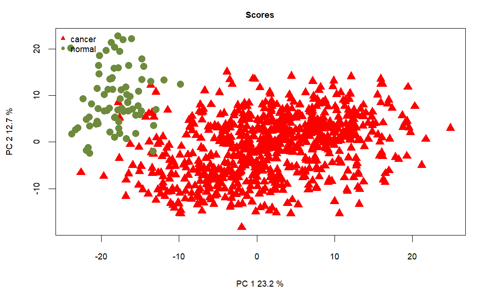

``` r
design <- model.matrix(~ barcodes$condition)

fit1 <- lmFit(logCPM, design)

fit2 <- eBayes(fit1)

top.limma <- topTable(fit2, coef = 2, number = Inf)

log.fold.change <- top.limma$logFC
q.value <- top.limma$adj.P.Val
genes.ids <- rownames(top.limma)
names(log.fold.change) <- genes.ids
names(q.value) <- genes.ids

activated.genes.limma <- genes.ids[log.fold.change > 1 & q.value < 0.05]
repressed.genes.limma <- genes.ids[log.fold.change < -1 & q.value < 0.05]

length(activated.genes.limma) # 63
length(repressed.genes.limma) # 88

log.q.val <- -log10(q.value)
plot(log.fold.change,log.q.val,pch=19,col="grey",cex=0.8,
xlim=c(-4,4),ylim = c(0,130),
xlab="log2(Fold-change)",ylab="-log10(q-value)",cex.lab=1.5)
points(x = log.fold.change[activated.genes.limma],
y = log.q.val[activated.genes.limma],col="red",cex=0.8,pch=19)
points(x = log.fold.change[repressed.genes.limma],
y = log.q.val[repressed.genes.limma],col="blue",cex=0.8,pch=19)
```

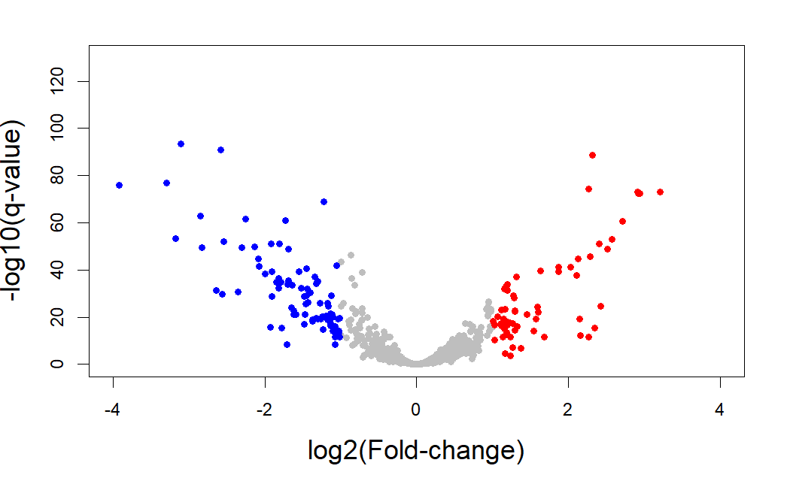

``` r
write.table(activated.genes.limma, file = "results/preprocessing/cookingmiRNASeq/limma.up.txt", row.names = FALSE, col.names = FALSE, quote = FALSE)

write.table(repressed.genes.limma, file = "results/preprocessing/cookingmiRNASeq/limma.down.txt", row.names = FALSE, col.names = FALSE, quote = FALSE)

topOrdered <- top.limma[order(top.limma$adj.P.Val),]
topOrderedDF <- as.data.frame(topOrdered)
topOrderedDF <- na.omit(topOrderedDF)
write.table(topOrderedDF, file = "results/preprocessing/cookingmiRNASeq/limma.ordered.tsv", row.names=TRUE, col.names=TRUE, sep="\t", quote=FALSE)
```

## limma-voom

When the library sizes are quite variable between samples, then the voom
approach is theoretically more powerful than limma-trend, which could be
the case here.

``` r
v <- voom(mirna.filt.counts, design, plot=TRUE)

pc = prcomp(t(v$E), scale = FALSE)
bcodes <- substr(rownames(pc$x), 1, 15)
tumor <- substr(bcodes, 14, 15) == "01"
loads <- round(pc$sdev^2/sum(pc$sdev)*100, 1)
xlab <- c(paste("PC 1", loads[1], "%"))
ylab <- c(paste("PC 2", loads[2], "%"))
plot(pc$x[ , 1], pc$x[ , 2], xlab = xlab, ylab = ylab, type = "n",
main = "Scores", cex.axis = 0.75, cex.lab = 0.75, cex.main = 0.75)
points(pc$x[tumor, 1] , pc$x[tumor, 2], col = "red", pch = 17, cex = 1.4)
points(pc$x[!tumor, 1] , pc$x[!tumor, 2], col = "darkolivegreen4", pch = 16, cex = 1.4)
legend("topleft", bty = "n", legend = c("cancer" , "normal" ), pch = c(17, 16), col = c("red", "darkolivegreen4"), cex = 0.75)
```

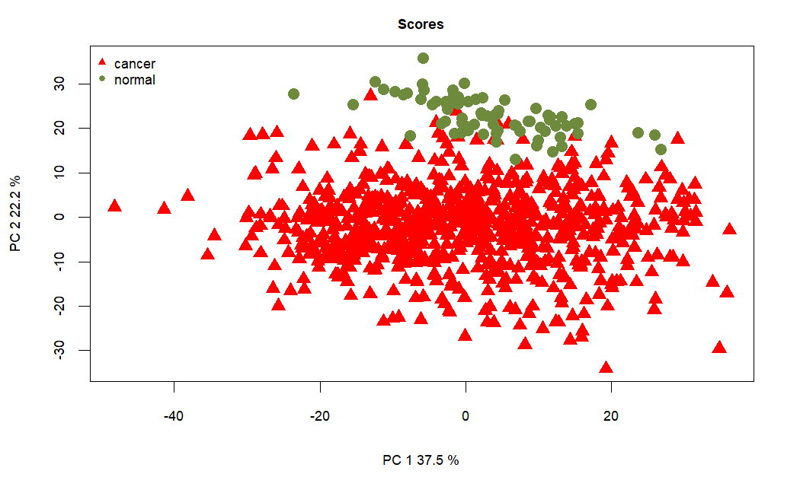

``` r
fit <- lmFit(v, design)
fit2 <- eBayes(fit)
top.limma.voom <- topTable(fit2, coef=ncol(design), number = Inf)

log.fold.change <- top.limma.voom$logFC
q.value <- top.limma.voom$adj.P.Val
genes.ids <- rownames(top.limma.voom)
names(log.fold.change) <- genes.ids
names(q.value) <- genes.ids

activated.genes.limma.voom <- genes.ids[log.fold.change > 1 & q.value < 0.05]
repressed.genes.limma.voom <- genes.ids[log.fold.change < -1 & q.value < 0.05]

length(activated.genes.limma.voom) # 87
length(repressed.genes.limma.voom) # 127

log.q.val <- -log10(q.value)
plot(log.fold.change,log.q.val,pch=19,col="grey",cex=0.8,
xlim=c(-6,6),ylim = c(0,150),
xlab="log2(Fold-change)",ylab="-log10(q-value)",cex.lab=1.5)
points(x = log.fold.change[activated.genes.limma.voom],
y = log.q.val[activated.genes.limma.voom],col="red",cex=0.8,pch=19)
points(x = log.fold.change[repressed.genes.limma.voom],
y = log.q.val[repressed.genes.limma.voom],col="blue",cex=0.8,pch=19)
```

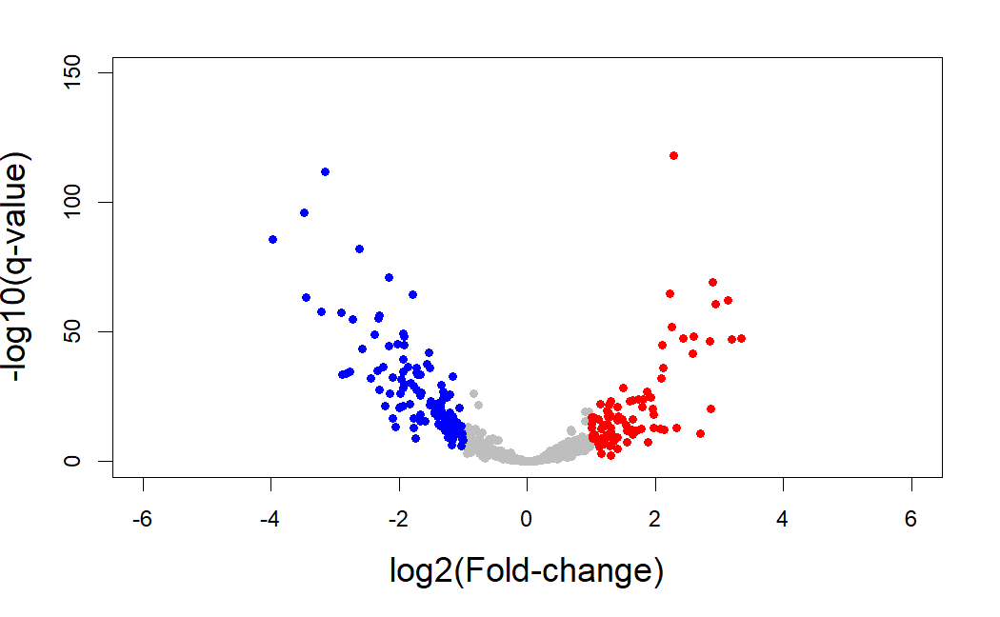 We get quite a
different result with `limma-voom` compared to `limma`. In order to end
up with a sizeable number of DEGs, we’ll use `limma-voom` instead of
`limma`.

``` r
write.table(activated.genes.limma.voom, file = "results/preprocessing/cookingmiRNASeq/limma.voom.up.txt", row.names = FALSE, col.names = FALSE, quote = FALSE)

write.table(repressed.genes.limma.voom, file = "results/preprocessing/cookingmiRNASeq/limma.voom.down.txt", row.names = FALSE, col.names = FALSE, quote = FALSE)

topOrdered <- top.limma.voom[order(top.limma.voom$adj.P.Val),]
topOrderedDF <- as.data.frame(topOrdered)
topOrderedDF <- na.omit(topOrderedDF)
write.table(topOrderedDF, file = "results/preprocessing/cookingmiRNASeq/limma.voom.ordered.tsv", row.names=TRUE, col.names=TRUE, sep="\t", quote=FALSE)
```

## edgeR

``` r
library(edgeR)

y <- DGEList(counts = mirna.filt.counts, lib.size = colSums(mirna.filt.counts), group = barcodes$condition, genes = rownames(mirna.filt.counts))

y <- calcNormFactors(y)
```

``` r
design <- model.matrix(~ barcodes$condition)

y <- estimateCommonDisp(y, design = design)
y <- estimateTagwiseDisp(y, design = design)

plotBCV(y)
```

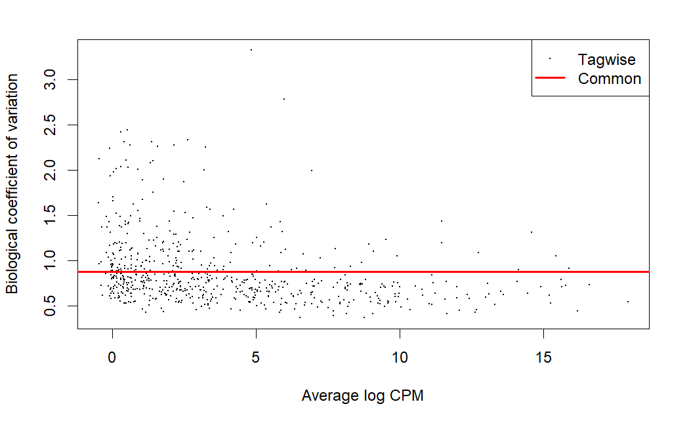

``` r
pc = prcomp(t(tmm_log <- edgeR::cpm(y, log = T, prior.count = 1)), scale = FALSE)
bcodes <- substr(rownames(pc$x), 1, 15)
tumor <- substr(bcodes, 14, 15) == "01"
loads <- round(pc$sdev^2/sum(pc$sdev)*100, 1)
xlab <- c(paste("PC 1", loads[1], "%"))
ylab <- c(paste("PC 2", loads[2], "%"))
plot(pc$x[ , 1], pc$x[ , 2], xlab = xlab, ylab = ylab, type = "n",
main = "Scores", cex.axis = 0.75, cex.lab = 0.75, cex.main = 0.75)
points(pc$x[tumor, 1] , pc$x[tumor, 2], col = "red", pch = 17, cex = 1.4)
points(pc$x[!tumor, 1] , pc$x[!tumor, 2], col = "darkolivegreen4", pch = 16, cex = 1.4)
legend("topleft", bty = "n", legend = c("cancer" , "normal" ), pch = c(17, 16), col = c("red", "darkolivegreen4"), cex = 0.75)
```

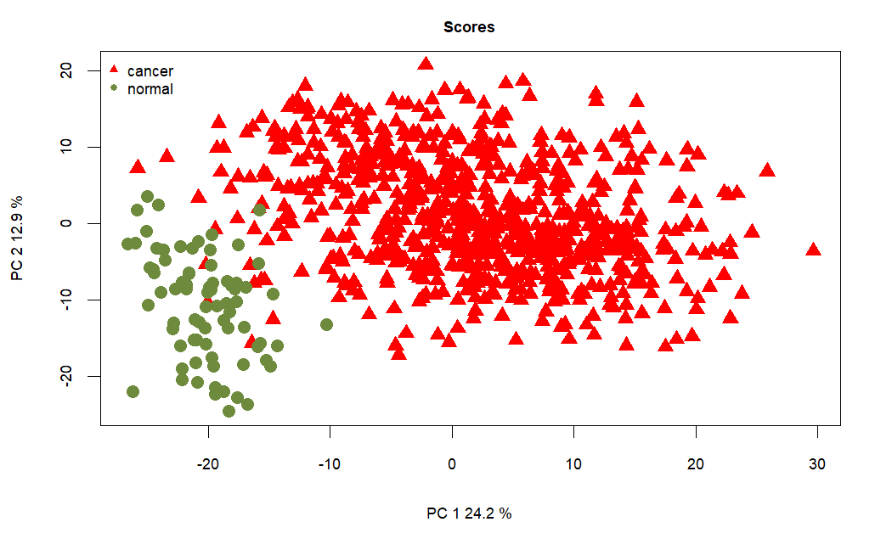

This time it’s also better to estimate dispersions tagwise instead of
using a common one for all genes.

``` r
et <- exactTest(y) # performs pair-wise tests for differential expression between two groups
top.edger <- topTags(et, n = Inf) # takes the output from exactTest(), adjusts the raw p-values using the False Discovery Rate (FDR) correction, and returns the top differentially expressed genes

summary(decideTestsDGE(et, lfc = 1, p.value = 0.05))

#        cancer-normal
# Down             103
# NotSig           381
# Up               158
```

``` r
top.edger <- top.edger$table
top.edger <- top.edger[order(top.edger$genes), ]
log.fold.change <- top.edger$logFC
q.value <- top.edger$FDR
genes.ids <- rownames(mirna.filt.counts)
names(log.fold.change) <- genes.ids
names(q.value) <- genes.ids
activated.genes.edger <- genes.ids[log.fold.change > 1 & q.value < 0.05] # 163
activated.genes.edger <- activated.genes.edger[!is.na(activated.genes.edger)]
repressed.genes.edger <- genes.ids[log.fold.change < - 1 & q.value < 0.05] # 97
repressed.genes.edger <- repressed.genes.edger[!is.na(repressed.genes.edger)]

log.q.val <- -log10(q.value)
plot(log.fold.change,log.q.val,pch=19,col="grey",cex=0.8,
xlim=c(-8,8),ylim = c(0,240),
xlab="log2(Fold-change)",ylab="-log10(q-value)",cex.lab=1.5)
points(x = log.fold.change[activated.genes.edger],
y = log.q.val[activated.genes.edger],col="red",cex=0.8,pch=19)
points(x = log.fold.change[repressed.genes.edger],
y = log.q.val[repressed.genes.edger],col="blue",cex=0.8,pch=19)
```


``` r
write.table(activated.genes.edger, file = "results/preprocessing/cookingmiRNASeq/edgeR.up.txt", row.names = FALSE, col.names = FALSE, quote = FALSE)

write.table(repressed.genes.edger, file = "results/preprocessing/cookingmiRNASeq/edgeR.down.txt", row.names = FALSE, col.names = FALSE, quote = FALSE)

top.edger <- as.data.frame(top.edger)

topOrdered <- top.edger[order(top.edger$FDR),]
topOrderedDF <- as.data.frame(topOrdered)
topOrderedDF <- na.omit(topOrderedDF)
write.table(topOrderedDF, file = "results/preprocessing/cookingmiRNASeq/edgeR.ordered.tsv", row.names=TRUE, col.names=TRUE, sep="\t", quote=FALSE)
```

## Intersecting DEGs

``` r
# with DESeq2, limma and edgeR
common.activated <- intersect(intersect(activated.genes.deseq2, activated.genes.edger), activated.genes.limma) # 62
common.repressed <- intersect(intersect(repressed.genes.deseq2, repressed.genes.edger), repressed.genes.limma) # 69

# with DESeq2, limma-voom and edgeR
common.activated <- intersect(intersect(activated.genes.deseq2, activated.genes.edger), activated.genes.limma.voom) # 86
common.repressed <- intersect(intersect(repressed.genes.deseq2, repressed.genes.edger), repressed.genes.limma.voom) # 91

# with DESeq2, limma, limma-voom and edgeR
common.activated <- intersect(intersect(intersect(activated.genes.deseq2, activated.genes.edger), activated.genes.limma.voom), activated.genes.limma) # 61
common.repressed <- intersect(intersect(intersect(repressed.genes.deseq2, repressed.genes.edger), repressed.genes.limma.voom), repressed.genes.limma) # 69
```

We’ll select as DEGs as those intersecting for `DESeq2`, `limma-voom`
and `edgeR`, since `limma` appears to miss out on quite a few of them.

``` r
# with DESeq2, limma-voom and edgeR
common.activated <- intersect(intersect(activated.genes.deseq2, activated.genes.edger), activated.genes.limma.voom) # 86
common.repressed <- intersect(intersect(repressed.genes.deseq2, repressed.genes.edger), repressed.genes.limma.voom) # 91

write.table(common.activated, file = "results/preprocessing/cookingmiRNASeq/common.up.txt", row.names = FALSE, col.names = FALSE, quote = FALSE)

write.table(common.repressed, file = "results/preprocessing/cookingmiRNASeq/common.down.txt", row.names = FALSE, col.names = FALSE, quote = FALSE)
```

|    DEGs     | DESeq2 | limma-voom | edgeR | Common |
|:-----------:|:------:|:----------:|:-----:|:------:|
| *Activated* |  132   |     79     |  129  |   67   |
| *Repressed* |   83   |     93     |  76   |   56   |
|   *Total*   | *215*  |   *172*    | *205* | *123*  |

We have 177 DEGs, a 27.6% of the filtered miRNAs (642) and a 8% of the
original miRNAs (2,209).

We will use the logFC results from `limma-voom` as input for Paintomics
4.

``` r
dea.limma.voom.mirna <- read.table("results/preprocessing/cookingmiRNASeq/limma.voom.ordered.tsv")
mirna.expression <- as.data.frame(dea.limma.voom.mirna[, 1])
rownames(mirna.expression) <- rownames(dea.limma.voom.mirna)

write.table(mirna.expression, file = "results/associations/miRNA-gene/miRNA.expression.txt", sep = "\t", quote = FALSE, col.names = FALSE)
```
